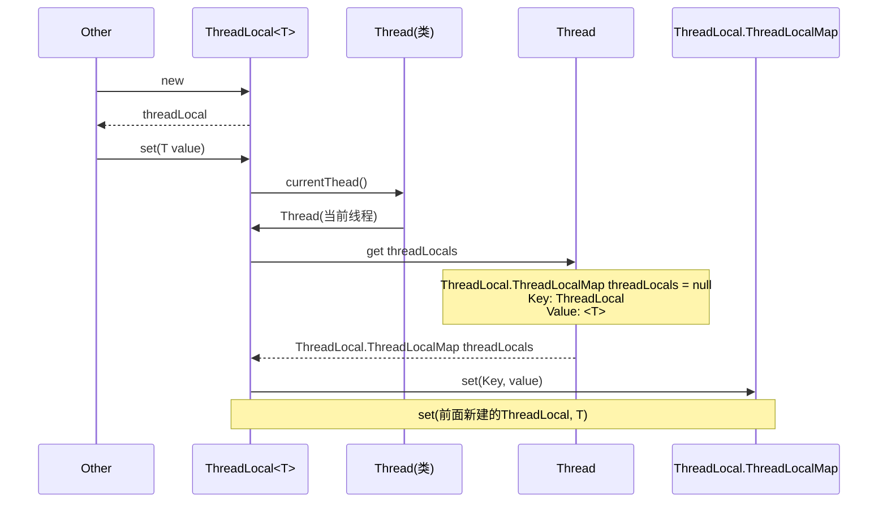
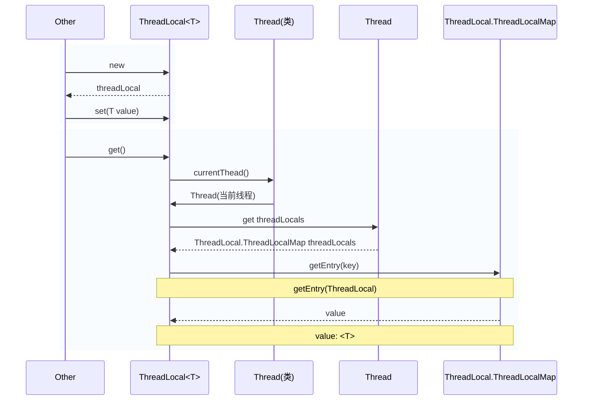

## set



```plaintText
                                            ▼                                
                                                                             
                                                                             
                                                                             
set： find currentThread, and call Thread.threadLocals.set(ThreadLocal, value)
                                                                             
┌────────────────────────┐                                                   
│                        │                                                   
│                        │                                                   
│       ┌────────────────▼────────────────────────────────────┐              
│       │                                                     │              
│       │                        Thread                       │              
│       │                                                     │              
│       │    ┌───────────────────────────────────────┐        │              
│       │    │       threadLocals: ThreadLocalMap    │        │              
│       │    │                                       │        │              
│       │    │                                       │        │              
│       │    │  ┌─────────────────┐────────────────┐ │        │              
└───────┼────┼──┼ ThreadLocal     │   Value        │ │        │              
        │    │  │                 │                │ │        │              
        │    │  └─────────────────┘────────────────┘ │        │              
        │    │  ┌─────────────────┐────────────────┐ │        │              
        │    │  │ ThreadLocal     │   Value        │ │        │              
        │    │  │                 │                │ │        │              
        │    │  └─────────────────┘────────────────┘ │        │              
        │    │  ┌─────────────────┐────────────────┐ │        │              
        │    │  │ ThreadLocal     │   Value        │ │        │              
        │    │  │                 │                │ │        │              
        │    │  └─────────────────┘────────────────┘ │        │              
        │    │  ┌─────────────────┐────────────────┐ │        │              
        │    │  │ ...             │   ...          │ │        │              
        │    │  │                 │                │ │        │              
        │    │  └─────────────────┘────────────────┘ │        │              
        │    │                                       │        │              
        │    └───────────────────────────────────────┘        │              
        │                                                     │              
        └─────────────────────────────────────────────────────┘              
```

## get



```plaintText
            2. find currentThread call Thread.threadLocals.get(ThreadLocal)
            ┌────────────────────────┐                                     
            │                        │                                     
            │                        │                                     
            │       ┌────────────────▼─┬──────────────────────────────────┐
            │       │                  │                                  │
            │       │                  │     Thread                       │
            │       │                  │                                  │
            │       │    ┌─────────────▼─────────────────────────┐        │
            │       │    │       threadLocals: ThreadLocalMap    │        │
            │       │    │             ─────────────┐            │        │
            │       │    │                          │            │        │
            │       │    │  ┌─────────────────┐─────▼──────────┐ │        │
            └───────┼────┼──┼ ThreadLocal     │   Value        │ │        │
────────────────────┼────┼─►│                 │                │ │        │
   1. get           │    │  └─────────────────┘────────────────┘ │        │
                    │    │  ┌─────────────────┐────────────────┐ │        │
                    │    │  │ ThreadLocal     │   Value        │ │        │
                    │    │  │                 │                │ │        │
                    │    │  └─────────────────┘────────────────┘ │        │
                    │    │  ┌─────────────────┐────────────────┐ │        │
                    │    │  │ ThreadLocal     │   Value        │ │        │
                    │    │  │                 │                │ │        │
                    │    │  └─────────────────┘────────────────┘ │        │
                    │    │  ┌─────────────────┐────────────────┐ │        │
                    │    │  │ ...             │   ...          │ │        │
                    │    │  │                 │                │ │        │
                    │    │  └─────────────────┘────────────────┘ │        │
                    │    │                                       │        │
                    │    └───────────────────────────────────────┘        │
                    │                                                     │
                    └─────────────────────────────────────────────────────┘
```