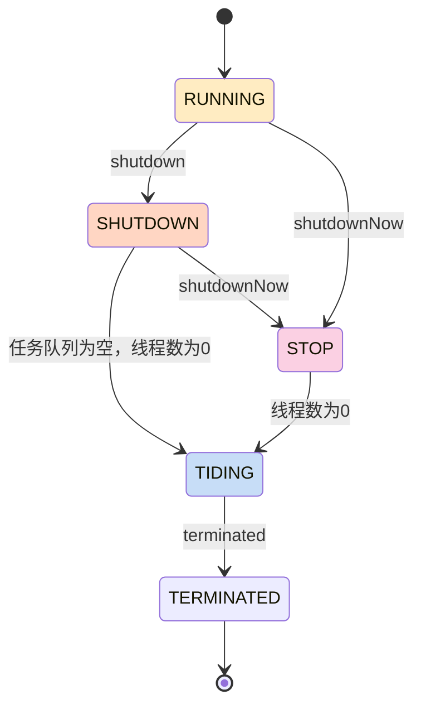

# ThreadPoolExecutor

## ctl @@状态&线程数

- 前3位用来表示状态，一共可以用来表示2 * 2 * 8种状态
- 剩余位数用来表示线程数

```java
    private final AtomicInteger ctl = new AtomicInteger(ctlOf(RUNNING, 0));
    private static final int COUNT_BITS = Integer.SIZE - 3; // 32 - 3 = 29
    // (1 << 29) - 1 
    // = (1左移29位) - 1 
    // = 2^29 - 1 = 536870912 - 1 = 536870911 
    // = 0b11111111111111111111111111111
    // = 0b 0001 1111 1111 1111  1111 1111 1111 1111
    private static final int COUNT_MASK = (1 << COUNT_BITS) - 1; 

    // runState is stored in the high-order bits
    private static final int RUNNING    = -1 << COUNT_BITS;
    private static final int SHUTDOWN   =  0 << COUNT_BITS;
    private static final int STOP       =  1 << COUNT_BITS;
    private static final int TIDYING    =  2 << COUNT_BITS;
    private static final int TERMINATED =  3 << COUNT_BITS;
```

|31|30|29|28|...|0|
|-|-|-|-|-|-|
|state begin||state end|task count begin||task count end|


|state||||
|-|-|-|-|
|RUNNING    |1110 0000  0000 0000  0000 0000  0000 0000|-536870912||
|SHUTDOWN   |0000 0000  0000 0000  0000 0000  0000 0000|0|不会接受新任务，但是可以继续处理现有任务队列中的任务|
|STOP       |0010 0000  0000 0000  0000 0000  0000 0000|536870912|不接受新任务，正在执行的任务也停止|
|TIDYING    |0100 0000  0000 0000  0000 0000  0000 0000|1073741824||
|TERMINATED |0110 0000  0000  0000 0000 0000  0000 0000|1610612736||

### 状态转换

```java
     * RUNNING -> SHUTDOWN
     *    On invocation of shutdown()
     * (RUNNING or SHUTDOWN) -> STOP
     *    On invocation of shutdownNow()
     * SHUTDOWN -> TIDYING
     *    When both queue and pool are empty
     * STOP -> TIDYING
     *    When pool is empty
     * TIDYING -> TERMINATED
     *    When the terminated() hook method has completed
```



## execute @@提交任务-入口

```kotlin
// 源码分析
    public void execute(Runnable command) {
        int c = ctl.get();
        // 1. 线程数 < 核心线程池 (即主力hc还有)
        if (workerCountOf(c) < corePoolSize) {
            // 1.1 优先补充主力(addWorker)成功&&将任务作为其第一个任务成功
            // addWorker会检查线程池是否在运行中
            if (addWorker(command, true))
                return;
            c = ctl.get();
        }
        // 2. 线程池运行中 && 提交任务到任务队列成功(workQueue.offer)
        if (isRunning(c) && workQueue.offer(command)) {
            int recheck = ctl.get();
            // 2.1 线程池停止运行 && 将任务从任务队列中移除成功 // 添加到任务队列期间可能线程池被停止了
            if (! isRunning(recheck) && remove(command))
                // 2.1.1 拒绝添加任务
                reject(command);
            // 2.2 workder为空 // 添加到任务队列期间worker可能被停止了
            else if (workerCountOf(recheck) == 0)
                // 2.2.1 添加临时工
                addWorker(null, false);
        }
        // 3. 队列满了，直接创建临时工执行任务
        else if (!addWorker(command, false))
            reject(command);
    }

```

> - 核心线程：主力
> - 非核心线程：临时工

```kotlin
// 伪代码
if 线程数 < 核心线程池 (即主力hc还有) [M2]
    if 优先补充主力(addWorker)成功&&将任务作为其第一个任务成功 [M2]// addWorker会检查线程池是否在运行中[M1]
        return
if 线程池运行中 [M1] && 提交任务到任务队列成功(workQueue.offer) [M3]
    if 线程池停止运行 && 将任务从任务队列中移除成功 // 添加到任务队列期间可能线程池被停止了
        拒绝添加任务
    else if workder为空 // 添加到任务队列期间worker可能被停止了
        addWorker(null, false);
else if 队列满了，直接创建临时工执行任务 [M4] // 会检查线程池运行状态[M1]，最大线程数[M4]等等
    拒绝添加任务
```

```kotlin
// 伪代码 & 简化逻辑
if !线程池正在运行 [M1]
    拒绝
else if 线程数 < 核心线程数 [M2]
    添加主力&执行
else if workQueue未满 [M3]
    提交任务到workQueue
else if 线程数 < 最大线程数 [M4]
    添加临时工&执行
else
    拒绝
```

## addWorker @@添加工人(主力 or 临时工)

```java
// 源码分析

    /**
     * 用于访问工作线程集合及相关统计信息的锁。
     * 虽然并发集合能提供线程安全的操作，
     * 但使用锁能够更好地控制和序列化 interruptIdleWorkers（中断空闲工作线程）操作。
     * 尤其在关闭线程池时，可以避免线程并发中断导致的“中断风暴”
     * （即多个线程同时被中断而相互干扰），这种情况会影响性能。
     * 
     * 如果没有使用锁，正在退出的线程可能会与其他还没有被中断的线程发生竞争，
     * 导致一些线程在不适当的时机被中断。
     * 
     * 它简化了线程池中一些统计信息的更新，例如 largestPoolSize（最大线程池大小）。
     * 另外，shutdown 和 shutdownNow 操作在执行过程中需要保证工作线程集合的稳定性，
     * 因此也需要通过持有 mainLock 锁来避免并发修改，
     * 确保在检查中断权限与执行实际中断操作时不发生数据不一致。
     */
    private final ReentrantLock mainLock = new ReentrantLock();
    ...

    private boolean addWorker(Runnable firstTask, boolean core) {
        // 给一下行的for循环起一个名字，不是c的goto的效果
        retry:
        for (int c = ctl.get();;) {
            if (
                // >=shut_down，即shut_down / stop / tiding / terminated
                runStateAtLeast(c, SHUTDOWN)
                // 转换一下就是
                // !(==shut_down && firstTask == null && !workQueue.isEmpty)
                // 也就是需要排除上述情况
                // !(shut_down状态 && 传入的新增task是空(即没有新增任务) && taskQueue还有没执行完的)
                // 也就是说两种情况
                // 1. < SHUTDOWN
                // 2. = SHUTDOWN && 没有新增任务
                // 也就说shut_down状态可以继续执行taskQueue中的任务，但是不接受新增的task
                && (runStateAtLeast(c, STOP)
                    || firstTask != null
                    || workQueue.isEmpty()))
                return false;

            for (;;) {
                // 当前线程数量已经达到最大
                if (workerCountOf(c)
                    >= ((core ? corePoolSize : maximumPoolSize) & COUNT_MASK))
                    // 退出
                    return false;
                // 通过CAS机制增加工作线程数量记录
                if (compareAndIncrementWorkerCount(c))
                    // CAS机制可能失败，成功的话则退出外层for循环
                    break retry;
                c = ctl.get();  // Re-read ctl
                // 走到这里说明CAS增加工作线程数量纪录失败，
                // 再次检查线程池状态，以为上述过程期间可能状态已经变更
                // 如果变成了shut_down状态，
                if (runStateAtLeast(c, SHUTDOWN))
                    // 则需要直接进入外层for循环的下一次循环
                    // 完整检查一下线程池状态，可能需要直接return false了
                    continue retry;
                // else CAS failed due to workerCount change; retry inner loop
                // 最后这里，CAS增加工作线程数量纪录失败 && 线程池状态 < shutdown
                // 可以正常addWorkder，会继续循环尝试CAS增加工作线程数量纪录
            }
        }

        // 上面只是增加了计数，下面才是真正创建新Worker

        boolean workerStarted = false;
        boolean workerAdded = false;
        Worker w = null;
        try {
            w = new Worker(firstTask);
            final Thread t = w.thread;
            if (t != null) {
                final ReentrantLock mainLock = this.mainLock;
                mainLock.lock();
                try {
                    // Recheck while holding lock.
                    // Back out on ThreadFactory failure or if
                    // shut down before lock acquired.
                    int c = ctl.get();

                    // 条件1. < SHUTDOWN
                    // 条件2. = SHUTDOWN && 没有新增任务
                    if (isRunning(c) ||
                        (runStateLessThan(c, STOP) && firstTask == null)) {
                        if (t.getState() != Thread.State.NEW)
                            throw new IllegalThreadStateException();
                        // 添加workder
                        workers.add(w);
                        workerAdded = true;
                        int s = workers.size();
                        if (s > largestPoolSize)
                            largestPoolSize = s;
                    }
                } finally {
                    mainLock.unlock();
                }
                if (workerAdded) {
                    t.start();
                    workerStarted = true;
                }
            }
        } finally {
            if (! workerStarted)
                addWorkerFailed(w);
        }
        return workerStarted;
    }
```

## workQueue @任务队列

```java
    /**
     * The queue used for holding tasks and handing off to worker
     * threads.  We do not require that workQueue.poll() returning
     * null necessarily means that workQueue.isEmpty(), so rely
     * solely on isEmpty to see if the queue is empty (which we must
     * do for example when deciding whether to transition from
     * SHUTDOWN to TIDYING).  This accommodates special-purpose
     * queues such as DelayQueues for which poll() is allowed to
     * return null even if it may later return non-null when delays
     * expire.
     * 
     * 存放任务并将其交给工作线程的队列。
     * 我们不要求 `workQueue.poll()` 返回 `null` 必然意味着 `workQueue.isEmpty()`，
     * 因此仅依赖 `isEmpty()` 来判断队列是否为空
     * （例如，在决定是否从 `SHUTDOWN` 状态过渡到 `TIDYING` 状态时，我们必须这样做）。
     * 这种做法适用于特殊用途的队列，例如 `DelayQueue`，在这些队列中，`poll()` 允许返回 `null`，
     * 即使稍后延迟过期时可能会返回非 `null` 的任务。
     */
    private final BlockingQueue<Runnable> workQueue;
```

## workQueue.offer @@添加任务到任务队列


> slink begin @@@1735398709 - LinkedBlockingQueue.md
```java
    final AtomicInteger count = this.count;

    private final ReentrantLock putLock = new ReentrantLock();

    public boolean offer(E e) {
        ...
        // 1. 已经满了，返回false
        if (count.get() == capacity)
            return false;
        // 2. 还没满
        final int c;
        // 3. 创建"队员"
        final Node<E> node = new Node<E>(e);
        // 4. 即将操作入队，先加个put锁(不用管take锁，巧妙设计从而添加和删除可以并发)
        putLock.lock();
        try {
        // 5. 加锁后再次检查，防止加锁期间被别的线程截胡
            if (count.get() == capacity)
                return false;
            // 6. 执行入队
            enqueue(node);
            c = count.getAndIncrement();
            if (c + 1 < capacity)
                notFull.signal();
            }
        } finally {
            // 8. 释放锁
            putLock.unlock();
        }
        if (c == 0)
            signalNotEmpty();
        return true;
    }
```
> slink end @@@1735398709 - LinkedBlockingQueue.md


## Worker.runWorker


> slink begin @@@1735975636 - Worker.md
```java
        Worker(Runnable firstTask) {
            setState(-1); // inhibit interrupts until runWorker
            this.firstTask = firstTask;
            this.thread = getThreadFactory().newThread(this);
        }
```
> slink end @@@1735975636 - Worker.md


这里`this.thread = getThreadFactory().newThread(this)`，将Worker本身作为runnable传入Thread;
之后Thread调用start之后，就会执行run()方法如下,


> slink begin @@@1735975874 - Thread.md
```java
    @Override
    public void run() {
        if (target != null) {
            target.run();
        }
    }
```
> slink end @@@1735975874 - Thread.md


target即Worker
那么Worker.run方法为


> slink begin @@@1735975959 - Worker.md
```java
        /** Delegates main run loop to outer runWorker. */
        public void run() {
            runWorker(this);
        }
```
> slink end @@@1735975959 - Worker.md


调用了runWorker方法


> slink begin @@@1735975307 - Worker.md
```java
    final void runWorker(Worker w) {
        Thread wt = Thread.currentThread();
        Runnable task = w.firstTask;
        w.firstTask = null;
        w.unlock(); // allow interrupts
        boolean completedAbruptly = true;
        try {
            while (task != null || (task = getTask()) != null) {
                w.lock();
                // If pool is stopping, ensure thread is interrupted;
                // if not, ensure thread is not interrupted.  This
                // requires a recheck in second case to deal with
                // shutdownNow race while clearing interrupt
                if ((runStateAtLeast(ctl.get(), STOP) ||
                     (Thread.interrupted() &&
                      runStateAtLeast(ctl.get(), STOP))) &&
                    !wt.isInterrupted())
                    wt.interrupt();
                try {
                    beforeExecute(wt, task);
                    try {
                        // 执行任务
                        task.run();
                        afterExecute(task, null);
                    } catch (Throwable ex) {
                        afterExecute(task, ex);
                        throw ex;
                    }
                } finally {
                    task = null;
                    w.completedTasks++;
                    w.unlock();
                }
            }
            completedAbruptly = false;
        } finally {
            processWorkerExit(w, completedAbruptly);
        }
    }
```
> slink end @@@1735975307 - Worker.md


# 参考

- [如果你是 JDK 设计者，如何设计线程池？我跟面试官大战了三十个回合](https://juejin.cn/post/6968721240592744455)
- [ThreadPoolExecutor 源码解析(含流程图)](https://juejin.cn/post/6926471351452565512)
- [聊聊 Java 多线程（5）- 超详细的 ThreadPoolExecutor 源码解析](https://juejin.cn/post/6901317365561032712?searchId=202412291535082885556DD4BAC7D74B0D)