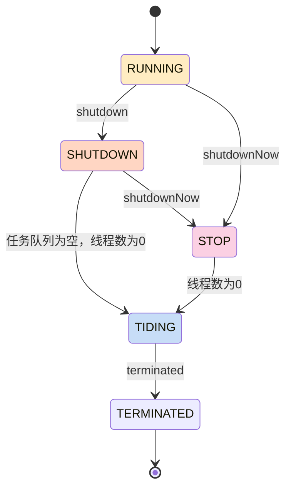

## ctl: 状态&线程数

- 前3位用来表示状态
- 剩余位数用来表示线程数

```java
    private final AtomicInteger ctl = new AtomicInteger(ctlOf(RUNNING, 0));
    private static final int COUNT_BITS = Integer.SIZE - 3; // 32 - 3 = 29
    // (1 << 29) - 1 
    // = (1左移29位) - 1 
    // = 2^29 - 1 = 536870912 - 1 = 536870911 
    // = 0b11111111111111111111111111111
    // = 0b 0001 1111 1111 1111  1111 1111 1111 1111
    private static final int COUNT_MASK = (1 << COUNT_BITS) - 1; 

    // runState is stored in the high-order bits
    private static final int RUNNING    = -1 << COUNT_BITS;
    private static final int SHUTDOWN   =  0 << COUNT_BITS;
    private static final int STOP       =  1 << COUNT_BITS;
    private static final int TIDYING    =  2 << COUNT_BITS;
    private static final int TERMINATED =  3 << COUNT_BITS;
```

|31|30|29|28|...|0|
|-|-|-|-|-|-|
|state begin||state end|task count begin||task count end|


|state|||
|-|-|-|
|RUNNING    |1110 0000  0000 0000  0000 0000  0000 0000|-536870912|
|SHUTDOWN   |0000 0000  0000 0000  0000 0000  0000 0000|0|
|STOP       |0010 0000  0000 0000  0000 0000  0000 0000|536870912|
|TIDYING    |0100 0000  0000 0000  0000 0000  0000 0000|1073741824|
|TERMINATED |0110 0000  0000  0000 0000 0000  0000 0000|1610612736|

### 状态转换

```java
     * RUNNING -> SHUTDOWN
     *    On invocation of shutdown()
     * (RUNNING or SHUTDOWN) -> STOP
     *    On invocation of shutdownNow()
     * SHUTDOWN -> TIDYING
     *    When both queue and pool are empty
     * STOP -> TIDYING
     *    When pool is empty
     * TIDYING -> TERMINATED
     *    When the terminated() hook method has completed
```



## execute

核心线程：主力
非核心线程：临时工

```kotlin
// 源码分析
    public void execute(Runnable command) {
        int c = ctl.get();
        // 1. 线程数 < 核心线程池 (即主力hc还有)
        if (workerCountOf(c) < corePoolSize) {
            // 1.1 优先补充主力(addWorker)成功&&将任务作为其第一个任务成功
            // addWorker会检查线程池是否在运行中
            if (addWorker(command, true))
                return;
            c = ctl.get();
        }
        // 2. 线程池运行中 && 提交任务到任务队列成功(workQueue.offer)
        if (isRunning(c) && workQueue.offer(command)) {
            int recheck = ctl.get();
            // 2.1 线程池停止运行 && 将任务从任务队列中移除成功 // 添加到任务队列期间可能线程池被停止了
            if (! isRunning(recheck) && remove(command))
                // 2.1.1 拒绝添加任务
                reject(command);
            // 2.2 workder为空 // 添加到任务队列期间worker可能被停止了
            else if (workerCountOf(recheck) == 0)
                // 2.2.1 添加临时工
                addWorker(null, false);
        }
        // 3. 队列满了，直接创建临时工执行任务
        else if (!addWorker(command, false))
            reject(command);
    }

```

```kotlin
// 伪代码
if 线程数 < 核心线程池 (即主力hc还有) [M2]
    if 优先补充主力(addWorker)成功&&将任务作为其第一个任务成功 [M2]// addWorker会检查线程池是否在运行中[M1]
        return
if 线程池运行中 [M1] && 提交任务到任务队列成功(workQueue.offer) [M3]
    if 线程池停止运行 && 将任务从任务队列中移除成功 // 添加到任务队列期间可能线程池被停止了
        拒绝添加任务
    else if workder为空 // 添加到任务队列期间worker可能被停止了
        addWorker(null, false);
else if 队列满了，直接创建临时工执行任务 [M4] // 会检查线程池运行状态[M1]，最大线程数[M4]等等
    拒绝添加任务
```

```kotlin
// 伪代码 & 简化逻辑
if !线程池正在运行 [M1]
    拒绝
else if 线程数 < 核心线程数 [M2]
    添加主力&执行
else if workQueue未满 [M3]
    提交任务到workQueue
else if 线程数 < 最大线程数 [M4]
    添加临时工&执行
else
    拒绝
```

## addWorker 添加工人(主力 or 临时工)

```kotlin
if 生命周期>SHUTDOWN
  拒绝
else if 生命周期=SHUTDOWN && 等待队列空了 (队列不空的时候还是允许增加工人去执行未执行的任务，只是不让继续增加任务了)
  拒绝
```

## workQueue

```java
    /**
     * The queue used for holding tasks and handing off to worker
     * threads.  We do not require that workQueue.poll() returning
     * null necessarily means that workQueue.isEmpty(), so rely
     * solely on isEmpty to see if the queue is empty (which we must
     * do for example when deciding whether to transition from
     * SHUTDOWN to TIDYING).  This accommodates special-purpose
     * queues such as DelayQueues for which poll() is allowed to
     * return null even if it may later return non-null when delays
     * expire.
     * 
     * 于存放任务并将其交给工作线程的队列。
     * 我们不要求 `workQueue.poll()` 返回 `null` 必然意味着 `workQueue.isEmpty()`，
     * 因此仅依赖 `isEmpty()` 来判断队列是否为空
     * （例如，在决定是否从 `SHUTDOWN` 状态过渡到 `TIDYING` 状态时，我们必须这样做）。
     * 这种做法适用于特殊用途的队列，例如 `DelayQueue`，在这些队列中，`poll()` 允许返回 `null`，
     * 即使稍后延迟过期时可能会返回非 `null` 的任务。
     */
    private final BlockingQueue<Runnable> workQueue;
```

## workQueue.offer

see [offer](slink@@@1735398709)

## 参考

- [如果你是 JDK 设计者，如何设计线程池？我跟面试官大战了三十个回合](https://juejin.cn/post/6968721240592744455)
- [ThreadPoolExecutor 源码解析(含流程图)](https://juejin.cn/post/6926471351452565512)
- [聊聊 Java 多线程（5）- 超详细的 ThreadPoolExecutor 源码解析](https://juejin.cn/post/6901317365561032712?searchId=202412291535082885556DD4BAC7D74B0D)