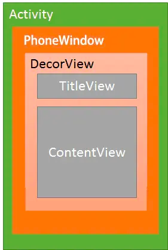
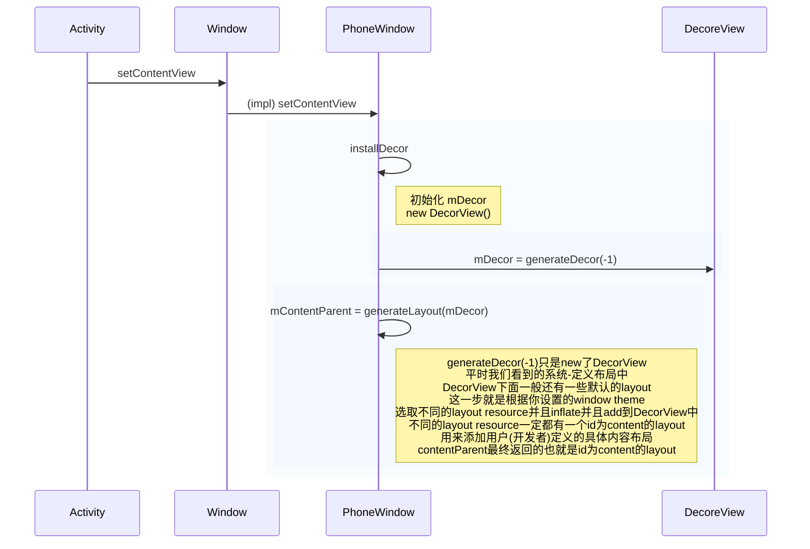
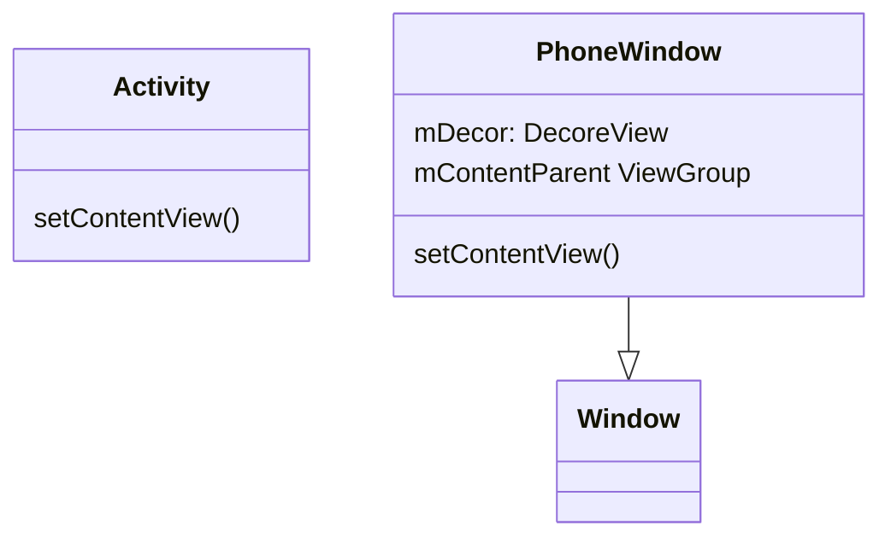
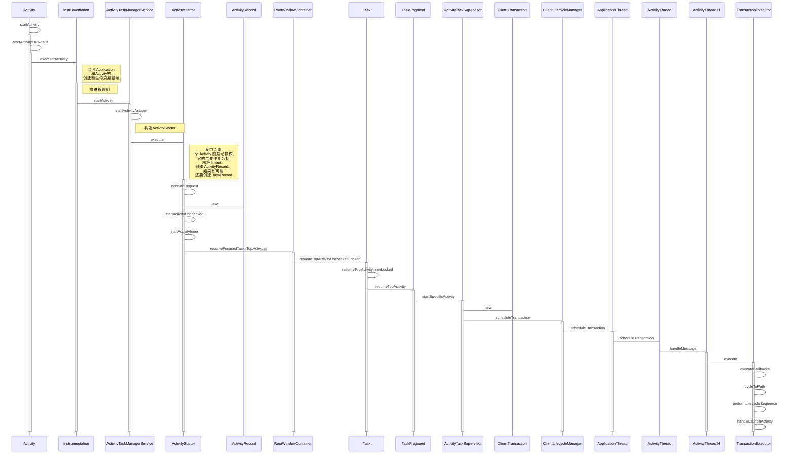
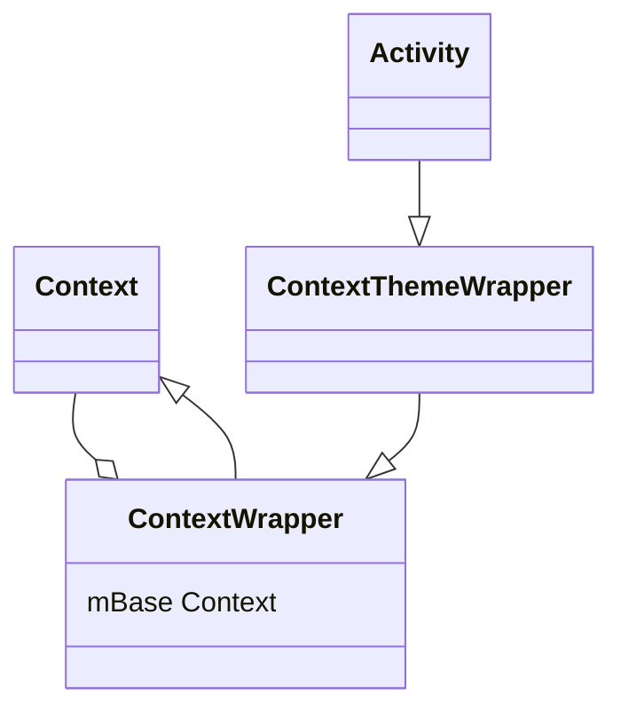
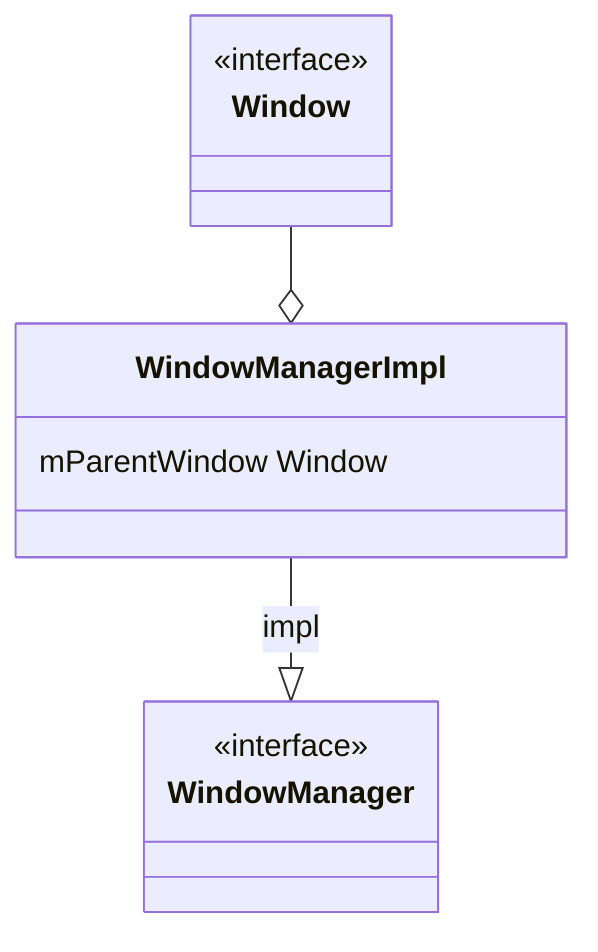
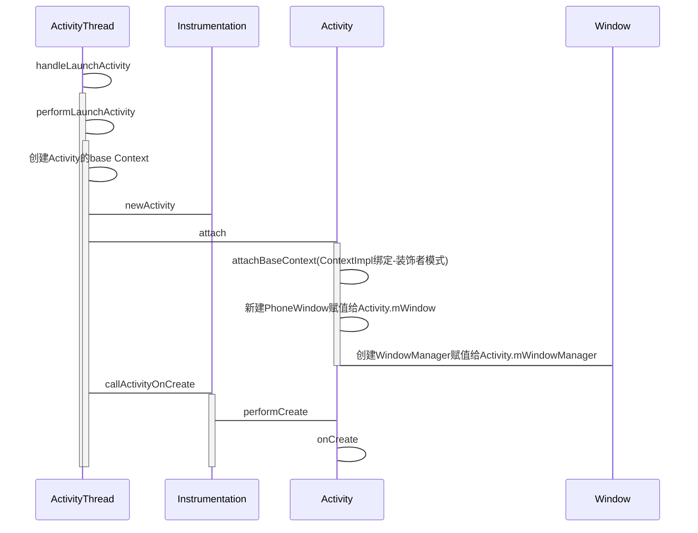
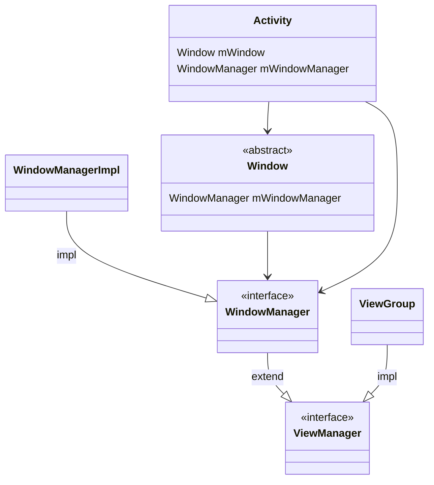
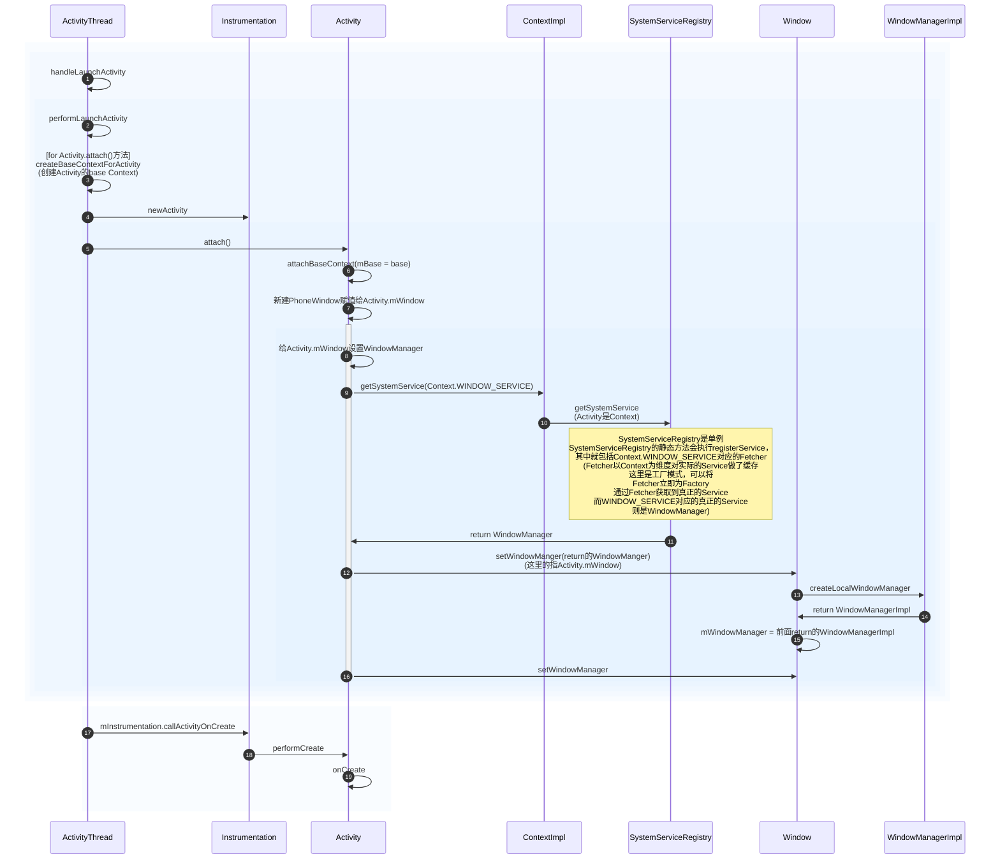

## window

```java
// frameworks/base/core/java/android/view/Window.java

/**
 * Abstract base class for a top-level window look and behavior policy.  An
 * instance of this class should be used as the top-level view added to the
 * window manager. It provides standard UI policies such as a background, title
 * area, default key processing, etc.
 *
 * <p>The framework will instantiate an implementation of this class on behalf of the application.
 */
public abstract class Window {
```

## PhoneWindow

```java
// frameworks/base/core/java/com/android/internal/policy/PhoneWindow.java

/**
 * Android-specific Window.
 * <p>
 * todo: need to pull the generic functionality out into a base class
 * in android.widget.
 *
 * @hide
 */
public class PhoneWindow extends Window implements MenuBuilder.Callback {
    ...
    // This is the top-level view of the window, containing the window decor.
    [1710064978] private DecorView mDecor;
    ...
```

Window的唯一实现类

## `[1710064978] private DecorView mDecor;`

```java
public class DecorView extends FrameLayout implements RootViewSurfaceTaker, WindowCallbacks {
```

继承自 `FrameLayout`

## `[1710065490] installDecor`

```java
// frameworks/base/core/java/com/android/internal/policy/PhoneWindow.java
    private void installDecor() {
        mForceDecorInstall = false;
        if (mDecor == null) {
            [1710065561] mDecor = generateDecor(-1);
            mDecor.setDescendantFocusability(ViewGroup.FOCUS_AFTER_DESCENDANTS);
            mDecor.setIsRootNamespace(true);
            if (!mInvalidatePanelMenuPosted && mInvalidatePanelMenuFeatures != 0) {
                mDecor.postOnAnimation(mInvalidatePanelMenuRunnable);
            }
        } else {
            mDecor.setWindow(this);
        }
        if (mContentParent == null) {
            [1710065911] mContentParent = generateLayout(mDecor);
            ...
```

## `[1710065561] mDecor = generateDecor(-1);`

```java
// frameworks/base/core/java/com/android/internal/policy/PhoneWindow.java
    protected DecorView generateDecor(int featureId) {
        ...
        return new DecorView(context, featureId, this, getAttributes());
    }
```

那么谁会调用 `[1710065490] installDecor`，调用处有多处，比如⬇️ [1710065801] setContentView


## `[1710065801] setContentView`

```java
// frameworks/base/core/java/com/android/internal/policy/PhoneWindow.java
    @Override
    public void setContentView(int layoutResID) {
        // Note: FEATURE_CONTENT_TRANSITIONS may be set in the process of installing the window
        // decor, when theme attributes and the like are crystalized. Do not check the feature
        // before this happens.
        [1710066153] if (mContentParent == null) {
            installDecor();
        } else if (!hasFeature(FEATURE_CONTENT_TRANSITIONS)) {
            mContentParent.removeAllViews();
        }

        if (hasFeature(FEATURE_CONTENT_TRANSITIONS)) {
            final Scene newScene = Scene.getSceneForLayout(mContentParent, layoutResID,
                    getContext());
            transitionTo(newScene);
        } else {
            mLayoutInflater.inflate(layoutResID, mContentParent);
        }
        mContentParent.requestApplyInsets();
        final Callback cb = getCallback();
        if (cb != null && !isDestroyed()) {
            cb.onContentChanged();
        }
        mContentParentExplicitlySet = true;
    }
```

`[1710066153] mContentParent` 为空，则会调用 `[1710065490] installDecork`

那么 `mContentParent` 由谁赋值

```java
// frameworks/base/core/java/com/android/internal/policy/PhoneWindow.java

    // This is the view in which the window contents are placed. It is either
    // mDecor itself, or a child of mDecor where the contents go.
    [1710066794] ViewGroup mContentParent;
```

## `[1710065911] mContentParent = generateLayout(mDecor);`

```java
// frameworks/base/core/java/com/android/internal/policy/PhoneWindow.java

    protected ViewGroup generateLayout(DecorView decor) {
        ...
                [1710066593] ViewGroup contentParent = (ViewGroup)findViewById(ID_ANDROID_CONTENT);

        [1710066603] return contentParent;
```

[1710066593]创建 `contentParent`，然后[1710066603]返回其作为返回值，也就是mContentParent

## `[1710066593] ViewGroup contentParent = (ViewGroup)findViewById(ID_ANDROID_CONTENT);`

```java
    @Nullable
    public <T extends View> T findViewById(@IdRes int id) {
        return [1710066709] getDecorView().findViewById(id);
    }
```

`[1710066709] getDecorView()`返回的实际上就是 `[1710064978] mDecor`，然后找到其中id为`content`的view

以上，也即是说 `[1710064978] mDecor`的创建会导致 `[1710066794] mContentParent` 的创建，所以 `[1710066153]`这里就可以用 `mContentParent` 为null作为是否需要 `[1710065490] installDecor`的判断。


## 总结以上





## ViewManager

Interface to let you add and remove child views to an Activity.

```java
/** Interface to let you add and remove child views to an Activity. To get an instance
  * of this class, call {@link android.content.Context#getSystemService(java.lang.String) Context.getSystemService()}.
  */
public interface ViewManager
{
    /**
     * Assign the passed LayoutParams to the passed View and add the view to the window.
     * <p>Throws {@link android.view.WindowManager.BadTokenException} for certain programming
     * errors, such as adding a second view to a window without removing the first view.
     * <p>Throws {@link android.view.WindowManager.InvalidDisplayException} if the window is on a
     * secondary {@link Display} and the specified display can't be found
     * (see {@link android.app.Presentation}).
     * @param view The view to be added to this window.
     * @param params The LayoutParams to assign to view.
     */
    public void addView(View view, ViewGroup.LayoutParams params);
    public void updateViewLayout(View view, ViewGroup.LayoutParams params);
    public void removeView(View view);
}
```

## WindowManager

The interface that apps use to talk to the window manager.

```java
/**
 * The interface that apps use to talk to the window manager.
 * <p>
 * Each window manager instance is bound to a {@link Display}. To obtain the
 * <code>WindowManager</code> associated with a display,
 * call {@link Context#createWindowContext(Display, int, Bundle)} to get the display's UI context,
 * then call {@link Context#getSystemService(String)} or {@link Context#getSystemService(Class)} on
 * the UI context.
 * <p>
 * The simplest way to show a window on a particular display is to create a {@link Presentation},
 * which automatically obtains a <code>WindowManager</code> and context for the display.
 */
@SystemService(Context.WINDOW_SERVICE)
public interface WindowManager extends ViewManager {
```

## WindowManagerImpl

```java
// android.view.WindowManagerImpl
public final class WindowManagerImpl implements WindowManager {
```

## [1710680968] startActivity

```java
// android.app.Activity
    @Override
    public void startActivity(Intent intent) {
        [1710681027] this.startActivity(intent, null);
    }
```

## [1710680968]#[1710681027] this.startActivity(intent, null);

```java
// android.app.Activity
    @Override
    public void startActivity(Intent intent, @Nullable Bundle options) {
        ..
            [1710681049] startActivityForResult(intent, -1);
```
## [1710681027]#[1710681049] startActivityForResult(intent, -1);

```java
    public void startActivityForResult(@RequiresPermission Intent intent, int requestCode,
            @Nullable Bundle options) {
            ...
            Instrumentation.ActivityResult ar =
                [1710684070] mInstrumentation.execStartActivity(
                    this, mMainThread.getApplicationThread(), mToken, this,
                    intent, requestCode, options);
```

## [1710681049]#[1710684070] mInstrumentation.execStartActivity(

```java
// android.app.ActivityTaskManager
    public ActivityResult execStartActivity(
            Context who, IBinder contextThread, IBinder token, Activity target,
            Intent intent, int requestCode, Bundle options) {
        IApplicationThread whoThread = (IApplicationThread) contextThread;
        Uri referrer = target != null ? target.onProvideReferrer() : null;
        if (referrer != null) {
            intent.putExtra(Intent.EXTRA_REFERRER, referrer);
        }
        if (mActivityMonitors != null) {
            synchronized (mSync) {
                final int N = mActivityMonitors.size();
                for (int i=0; i<N; i++) {
                    final ActivityMonitor am = mActivityMonitors.get(i);
                    ActivityResult result = null;
                    if (am.ignoreMatchingSpecificIntents()) {
                        if (options == null) {
                            options = ActivityOptions.makeBasic().toBundle();
                        }
                        result = am.onStartActivity(who, intent, options);
                    }
                    if (result != null) {
                        am.mHits++;
                        return result;
                    } else if (am.match(who, null, intent)) {
                        am.mHits++;
                        if (am.isBlocking()) {
                            return requestCode >= 0 ? am.getResult() : null;
                        }
                        break;
                    }
                }
            }
        }
        try {
            intent.migrateExtraStreamToClipData(who);
            intent.prepareToLeaveProcess(who);
            int result = ActivityTaskManager.[1710684185]getService().[1710684660]startActivity(whoThread,
                    who.getOpPackageName(), who.getAttributionTag(), intent,
                    intent.resolveTypeIfNeeded(who.getContentResolver()), token,
                    target != null ? target.mEmbeddedID : null, requestCode, 0, null, options);
            checkStartActivityResult(result, intent);
        } catch (RemoteException e) {
            throw new RuntimeException("Failure from system", e);
        }
        return null;
    }
```

## [1710684070]#[1710684185]getService()

```java
// android.app.ActivityTaskManager
    public static IActivityTaskManager getService() {
        return [1710684283]IActivityTaskManagerSingleton.[1710684319]get();
    }
```

## [1710684185]#[1710684283]IActivityTaskManagerSingleton

```java
    @UnsupportedAppUsage(trackingBug = 129726065)
    private static final Singleton<IActivityTaskManager> IActivityTaskManagerSingleton =
            new Singleton<IActivityTaskManager>() {
                @Override
                protected IActivityTaskManager create() {
                    final IBinder b = ServiceManager.getService(Context.ACTIVITY_TASK_SERVICE);
                    return [1710684357] IActivityTaskManager.Stub.asInterface(b);
                }
            };
```

## [1710684357]#[1710684283] IActivityTaskManager.Stub.asInterface(b);

## [1710684283]#[1710684660]startActivity(whoThread,

夸进程调用

// android.server.wm.ActivityTaskManagerService

```java
    @Override
    public final int startActivity(IApplicationThread caller, String callingPackage,
            String callingFeatureId, Intent intent, String resolvedType, IBinder resultTo,
            String resultWho, int requestCode, int startFlags, ProfilerInfo profilerInfo,
            Bundle bOptions) {
        return [1710684705] startActivityAsUser(caller, callingPackage, callingFeatureId, intent, resolvedType,
                resultTo, resultWho, requestCode, startFlags, profilerInfo, bOptions,
                UserHandle.getCallingUserId());
    }
```

## [1710684660]#[1710684705] startActivityAsUser(caller, callingPackage, callingFeatureId, intent, resolvedType,

```java
    @Override
    public int startActivityAsUser(IApplicationThread caller, String callingPackage,
            String callingFeatureId, Intent intent, String resolvedType, IBinder resultTo,
            String resultWho, int requestCode, int startFlags, ProfilerInfo profilerInfo,
            Bundle bOptions, int userId) {
        return [1710684754] startActivityAsUser(caller, callingPackage, callingFeatureId, intent, resolvedType,
                resultTo, resultWho, requestCode, startFlags, profilerInfo, bOptions, userId,
                true /*validateIncomingUser*/);
    }
```

## [1710684705]#[1710684754] startActivityAsUser(caller, callingPackage, callingFeatureId, intent, resolvedType,

```java
    private int startActivityAsUser(IApplicationThread caller, String callingPackage,
            @Nullable String callingFeatureId, Intent intent, String resolvedType,
            IBinder resultTo, String resultWho, int requestCode, int startFlags,
            ProfilerInfo profilerInfo, Bundle bOptions, int userId, boolean validateIncomingUser) {
        assertPackageMatchesCallingUid(callingPackage);
        enforceNotIsolatedCaller("startActivityAsUser");
        if (Process.isSdkSandboxUid(Binder.getCallingUid())) {
            SdkSandboxManagerLocal sdkSandboxManagerLocal = LocalManagerRegistry.getManager(
                    SdkSandboxManagerLocal.class);
            if (sdkSandboxManagerLocal == null) {
                throw new IllegalStateException("SdkSandboxManagerLocal not found when starting"
                        + " an activity from an SDK sandbox uid.");
            }
            sdkSandboxManagerLocal.enforceAllowedToStartActivity(intent);
        }

        userId = getActivityStartController().checkTargetUser(userId, validateIncomingUser,
                Binder.getCallingPid(), Binder.getCallingUid(), "startActivityAsUser");

        // TODO: Switch to user app stacks here.
        return getActivityStartController().obtainStarter(intent, "startActivityAsUser")
                .setCaller(caller)
                .setCallingPackage(callingPackage)
                .setCallingFeatureId(callingFeatureId)
                .setResolvedType(resolvedType)
                .setResultTo(resultTo)
                .setResultWho(resultWho)
                .setRequestCode(requestCode)
                .setStartFlags(startFlags)
                .setProfilerInfo(profilerInfo)
                .setActivityOptions(bOptions)
                .setUserId(userId)
                .[1710685003]execute();

    }
```

## [1710684754]#[1710685003]execute()

```java
// android.server.wm.ActivityStarter
    int execute() {
        try {
            // Refuse possible leaked file descriptors
            if (mRequest.intent != null && mRequest.intent.hasFileDescriptors()) {
                throw new IllegalArgumentException("File descriptors passed in Intent");
            }

            final LaunchingState launchingState;
            synchronized (mService.mGlobalLock) {
                final ActivityRecord caller = ActivityRecord.forTokenLocked(mRequest.resultTo);
                final int callingUid = mRequest.realCallingUid == Request.DEFAULT_REAL_CALLING_UID
                        ?  Binder.getCallingUid() : mRequest.realCallingUid;
                launchingState = mSupervisor.getActivityMetricsLogger().notifyActivityLaunching(
                        mRequest.intent, caller, callingUid);
            }

            // If the caller hasn't already resolved the activity, we're willing
            // to do so here. If the caller is already holding the WM lock here,
            // and we need to check dynamic Uri permissions, then we're forced
            // to assume those permissions are denied to avoid deadlocking.
            if (mRequest.activityInfo == null) {
                mRequest.resolveActivity(mSupervisor);
            }

            // Add checkpoint for this shutdown or reboot attempt, so we can record the original
            // intent action and package name.
            if (mRequest.intent != null) {
                String intentAction = mRequest.intent.getAction();
                String callingPackage = mRequest.callingPackage;
                if (intentAction != null && callingPackage != null
                        && (Intent.ACTION_REQUEST_SHUTDOWN.equals(intentAction)
                                || Intent.ACTION_SHUTDOWN.equals(intentAction)
                                || Intent.ACTION_REBOOT.equals(intentAction))) {
                    ShutdownCheckPoints.recordCheckPoint(intentAction, callingPackage, null);
                }
            }

            int res;
            synchronized (mService.mGlobalLock) {
                final boolean globalConfigWillChange = mRequest.globalConfig != null
                        && mService.getGlobalConfiguration().diff(mRequest.globalConfig) != 0;
                final Task rootTask = mRootWindowContainer.getTopDisplayFocusedRootTask();
                if (rootTask != null) {
                    rootTask.mConfigWillChange = globalConfigWillChange;
                }
                ProtoLog.v(WM_DEBUG_CONFIGURATION, "Starting activity when config "
                        + "will change = %b", globalConfigWillChange);

                final long origId = Binder.clearCallingIdentity();

                res = resolveToHeavyWeightSwitcherIfNeeded();
                if (res != START_SUCCESS) {
                    return res;
                }
                [1710685731] res = executeRequest(mRequest);

                Binder.restoreCallingIdentity(origId);

                if (globalConfigWillChange) {
                    // If the caller also wants to switch to a new configuration, do so now.
                    // This allows a clean switch, as we are waiting for the current activity
                    // to pause (so we will not destroy it), and have not yet started the
                    // next activity.
                    mService.mAmInternal.enforceCallingPermission(
                            android.Manifest.permission.CHANGE_CONFIGURATION,
                            "updateConfiguration()");
                    if (rootTask != null) {
                        rootTask.mConfigWillChange = false;
                    }
                    ProtoLog.v(WM_DEBUG_CONFIGURATION,
                                "Updating to new configuration after starting activity.");

                    mService.updateConfigurationLocked(mRequest.globalConfig, null, false);
                }

                // The original options may have additional info about metrics. The mOptions is not
                // used here because it may be cleared in setTargetRootTaskIfNeeded.
                final ActivityOptions originalOptions = mRequest.activityOptions != null
                        ? mRequest.activityOptions.getOriginalOptions() : null;
                // If the new record is the one that started, a new activity has created.
                final boolean newActivityCreated = mStartActivity == mLastStartActivityRecord;
                // Notify ActivityMetricsLogger that the activity has launched.
                // ActivityMetricsLogger will then wait for the windows to be drawn and populate
                // WaitResult.
                mSupervisor.getActivityMetricsLogger().notifyActivityLaunched(launchingState, res,
                        newActivityCreated, mLastStartActivityRecord, originalOptions);
                if (mRequest.waitResult != null) {
                    mRequest.waitResult.result = res;
                    res = waitResultIfNeeded(mRequest.waitResult, mLastStartActivityRecord,
                            launchingState);
                }
                return getExternalResult(res);
            }
        } finally {
            onExecutionComplete();
        }
    }
```

## [1710685003]#[1710685731] res = executeRequest(mRequest);

```java
// android.server.wm.ActivityStarter
    private int executeRequest(Request request) {
        ...
        [1710685907] final ActivityRecord r = new ActivityRecord.Builder(mService)
                .setCaller(callerApp)
                .setLaunchedFromPid(callingPid)
                .setLaunchedFromUid(callingUid)
                .setLaunchedFromPackage(callingPackage)
                .setLaunchedFromFeature(callingFeatureId)
                .setIntent(intent)
                .setResolvedType(resolvedType)
                .setActivityInfo(aInfo)
                .setConfiguration(mService.getGlobalConfiguration())
                .setResultTo(resultRecord)
                .setResultWho(resultWho)
                .setRequestCode(requestCode)
                .setComponentSpecified(request.componentSpecified)
                .setRootVoiceInteraction(voiceSession != null)
                .setActivityOptions(checkedOptions)
                .setSourceRecord(sourceRecord)
                .build();
        ...
        mLastStartActivityResult = [1710685981] startActivityUnchecked(r, sourceRecord, voiceSession,
                request.voiceInteractor, startFlags, true /* doResume */, checkedOptions,
                inTask, inTaskFragment, restrictedBgActivity, intentGrants);

```

## [1710685731]#[1710685907] final ActivityRecord r = new ActivityRecord.Builder(mService)

创建 `ActivityRecord`，记录 `Activity` 的关键信息

## [1710685731]#[1710685981] startActivityUnchecked(r, sourceRecord, voiceSession,

```java
// android.server.wm.ActivityStarter
    private int startActivityUnchecked(final ActivityRecord r, ActivityRecord sourceRecord,
            IVoiceInteractionSession voiceSession, IVoiceInteractor voiceInteractor,
            int startFlags, boolean doResume, ActivityOptions options, Task inTask,
            TaskFragment inTaskFragment, boolean restrictedBgActivity,
            NeededUriGrants intentGrants) {
        ...
            result = [1710686083] startActivityInner(r, sourceRecord, voiceSession, voiceInteractor,
                    startFlags, doResume, options, inTask, inTaskFragment, restrictedBgActivity,
                    intentGrants);
        ...
    }
```

## [1710685981]#[1710686083] startActivityInner(r, sourceRecord, voiceSession, voiceInteractor,

```java
// android.server.wm.ActivityStarter
    int startActivityInner(final ActivityRecord r, ActivityRecord sourceRecord,
            IVoiceInteractionSession voiceSession, IVoiceInteractor voiceInteractor,
            int startFlags, boolean doResume, ActivityOptions options, Task inTask,
            TaskFragment inTaskFragment, boolean restrictedBgActivity,
            NeededUriGrants intentGrants) {
            ...
                [1710686250] mRootWindowContainer.resumeFocusedTasksTopActivities(
                        mTargetRootTask, mStartActivity, mOptions, mTransientLaunch);
```

## [1710686083]#[1710686250] mRootWindowContainer.resumeFocusedTasksTopActivities(

```java
// android.server.wm.RootWindowContainer
    boolean resumeFocusedTasksTopActivities(
            Task targetRootTask, ActivityRecord target, ActivityOptions targetOptions,
            boolean deferPause) {
                ...
                    result |= [1710686434] focusedRoot.resumeTopActivityUncheckedLocked(target, targetOptions);
```

## [1710686250]#[1710686434] focusedRoot.resumeTopActivityUncheckedLocked(target, targetOptions);

```java
// android.server.wm.Task
    boolean resumeTopActivityUncheckedLocked(ActivityRecord prev, ActivityOptions options) {
        return [1710686479] resumeTopActivityUncheckedLocked(prev, options, false /* skipPause */);
    }
```

## [1710686434]#[1710686479] resumeTopActivityUncheckedLocked(prev, options, false /* skipPause */);

```java
// android.server.wm.Task
    boolean resumeTopActivityUncheckedLocked(ActivityRecord prev, ActivityOptions options,
            boolean deferPause) {
        ...
                            someActivityResumed = [1710686767]resumeTopActivityInnerLocked(prev, options, deferPause);
```

## [1710686479]#[1710686767]resumeTopActivityInnerLocked(prev, options, deferPause);

```java
// android.server.wm.Task
    private boolean resumeTopActivityInnerLocked(ActivityRecord prev, ActivityOptions options,
            boolean deferPause) {
            ...
            resumed[0] |= [1710686819]f.resumeTopActivity(prev, options, deferPause);
    }
```

## [1710686767]#[1710686819]f.resumeTopActivity(prev, options, deferPause);

```java
// android.server.wm.TaskFragment
    final boolean resumeTopActivity(ActivityRecord prev, ActivityOptions options,
            boolean deferPause) {
            ...
            [1710686992]mTaskSupervisor.startSpecificActivity(next, true, true);

```

## [1710686819]#[1710686992]mTaskSupervisor.startSpecificActivity(next, true, true);

```java
// android.server.wm.ActivityTaskSupervisor
    void startSpecificActivity(ActivityRecord r, boolean andResume, boolean checkConfig) {
        // Is this activity's application already running?
        ...
                [1710687088]realStartActivityLocked(r, wpc, andResume, checkConfig);
```

## [1710686992]#[1710687088]realStartActivityLocked(r, wpc, andResume, checkConfig);

```java
// android.server.wm.ActivityTaskSupervisor
    boolean realStartActivityLocked(ActivityRecord r, WindowProcessController proc,
            boolean andResume, boolean checkConfig) throws RemoteException {
                ...
                // Create activity launch transaction.
                [1710687197] final ClientTransaction clientTransaction = ClientTransaction.obtain(
                        proc.getThread(), r.token);
                ...
                [1710687306] mService.getLifecycleManager().scheduleTransaction(clientTransaction);


```

## [1710687088]#[1710687197] final ClientTransaction clientTransaction = ClientTransaction.obtain(

创建启动 Activity 的事务

## [1710687088]#[1710687306] mService.getLifecycleManager().scheduleTransaction(clientTransaction);

```java
// android.server.wm.ActivityTaskManagerService
    ClientLifecycleManager getLifecycleManager() {
        return mLifecycleManager;
    }
```

```java
// android.server.wm.ClientLifecycleManager
    void scheduleTransaction(ClientTransaction transaction) throws RemoteException {
        final IApplicationThread client = transaction.getClient();
        [1710687541] transaction.schedule();
        if (!(client instanceof Binder)) {
            // If client is not an instance of Binder - it's a remote call and at this point it is
            // safe to recycle the object. All objects used for local calls will be recycled after
            // the transaction is executed on client in ActivityThread.
            transaction.recycle();
        }
    }
```

## [1710687306]#[1710687541] transaction.schedule();

```java
// android.app.servertransaction.ClientTransaction
    public void schedule() throws RemoteException {
        [1710687621]mClient.scheduleTransaction(this);
    }
```

## [1710687541]#[1710687621]mClient.scheduleTransaction(this);

通过夸进程调用回到客户端

```java
// android.app.ActivityThread.ApplicationThread
        public void scheduleTransaction(ClientTransaction transaction) throws RemoteException {
            [1710687752] ActivityThread.this.scheduleTransaction(transaction);
        }
```

## [1710687621]#[1710687752] ActivityThread.this.scheduleTransaction(transaction);

由 ActivityThread 的父类 ClientTransactionHandler 实现

```java
// android.app.ClientTransactionHandler
    void scheduleTransaction(ClientTransaction transaction) {
        transaction.preExecute(this);
        [1710688032] sendMessage(ActivityThread.H.EXECUTE_TRANSACTION, transaction);
    }
```

## [1710687752]#[1710688032] sendMessage(ActivityThread.H.EXECUTE_TRANSACTION, transaction);

```java
// android.app.ActivityThread
    void sendMessage(int what, Object obj) {
        sendMessage(what, obj, 0, 0, false);
    }

    private void sendMessage(int what, Object obj, int arg1) {
        sendMessage(what, obj, arg1, 0, false);
    }

    private void sendMessage(int what, Object obj, int arg1, int arg2) {
        sendMessage(what, obj, arg1, arg2, false);
    }

    private void sendMessage(int what, Object obj, int arg1, int arg2, boolean async) {
        if (DEBUG_MESSAGES) {
            Slog.v(TAG,
                    "SCHEDULE " + what + " " + mH.codeToString(what) + ": " + arg1 + " / " + obj);
        }
        Message msg = Message.obtain();
        msg.what = what;
        msg.obj = obj;
        msg.arg1 = arg1;
        msg.arg2 = arg2;
        if (async) {
            msg.setAsynchronous(true);
        }
        [1710688095]mH.sendMessage(msg);
    }

```

## [1710688032]#[1710688095]mH.sendMessage(msg);

mH是个handler，直接看如果处理 message

```java
// android.app.ActivityThread.H
    class H extends Handler {
        ...
            public void handleMessage(Message msg) {
                ...
                case EXECUTE_TRANSACTION:
                    final ClientTransaction transaction = (ClientTransaction) msg.obj;
                    [1710688254] mTransactionExecutor.execute(transaction);
                    if (isSystem()) {
                        // Client transactions inside system process are recycled on the client side
                        // instead of ClientLifecycleManager to avoid being cleared before this
                        // message is handled.
                        transaction.recycle();
                    }
                    // TODO(lifecycler): Recycle locally scheduled transactions.
                    break;

```

## [1710688095]#[1710688254] mTransactionExecutor.execute(transaction);

```java

```

## 总结以上



## [1710583837] handleRelaunchActivity

```java
    public Activity handleLaunchActivity(ActivityClientRecord r,
            PendingTransactionActions pendingActions, Intent customIntent) {
        ...
        [1710583987] WindowManagerGlobal.initialize();
        ...
        [1710583914] final Activity a = performLaunchActivity(r, customIntent);

        if (a != null) {
            r.createdConfig = new Configuration(mConfigurationController.getConfiguration());
            reportSizeConfigurations(r);
            if (!r.activity.mFinished && pendingActions != null) {
                pendingActions.setOldState(r.state);
                pendingActions.setRestoreInstanceState(true);
                pendingActions.setCallOnPostCreate(true);
            }
        } else {
            // If there was an error, for any reason, tell the activity manager to stop us.
            ActivityClient.getInstance().finishActivity(r.token, Activity.RESULT_CANCELED,
                    null /* resultData */, Activity.DONT_FINISH_TASK_WITH_ACTIVITY);
        }

        return a;
    }
```

## [1710583837]#[1710583987] WindowManagerGlobal.initialize();

```java
// android.view.WindowManager
public final class WindowManagerGlobal {
    ...
    @UnsupportedAppUsage
    public static void initialize() {
        [1710584110] getWindowManagerService();
    }
```

## [1710583987]#[1710584110] getWindowManagerService();

```java
// android.view.WindowManager
    @UnsupportedAppUsage
    public static IWindowManager getWindowManagerService() {
        synchronized (WindowManagerGlobal.class) {
                [1710584184] sWindowManagerService = IWindowManager.Stub.asInterface(
                        ServiceManager.getService("window"));
                        ...
            return sWindowManagerService;
        }
    }
```

## [1710584110]#[1710584184] sWindowManagerService = IWindowManager.Stub.asInterface(

将 `sWindowManagerService` 作为 `WindowManagerGlobal` 的静态变量保存

```java
// android.view.WindowManagerGlobal
    private static IWindowManager sWindowManagerService;
```

## [1710583837]#[1710583914] final Activity a = performLaunchActivity(r, customIntent);

创建`Activity`，

```java
// android.app.ActivityThread
    /**  Core implementation of activity launch. */
    private Activity performLaunchActivity(ActivityClientRecord r, Intent customIntent) {
        ...
        [1710592951] ContextImpl appContext = createBaseContextForActivity(r);
        ...
            [1710584434] activity = mInstrumentation.newActivity(
                    cl, component.getClassName(), r.intent);
                ...
                [1710584653] activity.attach(appContext, this, getInstrumentation(), r.token,
                        r.ident, app, r.intent, r.activityInfo, title, r.parent,
                        r.embeddedID, r.lastNonConfigurationInstances, config,
                        r.referrer, r.voiceInteractor, window, r.activityConfigCallback,
                        r.assistToken, r.shareableActivityToken);
                ...
                   [1710680290] mInstrumentation.callActivityOnCreate(activity, r.state, r.persistentState);
        ...
        return activity;
    }
```

## [1710583914]#[1710592951] ContextImpl appContext = createBaseContextForActivity(r);

```java
// android.app.ActivityThread
    private ContextImpl createBaseContextForActivity(ActivityClientRecord r) {
        final int displayId = ActivityClient.getInstance().getDisplayId(r.token);
        [1710593100] ContextImpl appContext = ContextImpl.createActivityContext(
                this, r.packageInfo, r.activityInfo, r.token, displayId, r.overrideConfig);
        ...
        return appContext;
    }
```
## [1710592951]#[1710593100] ContextImpl appContext = ContextImpl.createActivityContext(

```java
// android.app.ContextImpl
    static ContextImpl createActivityContext(ActivityThread mainThread,
            LoadedApk packageInfo, ActivityInfo activityInfo, IBinder activityToken, int displayId,
            Configuration overrideConfiguration) {
        ...
        [1710596093] ContextImpl context = new ContextImpl(null, mainThread, packageInfo, ContextParams.EMPTY,
                attributionTag, null, activityInfo.splitName, activityToken, null, 0, classLoader,
                null);

```

`[1710596093] ContextImpl context = new ContextImpl` 这里新建一个 `ContextImpl`

## [1710583914]#[1710584434] activity = mInstrumentation.newActivity(

```java
// android.app.Instrumentation
    public Activity newActivity(ClassLoader cl, String className,
            Intent intent)
            throws InstantiationException, IllegalAccessException,
            ClassNotFoundException {
        String pkg = intent != null && intent.getComponent() != null
                ? intent.getComponent().getPackageName() : null;
        return [1710584537] getFactory(pkg).instantiateActivity(cl, className, intent);
    }
```

```java
// android.app.AppComponentFactory
    public @NonNull Activity instantiateActivity(@NonNull ClassLoader cl, @NonNull String className,
            @Nullable Intent intent)
            throws InstantiationException, IllegalAccessException, ClassNotFoundException {
        return (Activity) cl.loadClass(className).newInstance();
    }
```

通过 `ClassLoader` 加载 `Activity`

## [1710583914]#[1710584653] activity.attach(appContext, this, getInstrumentation(), r.token,

```java
// android.app.Activity
    final void attach(Context context, ActivityThread aThread,
            Instrumentation instr, IBinder token, int ident,
            Application application, Intent intent, ActivityInfo info,
            CharSequence title, Activity parent, String id,
            NonConfigurationInstances lastNonConfigurationInstances,
            Configuration config, String referrer, IVoiceInteractor voiceInteractor,
            Window window, ActivityConfigCallback activityConfigCallback, IBinder assistToken,
            IBinder shareableActivityToken) {
        [1710661255] attachBaseContext(context);
        ...
        [1710584779] mWindow = new PhoneWindow(this, window, activityConfigCallback);
        ...
        [1710591610] mWindow.setWindowManager(
                [1710591904] (WindowManager)context.getSystemService([1710595218]Context.WINDOW_SERVICE),
                mToken, mComponent.flattenToString(),
                (info.flags & ActivityInfo.FLAG_HARDWARE_ACCELERATED) != 0);
        if (mParent != null) {
            mWindow.setContainer(mParent.getWindow());
        }
        [1710596714] mWindowManager = mWindow.getWindowManager();
        mCurrentConfig = config;

        mWindow.setColorMode(info.colorMode);
        mWindow.setPreferMinimalPostProcessing(
                (info.flags & ActivityInfo.FLAG_PREFER_MINIMAL_POST_PROCESSING) != 0);

        getAutofillClientController().onActivityAttached(application);
        setContentCaptureOptions(application.getContentCaptureOptions());
    }

```

```java
// android.app.Activity
    @UnsupportedAppUsage
    [1710596612] private Window mWindow;
```

```java
// android.app.Activity
    @UnsupportedAppUsage
    [1710596656] private WindowManager mWindowManager;
```

## [1710584653]#[1710661255] attachBaseContext(context);

给 `Activity` 设置 `mBase`(base context)

```java
// android.app.Activity
    @Override
    protected void attachBaseContext(Context newBase) {
        [1710661335] super.attachBaseContext(newBase);
        ...
```
## [1710661255]#[1710661335] super.attachBaseContext(newBase);

```java
// android.view.ContextThemeWrapper
    @Override
    protected void attachBaseContext(Context newBase) {
        [1710661397] super.attachBaseContext(newBase);
    }
```

## [1710661335]#[1710661397] super.attachBaseContext(newBase);

Set the base context for this ContextWrapper.  All calls will then be delegated to the base context.

```java
// android.content.ContextWrapper
    protected void attachBaseContext(Context base) {
        if (mBase != null) {
            throw new IllegalStateException("Base context already set");
        }
        mBase = base;
    }
```

所以 `ContextWrapper`是什么

## [1710661397]#[1710662024] ContextWrapper

Proxying implementation of Context that simply delegates all of its calls to another Context

```java
public class ContextWrapper extends Context {
```



## [1710591904] (WindowManager)context.getSystemService(Context.WINDOW_SERVICE),

`context` 来自 `[1710596093]`，也就是 `Activity.mBase (Context)`(see [1710661255])

```java
// frameworks/base/core/java/android/app/ContextImpl.java
    @Override
    public Object getSystemService(String name) {
        ...
        return [1710594900] SystemServiceRegistry.getSystemService(this, name);
    }
```

## [1710591904]#[1710594900] SystemServiceRegistry.getSystemService(this, name)

```java
    /**
     * Gets a system service from a given context.
     * @hide
     */
    public static Object getSystemService(ContextImpl ctx, String name) {
        ..
        final ServiceFetcher<?> fetcher = [1710595007] SYSTEM_SERVICE_FETCHERS.get(name);
        ..
        final Object ret = fetcher.getService(ctx);
        ..
        return ret;
    }
```

从 `[1710595007] SYSTEM_SERVICE_FETCHERS` 中获取先前通过 `[1710592455] registerService` 注册的 fetcher,也就是个 Factory，使用其创建 `Service`, 而对于传入的 Key(`[1710595218]Context.WINDOW_SERVICE`)，返回的 Fetcher 会创建 `[1710595130] WindowManagerImpl(ctx)`, 也就是 `WindowManager` 的实现类

## [1710594900]#[1710592317] SystemServiceRegistry

Manages all of the system services that can be returned by {@link Context#getSystemService}

```java
// android.app.SystemServiceRegistry
public final class SystemServiceRegistry {
    static {
        ...
        [1710592455] registerService(Context.WINDOW_SERVICE, WindowManager.class,
                new CachedServiceFetcher<WindowManager>() {
            @Override
            public WindowManager createService(ContextImpl ctx) {
                return new [1710595130] WindowManagerImpl(ctx);
            }});
```

## [1710592317]#[1710592455] registerService(Context.WINDOW_SERVICE, WindowManager.class,

```java
// android.app.SystemServiceRegistry
    private static <T> void registerService(@NonNull String serviceName,
            @NonNull Class<T> serviceClass, @NonNull ServiceFetcher<T> serviceFetcher) {
        SYSTEM_SERVICE_NAMES.put(serviceClass, serviceName);
        SYSTEM_SERVICE_FETCHERS.put(serviceName, serviceFetcher);
        SYSTEM_SERVICE_CLASS_NAMES.put(serviceName, serviceClass.getSimpleName());
    }

```

## [1710584653]#[1710584779] mWindow = new PhoneWindow(this, window, activityConfigCallback);

在当前 `Activity` 创建 `Window`，并且赋值给 `Activity.mWindow`

```java
// android.app.Activity
    @UnsupportedAppUsage
    private Window mWindow;
```

## [1710584653]#[1710591610] mWindow.setWindowManager(

为 `Window` 设置 `WindowManager`

此时 `mWindow` 就是 `Activity.mWindow`(see [1710662024])，

```java
// android.view.Window
    public void setWindowManager(WindowManager wm, IBinder appToken, String appName,
            boolean hardwareAccelerated) {
        ...
        [1710596387] mWindowManager = ((WindowManagerImpl)wm).createLocalWindowManager(this);
    }
```

```java
// android.view.Window
    @UnsupportedAppUsage(maxTargetSdk = Build.VERSION_CODES.P, trackingBug = 115609023)
    [1710596791] private WindowManager mWindowManager;
```
给 Window#`[1710596791] private WindowManager mWindowManager;` 赋值

## [1710591610]#[1710596387] mWindowManager = ((WindowManagerImpl)wm).createLocalWindowManager(this);

```java
// android.view.WindowManagerImpl
    public WindowManagerImpl createLocalWindowManager(Window parentWindow) {
        return new WindowManagerImpl(mContext, parentWindow, mWindowContextToken);
    }
```

```java
    private WindowManagerImpl(Context context, Window parentWindow,
            @Nullable IBinder windowContextToken) {
        mContext = context;
        mParentWindow = parentWindow;
        mWindowContextToken = windowContextToken;
    }
```



## [1710584653]#[1710596714] mWindowManager = mWindow.getWindowManager();

给 `[1710596656] private WindowManager mWindowManager;` 赋值

```java
// android.view.window
    @UnsupportedAppUsage(maxTargetSdk = Build.VERSION_CODES.P, trackingBug = 115609023)
    private WindowManager mWindowManager;

    ...

    public WindowManager getWindowManager() {
        return mWindowManager;
    }
```

## [1710583837]#[1710680290] mInstrumentation.callActivityOnCreate(activity, r.state, r.persistentState);


`mWindowManager` 在 `[1710591610]` -> `[1710596387]` 处赋值

## 总结以上





## 总结




## 参考

- [Android窗口机制（一）初识Android的窗口结构](https://www.jianshu.com/p/40a9c93b5a8d)
- [Android -- Activity启动过程中的上下文环境初始化分析](https://blog.csdn.net/csdn_of_coder/article/details/78147399)
- [Android 11源码分析： Activity的启动流程](https://juejin.cn/post/6994823348190445604#heading-1)