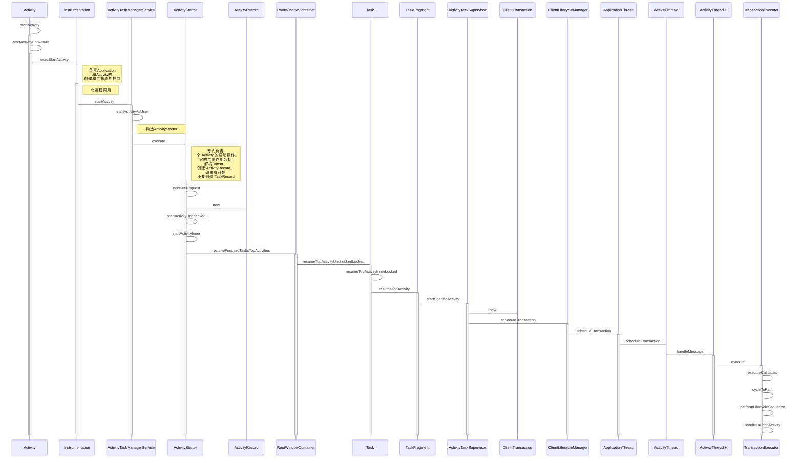
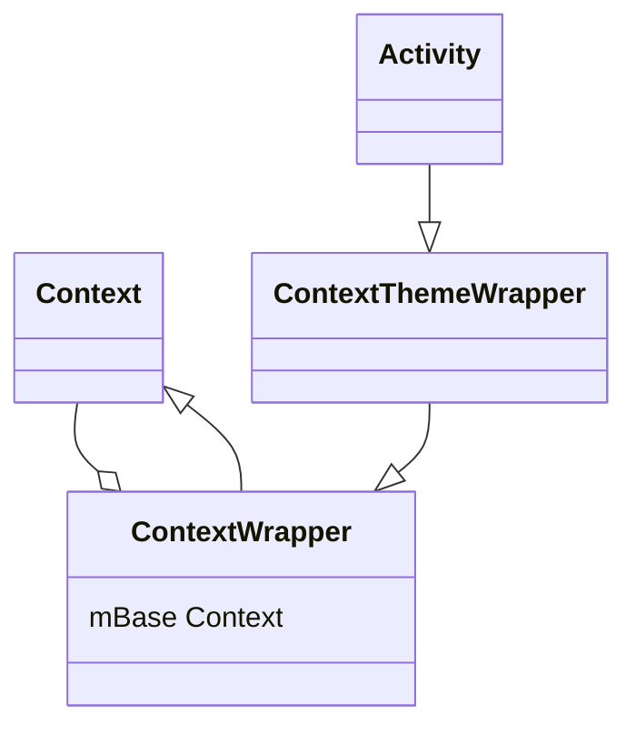
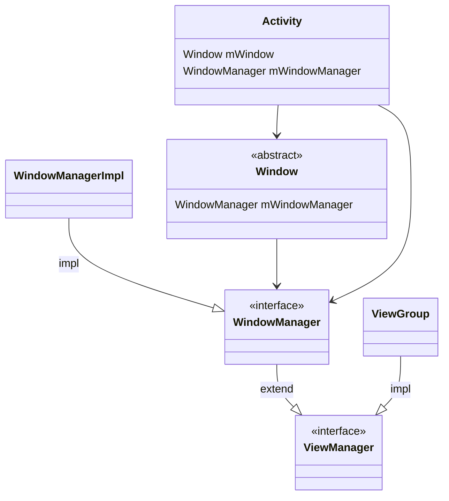
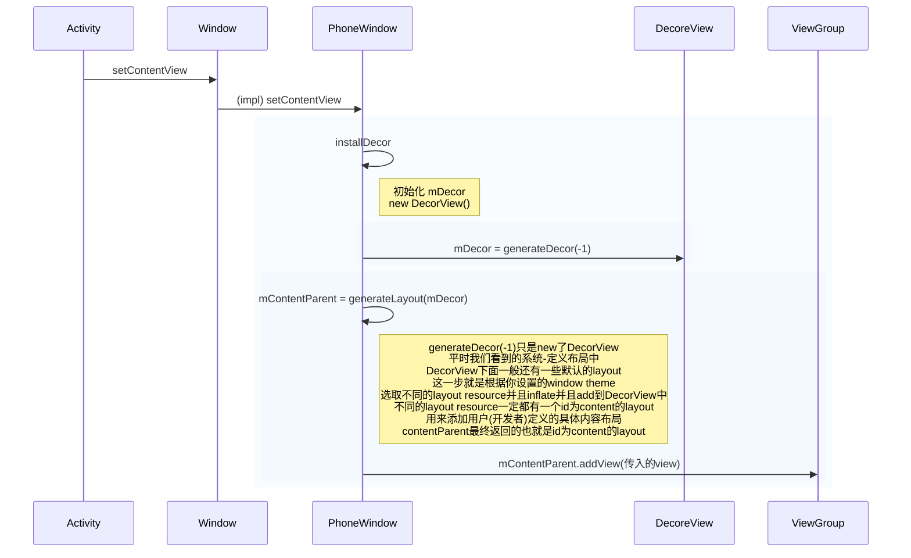
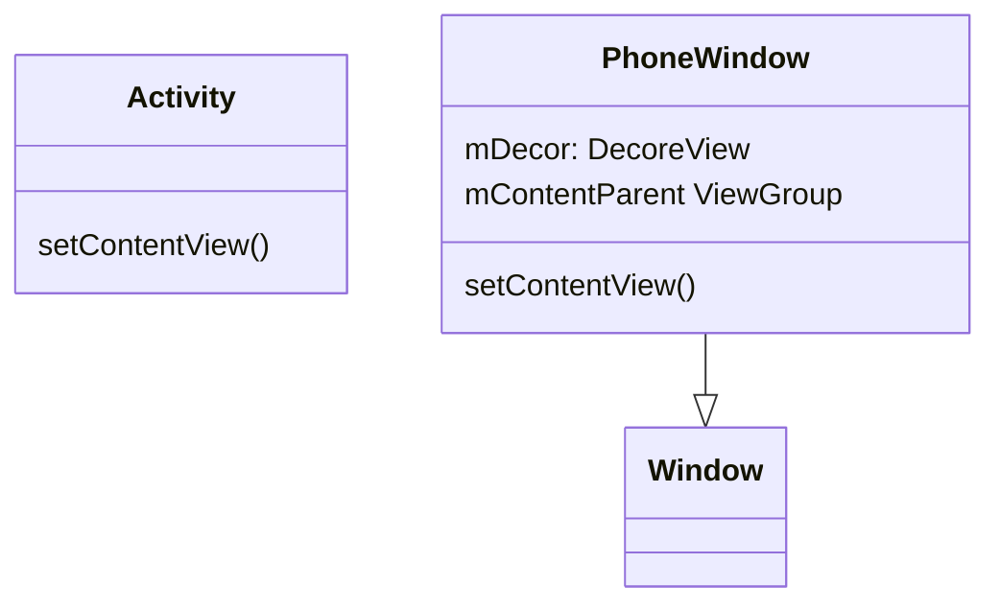

## startActivity

## handleLaunchActivity

## setContentView

## 参考

- [Android窗口机制（一）初识Android的窗口结构](https://www.jianshu.com/p/40a9c93b5a8d)
- [Android -- Activity启动过程中的上下文环境初始化分析](https://blog.csdn.net/csdn_of_coder/article/details/78147399)
- [Android 11源码分析： Activity的启动流程](https://juejin.cn/post/6994823348190445604#heading-1)