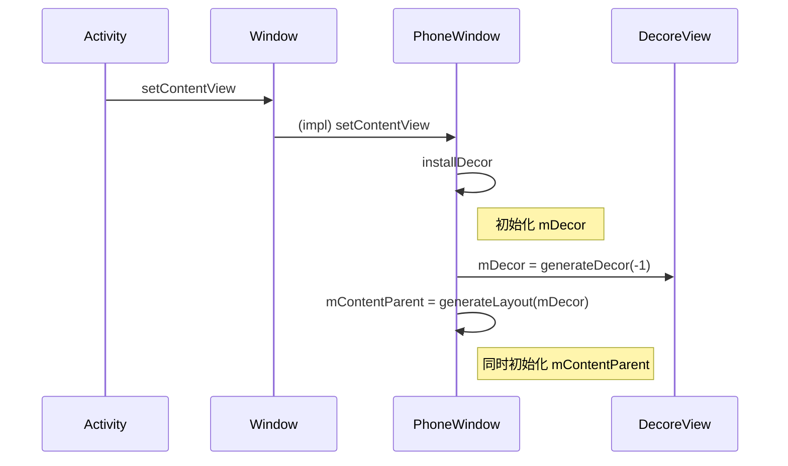
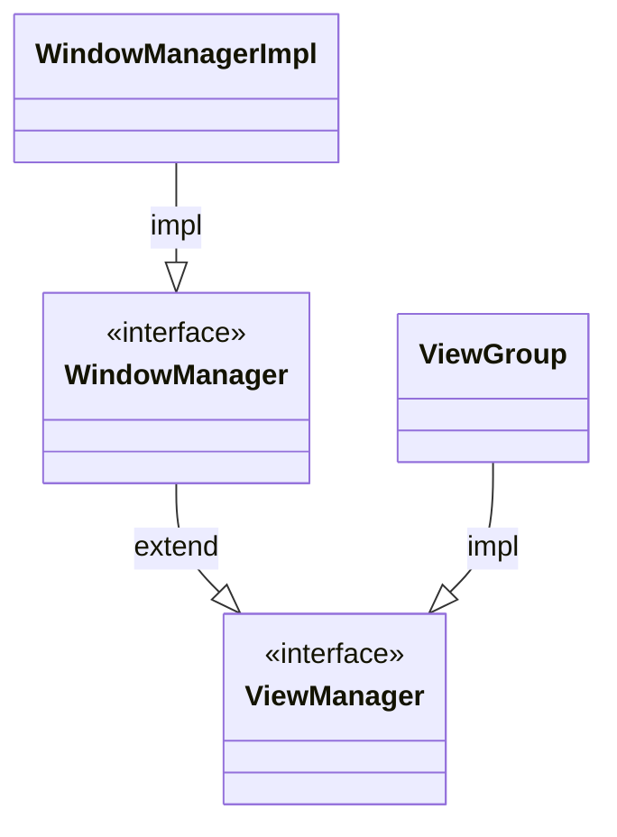

## window

```java
// frameworks/base/core/java/android/view/Window.java

/**
 * Abstract base class for a top-level window look and behavior policy.  An
 * instance of this class should be used as the top-level view added to the
 * window manager. It provides standard UI policies such as a background, title
 * area, default key processing, etc.
 *
 * <p>The framework will instantiate an implementation of this class on behalf of the application.
 */
public abstract class Window {
```

## PhoneWindow

```java
// frameworks/base/core/java/com/android/internal/policy/PhoneWindow.java

/**
 * Android-specific Window.
 * <p>
 * todo: need to pull the generic functionality out into a base class
 * in android.widget.
 *
 * @hide
 */
public class PhoneWindow extends Window implements MenuBuilder.Callback {
    ...
    // This is the top-level view of the window, containing the window decor.
    [1710064978] private DecorView mDecor;
    ...
```

Window的唯一实现类

## `[1710064978] private DecorView mDecor;`

```java
public class DecorView extends FrameLayout implements RootViewSurfaceTaker, WindowCallbacks {
```

继承自 `FrameLayout`

## `[1710065490] installDecor`

```java
// frameworks/base/core/java/com/android/internal/policy/PhoneWindow.java
    private void installDecor() {
        mForceDecorInstall = false;
        if (mDecor == null) {
            [1710065561] mDecor = generateDecor(-1);
            mDecor.setDescendantFocusability(ViewGroup.FOCUS_AFTER_DESCENDANTS);
            mDecor.setIsRootNamespace(true);
            if (!mInvalidatePanelMenuPosted && mInvalidatePanelMenuFeatures != 0) {
                mDecor.postOnAnimation(mInvalidatePanelMenuRunnable);
            }
        } else {
            mDecor.setWindow(this);
        }
        if (mContentParent == null) {
            [1710065911] mContentParent = generateLayout(mDecor);
            ...
```

## `[1710065561] mDecor = generateDecor(-1);`

```java
// frameworks/base/core/java/com/android/internal/policy/PhoneWindow.java
    protected DecorView generateDecor(int featureId) {
        ...
        return new DecorView(context, featureId, this, getAttributes());
    }
```

那么谁会调用 `[1710065490] installDecor`，调用处有多处，比如⬇️ [1710065801] setContentView


## `[1710065801] setContentView`

```java
// frameworks/base/core/java/com/android/internal/policy/PhoneWindow.java
    @Override
    public void setContentView(int layoutResID) {
        // Note: FEATURE_CONTENT_TRANSITIONS may be set in the process of installing the window
        // decor, when theme attributes and the like are crystalized. Do not check the feature
        // before this happens.
        [1710066153] if (mContentParent == null) {
            installDecor();
        } else if (!hasFeature(FEATURE_CONTENT_TRANSITIONS)) {
            mContentParent.removeAllViews();
        }

        if (hasFeature(FEATURE_CONTENT_TRANSITIONS)) {
            final Scene newScene = Scene.getSceneForLayout(mContentParent, layoutResID,
                    getContext());
            transitionTo(newScene);
        } else {
            mLayoutInflater.inflate(layoutResID, mContentParent);
        }
        mContentParent.requestApplyInsets();
        final Callback cb = getCallback();
        if (cb != null && !isDestroyed()) {
            cb.onContentChanged();
        }
        mContentParentExplicitlySet = true;
    }
```

`[1710066153] mContentParent` 为空，则会调用 `[1710065490] installDecork`

那么 `mContentParent` 由谁赋值

```java
// frameworks/base/core/java/com/android/internal/policy/PhoneWindow.java

    // This is the view in which the window contents are placed. It is either
    // mDecor itself, or a child of mDecor where the contents go.
    [1710066794] ViewGroup mContentParent;
```

## `[1710065911] mContentParent = generateLayout(mDecor);`

```java
// frameworks/base/core/java/com/android/internal/policy/PhoneWindow.java

    protected ViewGroup generateLayout(DecorView decor) {
        ...
                [1710066593] ViewGroup contentParent = (ViewGroup)findViewById(ID_ANDROID_CONTENT);

        [1710066603] return contentParent;
```

[1710066593]创建 `contentParent`，然后[1710066603]返回其作为返回值，也就是mContentParent

## `[1710066593] ViewGroup contentParent = (ViewGroup)findViewById(ID_ANDROID_CONTENT);`

```java
    @Nullable
    public <T extends View> T findViewById(@IdRes int id) {
        return [1710066709] getDecorView().findViewById(id);
    }
```

`[1710066709] getDecorView()`返回的实际上就是 `[1710064978] mDecor`，然后找到其中id为`content`的view

以上，也即是说 `[1710064978] mDecor`的创建会导致 `[1710066794] mContentParent` 的创建，所以 `[1710066153]`这里就可以用 `mContentParent` 为null作为是否需要 `[1710065490] installDecor`的判断。


## 总结以上



## ViewManager

Interface to let you add and remove child views to an Activity.

```java
/** Interface to let you add and remove child views to an Activity. To get an instance
  * of this class, call {@link android.content.Context#getSystemService(java.lang.String) Context.getSystemService()}.
  */
public interface ViewManager
{
    /**
     * Assign the passed LayoutParams to the passed View and add the view to the window.
     * <p>Throws {@link android.view.WindowManager.BadTokenException} for certain programming
     * errors, such as adding a second view to a window without removing the first view.
     * <p>Throws {@link android.view.WindowManager.InvalidDisplayException} if the window is on a
     * secondary {@link Display} and the specified display can't be found
     * (see {@link android.app.Presentation}).
     * @param view The view to be added to this window.
     * @param params The LayoutParams to assign to view.
     */
    public void addView(View view, ViewGroup.LayoutParams params);
    public void updateViewLayout(View view, ViewGroup.LayoutParams params);
    public void removeView(View view);
}
```

## WindowManager

The interface that apps use to talk to the window manager.

```java
/**
 * The interface that apps use to talk to the window manager.
 * <p>
 * Each window manager instance is bound to a {@link Display}. To obtain the
 * <code>WindowManager</code> associated with a display,
 * call {@link Context#createWindowContext(Display, int, Bundle)} to get the display's UI context,
 * then call {@link Context#getSystemService(String)} or {@link Context#getSystemService(Class)} on
 * the UI context.
 * <p>
 * The simplest way to show a window on a particular display is to create a {@link Presentation},
 * which automatically obtains a <code>WindowManager</code> and context for the display.
 */
@SystemService(Context.WINDOW_SERVICE)
public interface WindowManager extends ViewManager {
```

## WindowManagerImpl

```java
// android.view.WindowManagerImpl
public final class WindowManagerImpl implements WindowManager {
```

## [1710583837] handleRelaunchActivity

```java
    public Activity handleLaunchActivity(ActivityClientRecord r,
            PendingTransactionActions pendingActions, Intent customIntent) {
        // If we are getting ready to gc after going to the background, well
        // we are back active so skip it.
        unscheduleGcIdler();
        mSomeActivitiesChanged = true;

        if (r.profilerInfo != null) {
            mProfiler.setProfiler(r.profilerInfo);
            mProfiler.startProfiling();
        }

        // Make sure we are running with the most recent config.
        mConfigurationController.handleConfigurationChanged(null, null);

        if (localLOGV) Slog.v(
            TAG, "Handling launch of " + r);

        // Initialize before creating the activity
        if (ThreadedRenderer.sRendererEnabled
                && (r.activityInfo.flags & ActivityInfo.FLAG_HARDWARE_ACCELERATED) != 0) {
            HardwareRenderer.preload();
        }
        [1710583987] WindowManagerGlobal.initialize();

        // Hint the GraphicsEnvironment that an activity is launching on the process.
        GraphicsEnvironment.hintActivityLaunch();

        [1710583914] final Activity a = performLaunchActivity(r, customIntent);

        if (a != null) {
            r.createdConfig = new Configuration(mConfigurationController.getConfiguration());
            reportSizeConfigurations(r);
            if (!r.activity.mFinished && pendingActions != null) {
                pendingActions.setOldState(r.state);
                pendingActions.setRestoreInstanceState(true);
                pendingActions.setCallOnPostCreate(true);
            }
        } else {
            // If there was an error, for any reason, tell the activity manager to stop us.
            ActivityClient.getInstance().finishActivity(r.token, Activity.RESULT_CANCELED,
                    null /* resultData */, Activity.DONT_FINISH_TASK_WITH_ACTIVITY);
        }

        return a;
    }
```

## [1710583987] WindowManagerGlobal.initialize();

```java
// android.view.WindowManager
public final class WindowManagerGlobal {
    ...
    @UnsupportedAppUsage
    public static void initialize() {
        [1710584110] getWindowManagerService();
    }
```

## [1710584110] getWindowManagerService();

```java
// android.view.WindowManager
    @UnsupportedAppUsage
    public static IWindowManager getWindowManagerService() {
        synchronized (WindowManagerGlobal.class) {
            if (sWindowManagerService == null) {
                [1710584184] sWindowManagerService = IWindowManager.Stub.asInterface(
                        ServiceManager.getService("window"));
                try {
                    if (sWindowManagerService != null) {
                        ValueAnimator.setDurationScale(
                                sWindowManagerService.getCurrentAnimatorScale());
                        sUseBLASTAdapter = sWindowManagerService.useBLAST();
                    }
                } catch (RemoteException e) {
                    throw e.rethrowFromSystemServer();
                }
            }
            return sWindowManagerService;
        }
    }
```

## [1710584184] sWindowManagerService = IWindowManager.Stub.asInterface(

将 `sWindowManagerService` 作为 `WindowManagerGlobal` 的静态变量保存

```java
// android.view.WindowManager
    private static IWindowManager sWindowManagerService;
```

## [1710583914] final Activity a = performLaunchActivity(r, customIntent);

创建`Activity`，

```java
// android.app.ActivityThread
    /**  Core implementation of activity launch. */
    private Activity performLaunchActivity(ActivityClientRecord r, Intent customIntent) {
        ActivityInfo aInfo = r.activityInfo;
        if (r.packageInfo == null) {
            r.packageInfo = getPackageInfo(aInfo.applicationInfo, r.compatInfo,
                    Context.CONTEXT_INCLUDE_CODE);
        }

        ComponentName component = r.intent.getComponent();
        if (component == null) {
            component = r.intent.resolveActivity(
                mInitialApplication.getPackageManager());
            r.intent.setComponent(component);
        }

        if (r.activityInfo.targetActivity != null) {
            component = new ComponentName(r.activityInfo.packageName,
                    r.activityInfo.targetActivity);
        }

        [1710592951] ContextImpl appContext = createBaseContextForActivity(r);
        Activity activity = null;
        try {
            java.lang.ClassLoader cl = appContext.getClassLoader();
            [1710584434] activity = mInstrumentation.newActivity(
                    cl, component.getClassName(), r.intent);
            StrictMode.incrementExpectedActivityCount(activity.getClass());
            r.intent.setExtrasClassLoader(cl);
            r.intent.prepareToEnterProcess(isProtectedComponent(r.activityInfo),
                    appContext.getAttributionSource());
            if (r.state != null) {
                r.state.setClassLoader(cl);
            }
        } catch (Exception e) {
            if (!mInstrumentation.onException(activity, e)) {
                throw new RuntimeException(
                    "Unable to instantiate activity " + component
                    + ": " + e.toString(), e);
            }
        }

        try {
            Application app = r.packageInfo.makeApplicationInner(false, mInstrumentation);

            if (localLOGV) Slog.v(TAG, "Performing launch of " + r);
            if (localLOGV) Slog.v(
                    TAG, r + ": app=" + app
                    + ", appName=" + app.getPackageName()
                    + ", pkg=" + r.packageInfo.getPackageName()
                    + ", comp=" + r.intent.getComponent().toShortString()
                    + ", dir=" + r.packageInfo.getAppDir());

            // updatePendingActivityConfiguration() reads from mActivities to update
            // ActivityClientRecord which runs in a different thread. Protect modifications to
            // mActivities to avoid race.
            synchronized (mResourcesManager) {
                mActivities.put(r.token, r);
            }

            if (activity != null) {
                CharSequence title = r.activityInfo.loadLabel(appContext.getPackageManager());
                Configuration config =
                        new Configuration(mConfigurationController.getCompatConfiguration());
                if (r.overrideConfig != null) {
                    config.updateFrom(r.overrideConfig);
                }
                if (DEBUG_CONFIGURATION) Slog.v(TAG, "Launching activity "
                        + r.activityInfo.name + " with config " + config);
                Window window = null;
                if (r.mPendingRemoveWindow != null && r.mPreserveWindow) {
                    window = r.mPendingRemoveWindow;
                    r.mPendingRemoveWindow = null;
                    r.mPendingRemoveWindowManager = null;
                }

                // Activity resources must be initialized with the same loaders as the
                // application context.
                appContext.getResources().addLoaders(
                        app.getResources().getLoaders().toArray(new ResourcesLoader[0]));

                appContext.setOuterContext(activity);
                [1710584653] activity.attach(appContext, this, getInstrumentation(), r.token,
                        r.ident, app, r.intent, r.activityInfo, title, r.parent,
                        r.embeddedID, r.lastNonConfigurationInstances, config,
                        r.referrer, r.voiceInteractor, window, r.activityConfigCallback,
                        r.assistToken, r.shareableActivityToken);

                if (customIntent != null) {
                    activity.mIntent = customIntent;
                }
                r.lastNonConfigurationInstances = null;
                checkAndBlockForNetworkAccess();
                activity.mStartedActivity = false;
                int theme = r.activityInfo.getThemeResource();
                if (theme != 0) {
                    activity.setTheme(theme);
                }

                if (r.mActivityOptions != null) {
                    activity.mPendingOptions = r.mActivityOptions;
                    r.mActivityOptions = null;
                }
                activity.mLaunchedFromBubble = r.mLaunchedFromBubble;
                activity.mCalled = false;
                // Assigning the activity to the record before calling onCreate() allows
                // ActivityThread#getActivity() lookup for the callbacks triggered from
                // ActivityLifecycleCallbacks#onActivityCreated() or
                // ActivityLifecycleCallback#onActivityPostCreated().
                r.activity = activity;
                if (r.isPersistable()) {
                    mInstrumentation.callActivityOnCreate(activity, r.state, r.persistentState);
                } else {
                    mInstrumentation.callActivityOnCreate(activity, r.state);
                }
                if (!activity.mCalled) {
                    throw new SuperNotCalledException(
                        "Activity " + r.intent.getComponent().toShortString() +
                        " did not call through to super.onCreate()");
                }
                mLastReportedWindowingMode.put(activity.getActivityToken(),
                        config.windowConfiguration.getWindowingMode());
            }
            r.setState(ON_CREATE);

        } catch (SuperNotCalledException e) {
            throw e;

        } catch (Exception e) {
            if (!mInstrumentation.onException(activity, e)) {
                throw new RuntimeException(
                    "Unable to start activity " + component
                    + ": " + e.toString(), e);
            }
        }

        return activity;
    }

```

## [1710592951] ContextImpl appContext = createBaseContextForActivity(r);

```java
// android.app.ActivityThread
    private ContextImpl createBaseContextForActivity(ActivityClientRecord r) {
        final int displayId = ActivityClient.getInstance().getDisplayId(r.token);
        [1710593100] ContextImpl appContext = ContextImpl.createActivityContext(
                this, r.packageInfo, r.activityInfo, r.token, displayId, r.overrideConfig);

        final DisplayManagerGlobal dm = DisplayManagerGlobal.getInstance();
        // For debugging purposes, if the activity's package name contains the value of
        // the "debug.use-second-display" system property as a substring, then show
        // its content on a secondary display if there is one.
        String pkgName = SystemProperties.get("debug.second-display.pkg");
        if (pkgName != null && !pkgName.isEmpty()
                && r.packageInfo.mPackageName.contains(pkgName)) {
            for (int id : dm.getDisplayIds()) {
                if (id != DEFAULT_DISPLAY) {
                    Display display =
                            dm.getCompatibleDisplay(id, appContext.getResources());
                    appContext = (ContextImpl) appContext.createDisplayContext(display);
                    break;
                }
            }
        }
        return appContext;
    }
```
## [1710593100] ContextImpl appContext = ContextImpl.createActivityContext(

```java
// android.app.ContextImpl
    static ContextImpl createActivityContext(ActivityThread mainThread,
            LoadedApk packageInfo, ActivityInfo activityInfo, IBinder activityToken, int displayId,
            Configuration overrideConfiguration) {

        ...
        [1710596093] ContextImpl context = new ContextImpl(null, mainThread, packageInfo, ContextParams.EMPTY,
                attributionTag, null, activityInfo.splitName, activityToken, null, 0, classLoader,
                null);

```

`[1710596093] ContextImpl context = new ContextImpl` 这里新建一个 `ContextImpl`

## [1710584434] activity = mInstrumentation.newActivity(

```java
// android.app.Instrumentation
    public Activity newActivity(ClassLoader cl, String className,
            Intent intent)
            throws InstantiationException, IllegalAccessException,
            ClassNotFoundException {
        String pkg = intent != null && intent.getComponent() != null
                ? intent.getComponent().getPackageName() : null;
        return [1710584537] getFactory(pkg).instantiateActivity(cl, className, intent);
    }
```

```java
// android.app.AppComponentFactory
    public @NonNull Activity instantiateActivity(@NonNull ClassLoader cl, @NonNull String className,
            @Nullable Intent intent)
            throws InstantiationException, IllegalAccessException, ClassNotFoundException {
        return (Activity) cl.loadClass(className).newInstance();
    }
```

通过 `ClassLoader` 加载 `Activity`

## [1710584653] activity.attach(appContext, this, getInstrumentation(), r.token,

```java
// android.app.Activity
    final void attach(Context context, ActivityThread aThread,
            Instrumentation instr, IBinder token, int ident,
            Application application, Intent intent, ActivityInfo info,
            CharSequence title, Activity parent, String id,
            NonConfigurationInstances lastNonConfigurationInstances,
            Configuration config, String referrer, IVoiceInteractor voiceInteractor,
            Window window, ActivityConfigCallback activityConfigCallback, IBinder assistToken,
            IBinder shareableActivityToken) {
        attachBaseContext(context);

        mFragments.attachHost(null /*parent*/);

        [1710584779] mWindow = new PhoneWindow(this, window, activityConfigCallback);
        mWindow.setWindowControllerCallback(mWindowControllerCallback);
        mWindow.setCallback(this);
        mWindow.setOnWindowDismissedCallback(this);
        mWindow.getLayoutInflater().setPrivateFactory(this);
        if (info.softInputMode != WindowManager.LayoutParams.SOFT_INPUT_STATE_UNSPECIFIED) {
            mWindow.setSoftInputMode(info.softInputMode);
        }
        if (info.uiOptions != 0) {
            mWindow.setUiOptions(info.uiOptions);
        }
        mUiThread = Thread.currentThread();

        mMainThread = aThread;
        mInstrumentation = instr;
        mToken = token;
        mAssistToken = assistToken;
        mShareableActivityToken = shareableActivityToken;
        mIdent = ident;
        mApplication = application;
        mIntent = intent;
        mReferrer = referrer;
        mComponent = intent.getComponent();
        mActivityInfo = info;
        mTitle = title;
        mParent = parent;
        mEmbeddedID = id;
        mLastNonConfigurationInstances = lastNonConfigurationInstances;
        if (voiceInteractor != null) {
            if (lastNonConfigurationInstances != null) {
                mVoiceInteractor = lastNonConfigurationInstances.voiceInteractor;
            } else {
                mVoiceInteractor = new VoiceInteractor(voiceInteractor, this, this,
                        Looper.myLooper());
            }
        }

        [1710591610] mWindow.setWindowManager(
                [1710591904] (WindowManager)context.getSystemService([1710595218]Context.WINDOW_SERVICE),
                mToken, mComponent.flattenToString(),
                (info.flags & ActivityInfo.FLAG_HARDWARE_ACCELERATED) != 0);
        if (mParent != null) {
            mWindow.setContainer(mParent.getWindow());
        }
        [1710596714] mWindowManager = mWindow.getWindowManager();
        mCurrentConfig = config;

        mWindow.setColorMode(info.colorMode);
        mWindow.setPreferMinimalPostProcessing(
                (info.flags & ActivityInfo.FLAG_PREFER_MINIMAL_POST_PROCESSING) != 0);

        getAutofillClientController().onActivityAttached(application);
        setContentCaptureOptions(application.getContentCaptureOptions());
    }

```

```java
// android.app.Android
    @UnsupportedAppUsage
    [1710596612] private Window mWindow;
```

```java
// android.app.Android
    @UnsupportedAppUsage
    [1710596656] private WindowManager mWindowManager;
```


## [1710591904] (WindowManager)context.getSystemService(Context.WINDOW_SERVICE),

`context` 来自 `[1710596093]`

```java
// frameworks/base/core/java/android/app/ContextImpl.java
    @Override
    public Object getSystemService(String name) {
        ...
        return [1710594900] SystemServiceRegistry.getSystemService(this, name);
    }
```

## [1710594900] SystemServiceRegistry.getSystemService(this, name)

```java
    /**
     * Gets a system service from a given context.
     * @hide
     */
    public static Object getSystemService(ContextImpl ctx, String name) {
        if (name == null) {
            return null;
        }
        final ServiceFetcher<?> fetcher = [1710595007] SYSTEM_SERVICE_FETCHERS.get(name);
        if (fetcher == null) {
            if (sEnableServiceNotFoundWtf) {
                Slog.wtf(TAG, "Unknown manager requested: " + name);
            }
            return null;
        }

        final Object ret = fetcher.getService(ctx);
        if (sEnableServiceNotFoundWtf && ret == null) {
            // Some services do return null in certain situations, so don't do WTF for them.
            switch (name) {
                case Context.CONTENT_CAPTURE_MANAGER_SERVICE:
                case Context.APP_PREDICTION_SERVICE:
                case Context.INCREMENTAL_SERVICE:
                case Context.ETHERNET_SERVICE:
                    return null;
            }
            Slog.wtf(TAG, "Manager wrapper not available: " + name);
            return null;
        }
        return ret;
    }
```

从 `[1710595007] SYSTEM_SERVICE_FETCHERS` 中获取先前通过 `[1710592455] registerService` 注册的 fetcher,也就是个 Factory，使用其创建 `Service`, 而对于传入的 Key(`[1710595218]Context.WINDOW_SERVICE`)，返回的 Fetcher 会创建 `[1710595130] WindowManagerImpl(ctx)`, 也就是 `WindowManager` 的实现类

## [1710592317] SystemServiceRegistry

Manages all of the system services that can be returned by {@link Context#getSystemService}

```java
// android.app.SystemServiceRegistry
public final class SystemServiceRegistry {
    static {
        ...
        [1710592455] registerService(Context.WINDOW_SERVICE, WindowManager.class,
                new CachedServiceFetcher<WindowManager>() {
            @Override
            public WindowManager createService(ContextImpl ctx) {
                return new [1710595130] WindowManagerImpl(ctx);
            }});
```

## [1710592455] registerService(Context.WINDOW_SERVICE, WindowManager.class,

```java
// android.app.SystemServiceRegistry
    private static <T> void registerService(@NonNull String serviceName,
            @NonNull Class<T> serviceClass, @NonNull ServiceFetcher<T> serviceFetcher) {
        SYSTEM_SERVICE_NAMES.put(serviceClass, serviceName);
        SYSTEM_SERVICE_FETCHERS.put(serviceName, serviceFetcher);
        SYSTEM_SERVICE_CLASS_NAMES.put(serviceName, serviceClass.getSimpleName());
    }

```

## [1710584779] mWindow = new PhoneWindow(this, window, activityConfigCallback);

在当前 `Activity` 创建 `Window`

```java
// android.app.Activity
    @UnsupportedAppUsage
    private Window mWindow;
```

## [1710591610] mWindow.setWindowManager(

为 `Window` 设置 `WindowManager`

```java
// android.view.Window
    public void setWindowManager(WindowManager wm, IBinder appToken, String appName,
            boolean hardwareAccelerated) {
        mAppToken = appToken;
        mAppName = appName;
        mHardwareAccelerated = hardwareAccelerated;
        if (wm == null) {
            wm = (WindowManager)mContext.getSystemService(Context.WINDOW_SERVICE);
        }
        [1710596387] mWindowManager = ((WindowManagerImpl)wm).createLocalWindowManager(this);
    }
```
## [1710596387] mWindowManager = ((WindowManagerImpl)wm).createLocalWindowManager(this);

```java
// android.view.Window
    @UnsupportedAppUsage(maxTargetSdk = Build.VERSION_CODES.P, trackingBug = 115609023)
    [1710596791] private WindowManager mWindowManager;
```
给 Window#`[1710596791] private WindowManager mWindowManager;` 赋值

## [1710596387] mWindowManager = ((WindowManagerImpl)wm).createLocalWindowManager(this);

```java
// android.view.WindowManagerImpl
    public WindowManagerImpl createLocalWindowManager(Window parentWindow) {
        return new WindowManagerImpl(mContext, parentWindow, mWindowContextToken);
    }
```

```java
    private WindowManagerImpl(Context context, Window parentWindow,
            @Nullable IBinder windowContextToken) {
        mContext = context;
        mParentWindow = parentWindow;
        mWindowContextToken = windowContextToken;
    }
```

## [1710596714] mWindowManager = mWindow.getWindowManager();

给 `[1710596656] private WindowManager mWindowManager;` 赋值

```java
// android.view.window
    @UnsupportedAppUsage(maxTargetSdk = Build.VERSION_CODES.P, trackingBug = 115609023)
    private WindowManager mWindowManager;

    ...

    public WindowManager getWindowManager() {
        return mWindowManager;
    }
```

`mWindowManager` 在 `[1710591610]` -> `[1710596387]` 处赋值

## 总结以上



## 参考

- [Android窗口机制（一）初识Android的窗口结构](https://www.jianshu.com/p/40a9c93b5a8d)