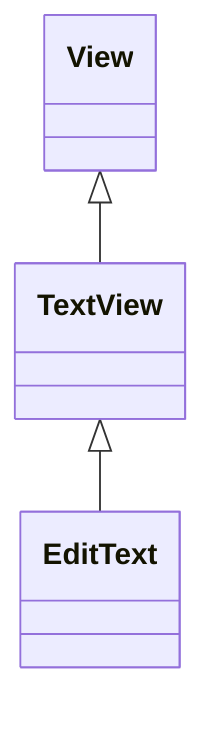
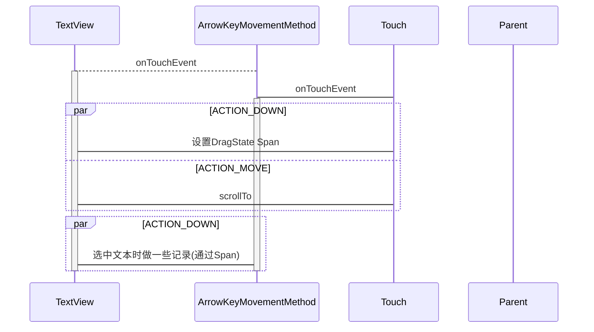
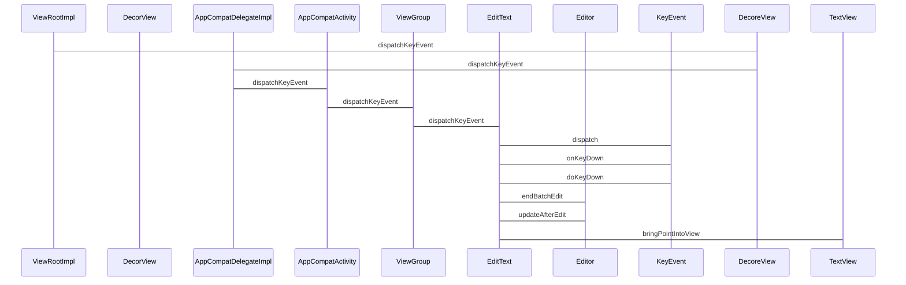

```mermaid

classDiagram
  direction TB
  class EditText 
  class TextView 
  class View  
  TextView <|-- EditText
  View <|-- TextView
```

```mermaid
sequenceDiagram

participant TextView
participant ArrowKeyMovementMethod
participant Touch
participant Parent

TextView --> ArrowKeyMovementMethod: onTouchEvent
activate TextView
 ArrowKeyMovementMethod -> Touch: onTouchEvent
 activate ArrowKeyMovementMethod 
 
  par ACTION_DOWN
   Touch -> TextView: 设置DragState Span
  and ACTION_MOVE
    Touch -> TextView: scrollTo
 
  end

  par ACTION_DOWN
   ArrowKeyMovementMethod -> TextView: 选中文本时做一些记录(通过Span)
 
  end
 deactivate ArrowKeyMovementMethod 
deactivate TextView

```

```mermaid
sequenceDiagram
participant ViewRootImpl
participant DecorView
participant AppCompatDelegateImpl
participant AppCompatActivity
participant ViewGroup
participant EditText
participant Editor
participant KeyEvent

ViewRootImpl -> DecoreView: dispatchKeyEvent
DecoreView -> AppCompatDelegateImpl: dispatchKeyEvent
AppCompatDelegateImpl -> AppCompatActivity:  dispatchKeyEvent
AppCompatActivity -> ViewGroup: dispatchKeyEvent
ViewGroup -> EditText: dispatchKeyEvent
EditText -> KeyEvent: dispatch
KeyEvent -> EditText: onKeyDown
KeyEvent -> EditText: doKeyDown
EditText -> Editor: endBatchEdit
Editor -> EditText: updateAfterEdit
EditText -> TextView: bringPointIntoView
```