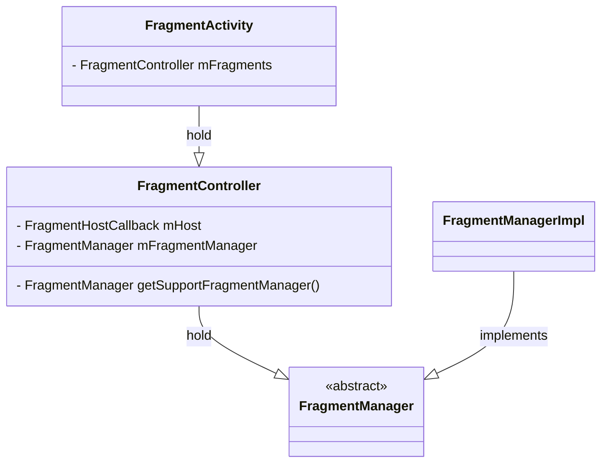

```java
// androidx.fragment.app.FragmentActivity
public class FragmentActivity extends ComponentActivity  ... {

    final FragmentController mFragments = FragmentController.createController(new HostCallbacks());

```

```java
// androidx.fragment.app.FragmentController
public class FragmentController {
    private final FragmentHostCallback<?> mHost;
```



- `FragmentController`> 
  - Provides integration points with a FragmentManager for a fragment host.
    "提供与 FragmentManager 集成的接口，用于托管片段（Fragment）。
  - It is the responsibility of the host to take care of the Fragment's lifecycle. The methods provided by FragmentController are for that purpose.  
    宿主（Host）需要负责处理片段（Fragment）的生命周期。FragmentController 提供的方法就是为了这个目的。"


- `androidx.fragment.app.FragmentManager`
  - Static library support version of the framework's android.app.FragmentManager. Used to write apps that run on platforms prior to Android 3.0. When running on Android 3.0 or above, this implementation is still used; it does not try to switch to the framework's implementation. See the framework FragmentManager documentation for a class overview.
    
  - Your activity must derive from FragmentActivity to use this. From such an activity, you can acquire the FragmentManager by calling FragmentActivity.getSupportFragmentManager.


## reference
- [Android Jetpack 开发套件 #7 AndroidX Fragment 核心原理分析](https://juejin.cn/post/6970998913754988552)
- [详细聊聊Fragment的实现原理](https://www.51cto.com/article/672135.html)