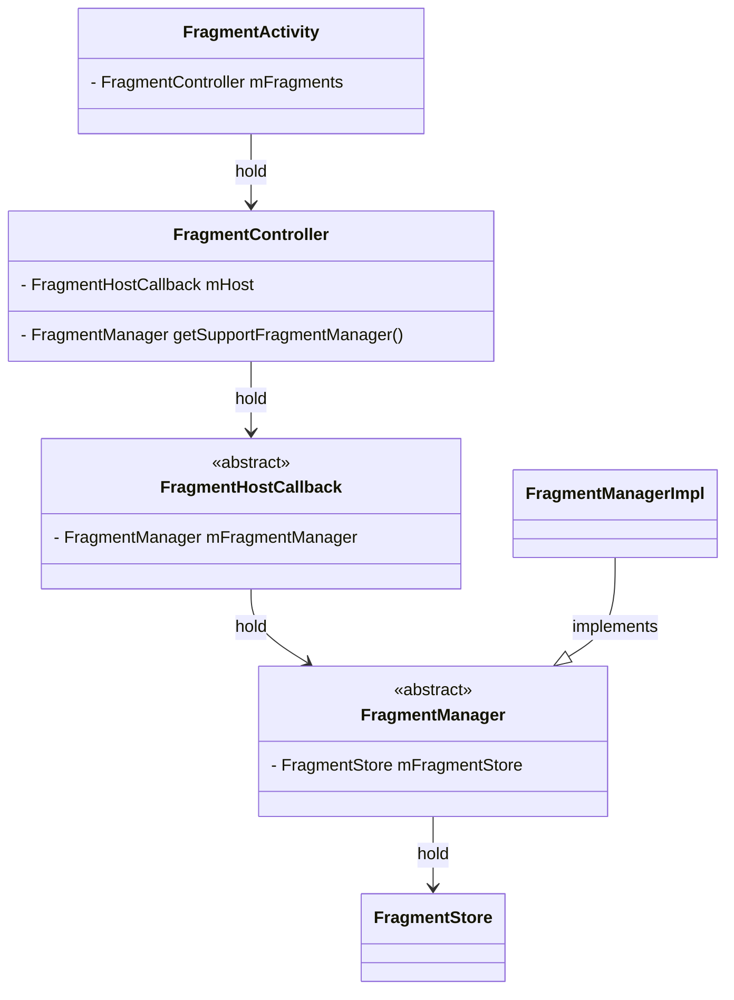
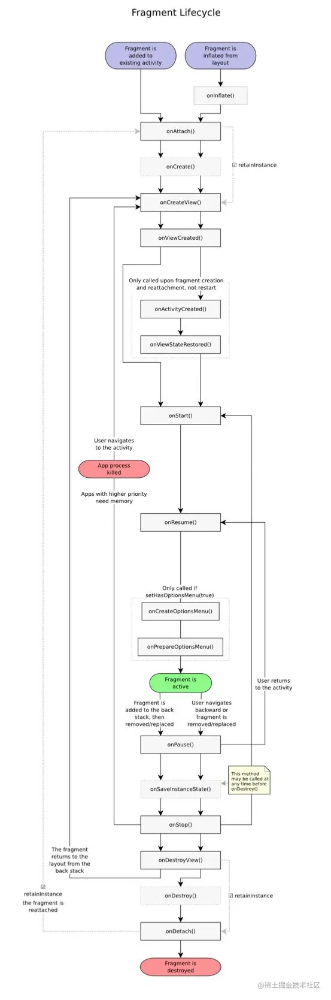
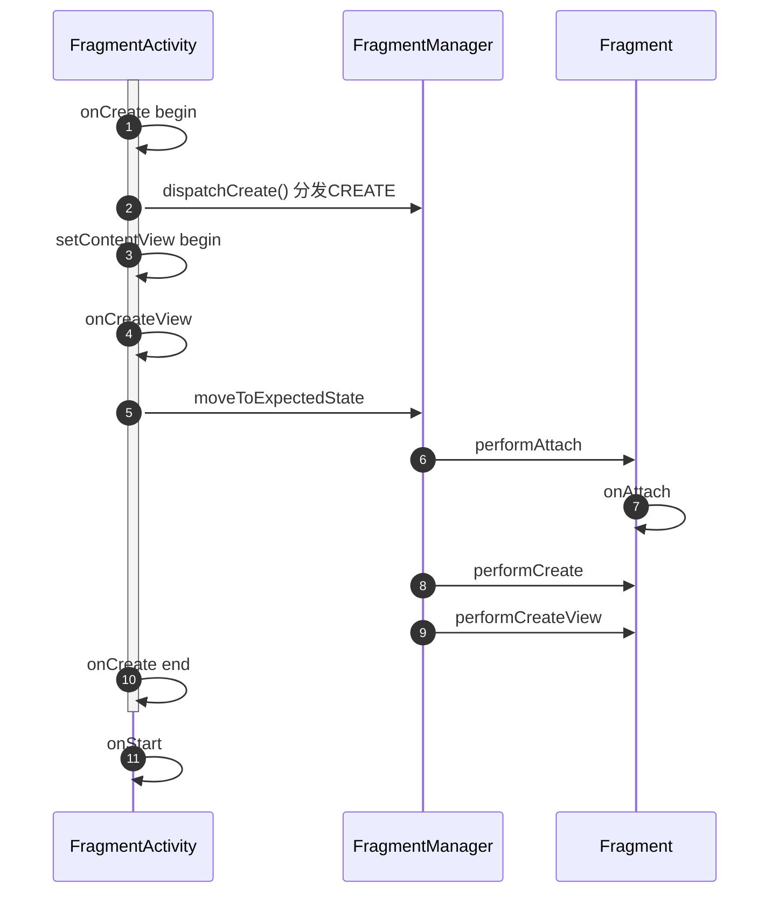

基于Android Api 33

```java
// androidx.fragment.app.FragmentActivity
public class FragmentActivity extends ComponentActivity  ... {

    final FragmentController mFragments = FragmentController.createController(new HostCallbacks());

```

```java
// androidx.fragment.app.FragmentController
public class FragmentController {
    private final FragmentHostCallback<?> mHost;
```



- `FragmentController`> 
  - Provides integration points with a FragmentManager for a fragment host.
    "提供与 FragmentManager 集成的接口，用于托管片段（Fragment）。
  - It is the responsibility of the host to take care of the Fragment's lifecycle. The methods provided by FragmentController are for that purpose.  
    宿主（Host）需要负责处理片段（Fragment）的生命周期。FragmentController 提供的方法就是为了这个目的。"


- `androidx.fragment.app.FragmentManager`
  - Static library support version of the framework's android.app.FragmentManager. Used to write apps that run on platforms prior to Android 3.0. When running on Android 3.0 or above, this implementation is still used; it does not try to switch to the framework's implementation. See the framework FragmentManager documentation for a class overview.
    
  - Your activity must derive from FragmentActivity to use this. From such an activity, you can acquire the FragmentManager by calling FragmentActivity.getSupportFragmentManager.

```java
// androidx.fragment.app.Fragment
    static final int INITIALIZING = -1;          // Not yet attached.
    static final int ATTACHED = 0;               // Attached to the host.
    static final int CREATED = 1;                // Created.
    static final int VIEW_CREATED = 2;           // View Created.
    static final int AWAITING_EXIT_EFFECTS = 3;  // Downward state, awaiting exit effects
    static final int ACTIVITY_CREATED = 4;       // Fully created, not started.
    static final int STARTED = 5;                // Created and started, not resumed.
    static final int AWAITING_ENTER_EFFECTS = 6; // Upward state, awaiting enter effects
    static final int RESUMED = 7;                // Created started and resumed.

```



## Activity的生命周期与Fragment生命周期的关联

先从代码分析，从`FragmentActivity`.`onCreate` 开始看

- `[T-1] MainActivity.onCreate`
    ```kotlin
        // MainActivity
    class MainActivity : FragmentActivity() {
        ...
        override fun onCreate(savedInstanceState: Bundle?) {
       [:0] super.onCreate(savedInstanceState)
       [:1] setContentView(R.layout.activity_main)
    ```

- `[:0] FragmentActivity.onCreate`
    ```java
    // androidx.fragment.app.FragmentActivity
        protected void onCreate(@Nullable Bundle savedInstanceState) {
            ...
        [:0:1] mFragments.dispatchCreate();
        }
    ```
    ```mermaid
    classDiagram

    class FragmentActivity {
        - FragmentController mFragments
    }
    class FragmentController

    FragmentActivity --> FragmentController: hold
    ```
    可以看出  
    1. `FragmentActivity`持有`FragmentController`
    2. 通知`FragmentController`分发`create`事件
- `[:0:1] mFragments.dispatchCreate()`

    ```java
    // androidx.fragment.app.FragmentController
        public void dispatchCreate() {
       [:0:1:0] mHost.mFragmentManager.dispatchCreate();
        }
    ```
    ```mermaid
    classDiagram

    class FragmentActivity {
        - FragmentController mFragments
    }
    class FragmentController {
        - FragmentHostCallback<?> mHost
    }
    class FragmentManager {
        <<abstract>>
    }
    class FragmentManagerImpl
    class FragmentHostCallback {
        <<abstract>>
        - FragmentManager mFragmentManager
    }

    FragmentActivity --> FragmentController: hold
    FragmentController --> FragmentHostCallback: hold
    FragmentHostCallback --> FragmentManager: hold
    FragmentManagerImpl --|> FragmentManager: implements
    ```
    可以看出
    1. `FragmentController`持有`FragmentHostCallback`持有`FragmentManger`
    2. 通知`FragmentManager`分发`create`事件
- `[:0:1:0] mHost.mFragmentManager.dispatchCreate()`
    ```java
    // androidx.fragment.app.FragmentManager
        void dispatchCreate() {
            ...
       [:0:1:0:0] dispatchStateChange(Fragment.CREATED);
            ...
        }
    ```
    ```java
    public class Fragment implements ComponentCallbacks, OnCreateContextMenuListener, LifecycleOwner,
            ViewModelStoreOwner, HasDefaultViewModelProviderFactory, SavedStateRegistryOwner,
            ActivityResultCaller {

        static final int INITIALIZING = -1;          // Not yet attached.
        static final int ATTACHED = 0;               // Attached to the host.
        static final int CREATED = 1;                // Created.
        static final int VIEW_CREATED = 2;           // View Created.
        static final int AWAITING_EXIT_EFFECTS = 3;  // Downward state, awaiting exit effects
        static final int ACTIVITY_CREATED = 4;       // Fully created, not started.
        static final int STARTED = 5;                // Created and started, not resumed.
        static final int AWAITING_ENTER_EFFECTS = 6; // Upward state, awaiting enter effects
        static final int RESUMED = 7;                // Created started and resumed.

    ```
    可以看出
    1. `FragmentManager`内部分发`Fragment.CREATED`事件——*Attached to the host*
- `[:0:1:0:0] dispatchStateChange(Fragment.CREATED)`
    ```java
    // androidx.fragment.app.FragmentManager
        private void dispatchStateChange(int nextState) {
            ...
           [:0:1:0:0:0] mFragmentStore.dispatchStateChange(nextState);
           [:0:1:0:0:1] moveToState(nextState, false);
           ...
    }
    ```
    ```java
    public abstract class FragmentManager implements FragmentResultOwner {
        ...
        private final FragmentStore mFragmentStore = new FragmentStore();
    ```
    ```mermaid
    classDiagram

    class FragmentActivity {
        - FragmentController mFragments
    }
    class FragmentController {
        - FragmentHostCallback<?> mHost
    }
    class FragmentManager {
        <<abstract>>
        FragmentStore mFragmentStore
    }
    class FragmentManagerImpl
    class FragmentHostCallback {
        <<abstract>>
        - FragmentManager mFragmentManager
    }
    class FragmentStore

    FragmentActivity --> FragmentController: hold
    FragmentController --> FragmentHostCallback: hold
    FragmentHostCallback --> FragmentManager: hold
    FragmentManagerImpl --|> FragmentManager: implements
    FragmentManager --> FragmentStore: hold
    ```
    可以看出
    1. `FragmentManager`持有一个`FragmentStore`
    2. `FragmentStore`分发收到的状态`nextState`——`Fragment.CREATED`
- `[:0:1:0:0:0] mFragmentStore.dispatchStateChange(nextState)`
    ```java
    // androidx.fragment.app.FragmentStore
        void dispatchStateChange(int state) {
            for (FragmentStateManager fragmentStateManager : mActive.values()) {
                if (fragmentStateManager != null) {
     [:0:1:0:0:0:0] fragmentStateManager.setFragmentManagerState(state);
                }
            }
        }
    ```
    `mActive`是存储`FragmentStateManager`的`Map`:⬇️
    ```java
    // androidx.fragment.app.FragmentStore
    class FragmentStore {
        ...
        private final HashMap<String, FragmentStateManager> mActive = new HashMap<>();
    ```
    ```mermaid
    classDiagram

    class FragmentActivity {
        - FragmentController mFragments
    }
    class FragmentController {
        - FragmentHostCallback<?> mHost
    }
    class FragmentManager {
        <<abstract>>
        FragmentStore mFragmentStore
    }
    class FragmentManagerImpl
    class FragmentHostCallback {
        <<abstract>>
        - FragmentManager mFragmentManager
    }
    class FragmentStore {
        HashMap「String, FragmentStateManager」 mActive
    }
    class FragmentStateManager

    FragmentActivity --> FragmentController: hold
    FragmentController --> FragmentHostCallback: hold
    FragmentHostCallback --> FragmentManager: hold
    FragmentManagerImpl --|> FragmentManager: implements
    FragmentManager --> FragmentStore: hold
    FragmentStore "1" --> "n" FragmentStateManager: hold
    ```
    可以看出
    1. `FragmentStore`持有n个`FragmentStateManager`
    2. `FragmentManager`将收到的状态分发给每一个`FragmentStateManager`
    
    **[总结]**: 由于`FragmentActivity`此时尚未`setContentView`，所以`FragmentManger`管理的`Fragment`数量实际上为0，`mActive`自然为0。但是我们仍然继续看下如果不为0会继续做什么。
- `[:0:1:0:0:0:0] fragmentStateManager.setFragmentManagerState(state)`
    ```java
    // androidx.fragment.app.FragmentStateManager
        void setFragmentManagerState(int state) {
            mFragmentManagerState = state;
        }
    ```
    ```java
    // androidx.fragment.app.FragmentStateManager
    class FragmentStateManager {
        ...
        private final Fragment mFragment;
        private int mFragmentManagerState = Fragment.INITIALIZING;
    ```
    ```mermaid
    classDiagram

    class FragmentActivity {
        - FragmentController mFragments
    }
    class FragmentController {
        - FragmentHostCallback<?> mHost
    }
    class FragmentManager {
        <<abstract>>
        FragmentStore mFragmentStore
    }
    class FragmentManagerImpl
    class FragmentHostCallback {
        <<abstract>>
        - FragmentManager mFragmentManager
    }
    class FragmentStore {
        HashMap「String, FragmentStateManager」 mActive
    }
    class FragmentStateManager {
        Fragment mFragment
        int mFragmentManagerState
    }
    class Fragment

    FragmentActivity --> FragmentController: hold
    FragmentController --> FragmentHostCallback: hold
    FragmentHostCallback --> FragmentManager: hold
    FragmentManagerImpl --|> FragmentManager: implements
    FragmentManager --> FragmentStore: hold
    FragmentStore "1" --> "n" FragmentStateManager: hold
    FragmentStateManager --> Fragment: hold
    ```
    可以看出
    1. `FragmentStateManager` 1:1 持有`Fragment`
    2. `FragmentStateManaget`持有变量`mFragmentManagerState`——所属的FragmentManager的状态

    至此，`FragmentActivity`将`CREATE`状态通知到`FragmentManager`进而通知到管理的每个`FragmentStateManager`——但是此时Fragment尚未更新。

    **[总结]**: （只关心重要的`FragmentActivity`,`FragmentManager`,`Fragment`）
    ```mermaid
    sequenceDiagram
    autonumber
    
    participant FragmentActivity
    participant FragmentManager
    participant Fragment
    
    FragmentActivity->>FragmentActivity: onCreate begin
    FragmentActivity->>FragmentManager: dispatchCreate() 分发CREATE
    ```

- `[:0:1:0:0:1] moveToState(nextState, false);`
    ```java
    // androidx.fragment.app.FragmentManager
        void moveToState(int newState, boolean always) {
            ...
                mFragmentStore.moveToExpectedState();
            ...
    ```
    `[:0:1:0:0:0:0]`只是将用来管理`Fragment`的`FragmentStateManager`的状态更新了，这里才是真正更新`Fragment`的状态——但是此时`FragmentManager`管理的`Fragment`数量实际上为0，所以这里先不继续看，后续流程下面`[:1:0:0:1]`会继续讲到。
- `[:1] setContentView(R.layout.activity_main)`
    执行`[:0] super.onCreate(savedInstanceState)`之后，setContentView
    ```java
    // androidx.activity.ComponentActivity
        @Override
        public void setContentView(@LayoutRes int layoutResID) {
            ...
        [:1:0] super.setContentView(layoutResID);
        }
    ```
- `[:1:0] super.setContentView(layoutResID);`
    `ComponentActivity`调用父类`Activity`.`setContentView`
    ```java
    // android.app.Activity
        public void setContentView(@LayoutRes int layoutResID) {
       [:1:0:0] getWindow().setContentView(layoutResID);
       ...
    ```
- `[:1:0:0] getWindow().setContentView(layoutResID);`
    `Window`.`setContentView`
    ```java
    // android.view.Window
        public abstract void setContentView(@LayoutRes int layoutResID);
    ```
    继续-跳过细节 根据传入的layout ResId 初始化 view
    ```java
    // com.android.internal.policy.PhoneWindow
        @Override
        public void setContentView(int layoutResID) {
            ...
            [...]    mLayoutInflater.inflate(layoutResID, mContentParent);
            ...
    ```
    `mContentParent`为`PhoneWindow`的根View，下面会根据`layoutResID`构造`View`并add到`mContentParent`  
    继续-跳过细节 根据传入的layout ResId 初始化 view
    ```java
    // android.view.LayoutInflater
        public View inflate(@LayoutRes int resource, @Nullable ViewGroup root) {
            return inflate(resource, root, root != null);
    ```
    ```java
    // android.view.LayoutInflater
        public View inflate(@LayoutRes int resource, @Nullable ViewGroup root, boolean attachToRoot) {
            [...] return inflate(parser, root, attachToRoot);
            ...
        }
    ```
    `attachToRoot`为true(`root != null`)  
    ```java
        // android.view.LayoutInflater
        public View inflate(XmlPullParser parser, @Nullable ViewGroup root, boolean attachToRoot) {
            synchronized (mConstructorArgs) {
                ...
                    advanceToRootNode(parser); // 让parser移动到下一个要解析的"结点"
                    final String name = parser.getName(); // 获取结点名字
                    ...
                        // 根据名字构造xml的根view
                        final View temp = createViewFromTag(root, name, inflaterContext, attrs);
                    ...
                        // 继续递归构造xml根view的子view，并addView到根view
                        rInflateChildren(parser, temp, attrs, true);
    ```
    根据`xml parser`构造`View`，`temp`是`xml`的根标签代表的view，根据`activity_main.xml`
    `xml-1` ⬇️
    ```xml
    <?xml version="1.0" encoding="utf-8"?>
    <androidx.constraintlayout.widget.ConstraintLayout     ...>
        <Button..>

        <fragment android:name="com.example.test_android.Fragment1"...>

        <FrameLayout
            android:id="@+id/content_fragment"...>

    </androidx.constraintlayout.widget.ConstraintLayout>
    ```
    `name`则为根标签`androidx.constraintlayout.widget.ConstraintLayout`，  
    `temp`相应的则是`androidx.constraintlayout.widget.ConstraintLayout`，  
    下面`rInflateChildren`则是继续递归的构造`ConstraintLayout`中的子view。(开头的`r`代表的是*Recursive*--*递归*)
    ```java
    // android.view.LayoutInflater
        final void rInflateChildren(XmlPullParser parser, View parent, AttributeSet attrs,
                boolean finishInflate) throws XmlPullParserException, IOException {
            rInflate(parser, parent, parent.getContext(), attrs, finishInflate);
    ```
    ```java
    // android.view.LayoutInflater
        void rInflate(XmlPullParser parser, View parent, Context context,
                AttributeSet attrs, boolean finishInflate) throws XmlPullParserException, IOException {
            ...
                while (((type = parser.next()) != XmlPullParser.END_TAG ||
                    ...
                    final View view = createViewFromTag(parent, name, context, attrs);
            ...
    ```
    `rInflate`: 继续递归构造`temp`的子view
    `parser.next`: 不断的获取下一个要解析的标签，根据`xml-1`，会解析到 `<fragment`标签——通过`createViewFromTag`构造Fragment
    ```java
    // android.view.LayoutInflater
        private View createViewFromTag(View parent, String name, Context context, AttributeSet attrs) {
            return createViewFromTag(parent, name, context, attrs, false);
    ```
    ```java
    // android.view.LayoutInflater
        View createViewFromTag(View parent, String name, Context context, AttributeSet attrs,
            ...
                View view = tryCreateView(parent, name, context, attrs);
            ...
    ```
    构造fragment view
    ```java
    // android.view.LayoutInflater
        public final View tryCreateView(@Nullable View parent, @NonNull String name,
            ...
                view = mPrivateFactory.onCreateView(parent, name, context, attrs);
            ...
    ```
    ```java
    // android.view.LayoutInflater
        private Factory2 mPrivateFactory;
    ```
    `mPrivateFactory`实际上是我们写的的`MainActivity`，所以继续会走到`MainActivity.onCreateView`
    ```java
    // androidx.fragment.app.FragmentActivity
        public View onCreateView(@Nullable View parent, @NonNull String name, @NonNull Context context,
                @NonNull AttributeSet attrs) {
            final View v = dispatchFragmentsOnCreateView(parent, name, context, attrs);
            if (v == null) {
                return super.onCreateView(parent, name, context, attrs);
            }
            return v;
        }
    ```
    `@param View parent`: xml的根布局`ConstraintLayout`
    `@param String name`: `fragment`，也就是`xml-1`中的`fragment`标签

    `dispatchFragmentsOnCreateView(`: 会先尝试通过该方法处理`fragment`标签对应的View，如果有返回结果则跳过`if (v == null)`中的逻辑，我们这里`name`为`framgment`，所以不应该返回null。
    ```java
    // androidx.fragment.app.FragmentActivity
        @Nullable
        final View dispatchFragmentsOnCreateView(@Nullable View parent, @NonNull String name,
                @NonNull Context context, @NonNull AttributeSet attrs) {
            return mFragments.onCreateView(parent, name, context, attrs);
    ```
    ```java
    // androidx.fragment.app.FragmentController
        public View onCreateView(@Nullable View parent, @NonNull String name, @NonNull Context context,
                @NonNull AttributeSet attrs) {
            return mHost.mFragmentManager.getLayoutInflaterFactory()
                    .onCreateView(parent, name, context, attrs);
        }
    ```
    return `FragmentActivity.dispatchFragmentsOnCreateView` $\rightarrow$ return `FragmentController.onCreateView` $\rightarrow$ return `FragmentLayoutInflaterFactory.onCreateView`
    ```java
    // androidx.fragment.app.FragmentLayoutInflaterFactory
        public View onCreateView(@Nullable final View parent, @NonNull String name,
            ...
                // new Fragment
                fragment = mFragmentManager.getFragmentFactory().instantiate(
                context.getClassLoader(), fname);
                // fragment 的属性设置 begin
                fragment.mFromLayout = true;
                fragment.mFragmentId = id != 0 ? id : containerId;
                fragment.mContainerId = containerId;
                fragment.mTag = tag;
                fragment.mInLayout = true;
                fragment.mFragmentManager = mFragmentManager;
                fragment.mHost = mFragmentManager.getHost();
                fragment.onInflate(mFragmentManager.getHost().getContext(), attrs,
                        fragment.mSavedFragmentState);
                // fragment 的属性设置 end

                // 添加到mFragmentManager中，同时返回 持有Fragment的FragmentStateManager
                fragmentStateManager = mFragmentManager.addFragment(fragment);
                // 此时Fragment这个壳已经初始化，但是Fragment.mView实际上还没有构造
            ...
            // 通过FragmentStateManager更新他持有的一对一的Fragment的State
       [:1:0:0:1] fragmentStateManager.moveToExpectedState();
            // 确保走到这行代码是Fragment已经构造好view
       [B2] fragmentStateManager.ensureInflatedView();
    ```
    - `fragmentStateManager = mFragmentManager.addFragment(fragment);`: 将新建的`Fragment`添加到`FragmentManager`中进行管理。
- `[:1:0:0:1] fragmentStateManager.moveToExpectedState();`
    通过FragmentStateManager更新他持有的一对一的Fragment的State  
    ```java
    // androidx.fragment.app.FragmentStateManager
        void moveToExpectedState() {
            ...
                int newState;
         [:1:0:0:1:0] while ((newState = computeExpectedState()) != mFragment.mState) {
                    if (newState > mFragment.mState) {
                        // Moving upward
                        int nextStep = mFragment.mState + 1;
                        switch (nextStep) {
                            case Fragment.ATTACHED:
                         [:1:0:0:1:1] attach();
                            case Fragment.CREATED:
                         [:1:0:0:1:2] create();
                                break;
                            case Fragment.VIEW_CREATED:
                         [:1:0:0:1:3] ensureInflatedView();
                         [:1:0:0:1:4] createView();
                                break;
    ```
- `[:1:0:0:1:0] while ((newState = computeExpectedState()) != mFragment.mState) {`
    - `computeExpectedState()`: 根据FragmentManager等等计算mFragment应该达到的状态，先不看这里的复杂计算，但是最终的结果是2，对应`Fragment.VIEW_CREATED`，即Fragment应该进行到构造好View的状态
    - `while`: `mFragment`不断切换到下一个状态，知道达到目标状态——`VIEW_CREATED`
    - `mFragment.mState`: 当前`mFragment.mState`为`INITIALIZING`，则表示会依次执行`FragmentManager.attach()`、`FragmentManager.create()`、`FragmentManager.createView()`
    ```java
        static final int INITIALIZING = -1;          // Not yet attached.
        static final int ATTACHED = 0;               // Attached to the host.
        static final int CREATED = 1;                // Created.
        static final int VIEW_CREATED = 2;           // View Created.
        static final int AWAITING_EXIT_EFFECTS = 3;  // Downward state, awaiting exit effects
        static final int ACTIVITY_CREATED = 4;       // Fully created, not started.
        static final int STARTED = 5;                // Created and started, not resumed.
        static final int AWAITING_ENTER_EFFECTS = 6; // Upward state, awaiting enter effects
        static final int RESUMED = 7;                // Created started and resumed.
    ```
- `[:1:0:0:1:1] attach();`
    ```java
    // androidx.fragment.app.FragmentStateManager
        void attach() {
            ....
   [:1:0:0:1:1:0] mFragment.performAttach();
            mDispatcher.dispatchOnFragmentAttached(mFragment, false);
        }
    ```
- `[:1:0:0:1:1:0] mFragment.performAttach()`
    ```java
    // androidx.fragment.app.Fragment
        void performAttach() {
            ...
            mState = ATTACHED;
            onAttach(mHost.getContext());
            ...
            mChildFragmentManager.dispatchAttach();
        }
    ```
    - `mState = ATTACHED`: 更新`Fragment`状态为`ATTACHED`
    ```java
    // androidx.fragment.app.Fragment
        public void onAttach(@NonNull Context context) {
            mCalled = true;
            final Activity hostActivity = mHost == null ? null : mHost.getActivity();
            if (hostActivity != null) {
                mCalled = false;
                onAttach(hostActivity);
            }
        }
    ```
    ```java
    // androidx.fragment.app.Fragment
        public void onAttach(@NonNull Activity activity) {
            mCalled = true;
        }
    ```

**至此，`Fragment`的状态由`INITIALIZING`切换到`ATTACHED`切换到`CREATED`切换到`VIEW_CREATED`，关键方法是`B1`-`fragmentStateManager.moveToExpectedState`，不断的将`FragmentStateManager`所管理的所有`Fragment`推动到应该达到的状态。**



以上以`Create`为例，了解了`FragmentActivity`的状态对`Fragment`的状态影响以及`FragmentActivity`, `FragmentController`, `FragmentManager`, `FragmentStateManager`, `Fragment`中间的关系。

| Activity 生命周期 | Fragment 生命周期回调                                               |
| ----------------- | ------------------------------------------------------------------- |
| onCreate          | - onAttach <br> - onCreate <br> - onCreateView <br> - onViewCreated |
| onStart           | - onActivityCreated <br> - onStart                                  |
| onResume          | - onResume                                                          |


### 总结
总结以上，`FragmentActivity` `onCreate` 时将 `Create` 事件 $\xrightarrow{1:通知:1}$ `FragmentController` $\xrightarrow{1:通知:1}$ `FragmentManager` $\xrightarrow{1:通知:n}$ 持有的每个 `FragmentStateManager` $\xrightarrow{1:通知:1}$ `Fragment`
也就是说 `Fragment` 生命周期随着 `FragmentActivity` 的变化而变化。


## reference
- [Android Jetpack 开发套件 #7 AndroidX Fragment 核心原理分析](https://juejin.cn/post/6970998913754988552)
- [详细聊聊Fragment的实现原理](https://www.51cto.com/article/672135.html)