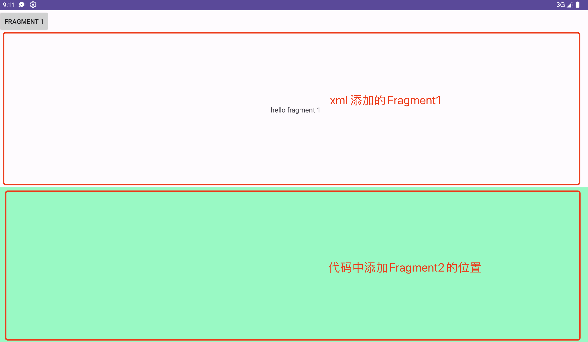
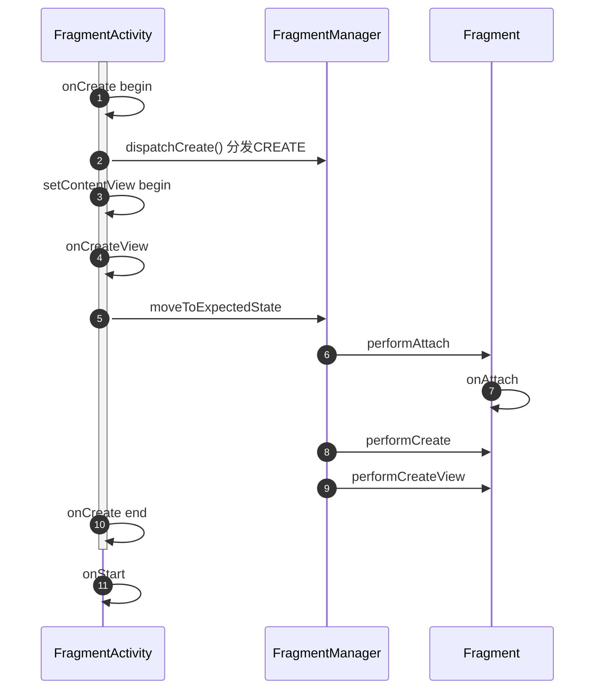

> 基于Android Api 33

## Activity的生命周期与Fragment生命周期的关联



### 代码

```xml
<?xml version="1.0" encoding="utf-8"?>
<androidx.constraintlayout.widget.ConstraintLayout xmlns:android="http://schemas.android.com/apk/res/android"
    xmlns:app="http://schemas.android.com/apk/res-auto"
    xmlns:tools="http://schemas.android.com/tools"
    android:layout_width="match_parent"
    android:layout_height="match_parent"
    tools:context=".MainActivity">

    <Button
        android:id="@+id/f1"
        android:text="Fragment 1"
        android:layout_width="wrap_content"
        android:layout_height="wrap_content"
        app:layout_constraintTop_toTopOf="parent"
        app:layout_constraintLeft_toLeftOf="parent"
        />

    <fragment android:name="com.example.test_android.Fragment1"
        android:id="@+id/prefill_fragment"
        android:layout_width="match_parent"
        android:layout_height="0dp"
        app:layout_constraintTop_toBottomOf="@id/f1"
        app:layout_constraintStart_toStartOf="parent"
        app:layout_constraintEnd_toEndOf="parent"
        app:layout_constraintBottom_toTopOf="@id/content_fragment"
        />

    <FrameLayout
        android:id="@+id/content_fragment"
        android:background="#8EFDCB"
        android:layout_width="match_parent"
        android:layout_height="0dp"
        app:layout_constraintTop_toBottomOf="@id/prefill_fragment"
        app:layout_constraintStart_toStartOf="parent"
        app:layout_constraintEnd_toEndOf="parent"
        app:layout_constraintBottom_toBottomOf="parent"
        />

</androidx.constraintlayout.widget.ConstraintLayout>
```

```kotlin
import android.content.Context
import android.os.Bundle
import android.util.AttributeSet
import android.util.Log
import android.view.View
import android.widget.Button
import androidx.fragment.app.Fragment
import androidx.fragment.app.FragmentActivity

class MainActivity : FragmentActivity() {

    var f1: Button? = null

    override fun onCreate(savedInstanceState: Bundle?) {
        Log.d("swithun-xxxx", "MainActivity onCreate")
        super.onCreate(savedInstanceState)
        setContentView(R.layout.activity_main)

        f1 = findViewById(R.id.f1)

        f1()
        Log.d("swithun-xxxx", "MainActivity onCreate end")
    }

    override fun onStart() {
        Log.d("swithun-xxxx", "MainActivity onStart begin")
        super.onStart()
        Log.d("swithun-xxxx", "MainActivity onStart end")
    }

    override fun onCreateView(name: String, context: Context, attrs: AttributeSet): View? {
        Log.d("swithun-xxxx", "MainActivity onCreateView 1")
        return super.onCreateView(name, context, attrs)
    }

    override fun onCreateView(
        parent: View?,
        name: String,
        context: Context,
        attrs: AttributeSet
    ): View? {
        Log.d("swithun-xxxx", "MainActivity onCreateView 2")
        return super.onCreateView(parent, name, context, attrs)
    }

    override fun onAttachFragment(fragment: Fragment) {
        Log.d("swithun-xxxx", "MainActivity onAttachFragment")
        super.onAttachFragment(fragment)
    }

    override fun onResume() {
        Log.d("swithun-xxxx", "MainActivity onResume")
        super.onResume()
    }

    override fun onStop() {
        Log.d("swithun-xxxx", "MainActivity onResume")
        super.onStop()
    }

    override fun onDestroy() {
        Log.d("swithun-xxxx", "MainActivity onDestroy")
        super.onDestroy()
    }

    private fun f1() {
        f1?.setOnClickListener {
            val transaction = supportFragmentManager.beginTransaction();
            transaction.add(R.id.content_fragment, Fragment2())
            transaction.commit()
        }
    }
}
```

```kotlin
import android.content.Context
import android.os.Bundle
import android.util.Log
import android.view.Gravity
import android.view.LayoutInflater
import android.view.View
import android.view.ViewGroup
import android.widget.FrameLayout
import android.widget.TextView
import androidx.fragment.app.Fragment

open class Fragment1: Fragment() {

    open val name = "fragment 1"

    override fun onAttach(context: Context) {
        Log.d("swithun-xxxx", "$name onAttach")
        super.onAttach(context)
    }

    override fun onCreate(savedInstanceState: Bundle?) {
        Log.d("swithun-xxxx", "$name onCreate")
        super.onCreate(savedInstanceState)
    }

    override fun onCreateView(
        inflater: LayoutInflater,
        container: ViewGroup?,
        savedInstanceState: Bundle?
    ): View? {
        // 居中添加一个TextView——“hello Fragment1"
        Log.d("swithun-xxxx", "$name onCreateView")
        val view = TextView(context)
        val param = FrameLayout.LayoutParams(FrameLayout.LayoutParams.MATCH_PARENT, FrameLayout.LayoutParams.MATCH_PARENT)
        param.gravity = Gravity.CENTER
        view.layoutParams = param
        view.text = "hello $name"
        view.textSize = 15F
        view.gravity = Gravity.CENTER
        return view
    }

    override fun onViewCreated(view: View, savedInstanceState: Bundle?) {
        Log.d("swithun-xxxx", "$name onViewCreated")
        super.onViewCreated(view, savedInstanceState)
    }

    override fun onActivityCreated(savedInstanceState: Bundle?) {
        Log.d("swithun-xxxx", "$name onActivityCreated")
        super.onActivityCreated(savedInstanceState)
    }

    override fun onStart() {
        Log.d("swithun-xxxx", "$name onStart")
        super.onStart()
    }

    override fun onResume() {
        Log.d("swithun-xxxx", "$name onResume")
        super.onResume()
    }

    override fun onPause() {
        Log.d("swithun-xxxx", "$name onPause")
        super.onPause()
    }

    override fun onStop() {
        Log.d("swithun-xxxx", "$name onStop")
        super.onStop()
    }

    override fun onDestroyView() {
        Log.d("swithun-xxxx", "$name onDestroyView")
        super.onDestroyView()
    }

    override fun onDestroy() {
        Log.d("swithun-xxxx", "$name onDestroy")
        super.onDestroy()
    }

    override fun onDetach() {
        Log.d("swithun-xxxx", "$name onDetach")
        super.onDetach()
    }
}
```

```kotlin
class Fragment2: Fragment1() {
    override val name: String = "Fragment 2"
}
```

### 通过xml文件添加Fragment —— Fragment1

```xml
<?xml version="1.0" encoding="utf-8"?>
<androidx.constraintlayout.widget.ConstraintLayout xmlns:android="http://schemas.android.com/apk/res/android"
    ...

    <fragment android:name="com.example.test_android.Fragment1"
        android:id="@+id/prefill_fragment"
        android:layout_width="match_parent"
        android:layout_height="0dp"
        app:layout_constraintTop_toBottomOf="@id/f1"
        app:layout_constraintStart_toStartOf="parent"
        app:layout_constraintEnd_toEndOf="parent"
        app:layout_constraintBottom_toTopOf="@id/content_fragment"
        />
    ...

</androidx.constraintlayout.widget.ConstraintLayout>
```


先从代码分析，从`FragmentActivity`.`onCreate` 开始看

- `[T-1] MainActivity.onCreate`
    ```kotlin
        // MainActivity
    class MainActivity : FragmentActivity() {
        ...
        override fun onCreate(savedInstanceState: Bundle?) {
       [:0] super.onCreate(savedInstanceState)
       [:1] setContentView(R.layout.activity_main)
    ```

#### 关键节点 [:0] FragmentActivity.onCreate

- `[:0] FragmentActivity.onCreate`
    ```java
    // androidx.fragment.app.FragmentActivity
        protected void onCreate(@Nullable Bundle savedInstanceState) {
            ...
        [:0:1] mFragments.dispatchCreate();
        }
    ```

    ```mermaid
    sequenceDiagram
    autonumber

    participant FragmentActivity
    participant FragmentController

    FragmentActivity->>FragmentActivity: onCreate begin
    FragmentActivity->>FragmentController: dispatchCreate
    ```

    ```mermaid
    classDiagram

    class FragmentActivity {
        - FragmentController mFragments
    }
    class FragmentController

    FragmentActivity --> FragmentController: hold
    ```

    可以看出  
    1. `FragmentActivity`持有`FragmentController`
    2. 通知`FragmentController`分发`create`事件
- `[:0:1] mFragments.dispatchCreate()`

    ```java
    // androidx.fragment.app.FragmentController
        public void dispatchCreate() {
       [:0:1:0] mHost.mFragmentManager.dispatchCreate();
        }
    ```

    ```mermaid
    sequenceDiagram
    autonumber

    participant FragmentActivity
    participant FragmentController

    FragmentActivity->>FragmentActivity: onCreate begin
    FragmentActivity->>FragmentController: dispatchCreate
    FragmentController->>FragmentManager: dispatchCreate
    ```

    ```mermaid
    classDiagram

    class FragmentActivity {
        - FragmentController mFragments
    }
    class FragmentController {
        - FragmentHostCallback<?> mHost
    }
    class FragmentManager {
        <<abstract>>
    }
    class FragmentManagerImpl
    class FragmentHostCallback {
        <<abstract>>
        - FragmentManager mFragmentManager
    }

    FragmentActivity --> FragmentController: hold
    FragmentController --> FragmentHostCallback: hold
    FragmentHostCallback --> FragmentManager: hold
    FragmentManagerImpl --|> FragmentManager: implements
    ```
    可以看出
    1. `FragmentController`持有`FragmentHostCallback`持有`FragmentManger`
    2. 通知`FragmentManager`分发`create`事件
- `[:0:1:0] mHost.mFragmentManager.dispatchCreate()`
    ```java
    // androidx.fragment.app.FragmentManager
        void dispatchCreate() {
            ...
       [:0:1:0:0] dispatchStateChange(Fragment.CREATED);
            ...
        }
    ```
    ```java
    public class Fragment implements ComponentCallbacks, OnCreateContextMenuListener, LifecycleOwner,
            ViewModelStoreOwner, HasDefaultViewModelProviderFactory, SavedStateRegistryOwner,
            ActivityResultCaller {

        static final int INITIALIZING = -1;          // Not yet attached.
        static final int ATTACHED = 0;               // Attached to the host.
        static final int CREATED = 1;                // Created.
        static final int VIEW_CREATED = 2;           // View Created.
        static final int AWAITING_EXIT_EFFECTS = 3;  // Downward state, awaiting exit effects
        static final int ACTIVITY_CREATED = 4;       // Fully created, not started.
        static final int STARTED = 5;                // Created and started, not resumed.
        static final int AWAITING_ENTER_EFFECTS = 6; // Upward state, awaiting enter effects
        static final int RESUMED = 7;                // Created started and resumed.
    ```

    ```mermaid
    sequenceDiagram
    autonumber

    participant FragmentActivity
    participant FragmentController
    participant FragmentManager

    FragmentActivity->>FragmentActivity: onCreate begin
    FragmentActivity->>FragmentController: dispatchCreate
    FragmentController->>FragmentManager: dispatchCreate
    FragmentManager->>FragmentManager: dispatchStateChange
    ```
    可以看出
    1. `FragmentManager`内部分发`Fragment.CREATED`事件——*Attached to the host*
- `[:0:1:0:0] dispatchStateChange(Fragment.CREATED)`
    ```java
    // androidx.fragment.app.FragmentManager
        private void dispatchStateChange(int nextState) {
            ...
           [:0:1:0:0:0] mFragmentStore.dispatchStateChange(nextState);
           [:0:1:0:0:1] moveToState(nextState, false);
           ...
    }
    ```
    ```java
    public abstract class FragmentManager implements FragmentResultOwner {
        ...
        private final FragmentStore mFragmentStore = new FragmentStore();
    ```

    ```mermaid
    sequenceDiagram
    autonumber

    participant FragmentActivity
    participant FragmentController
    participant FragmentManager
    participant FragmentStore

    FragmentActivity->>FragmentActivity: onCreate begin
    FragmentActivity->>FragmentController: dispatchCreate
    FragmentController->>FragmentManager: dispatchCreate
    FragmentManager->>FragmentManager: dispatchStateChange
    FragmentManager->>FragmentStore: dispatchStateChange
    ```

    ```mermaid
    classDiagram

    class FragmentActivity {
        - FragmentController mFragments
    }
    class FragmentController {
        - FragmentHostCallback<?> mHost
    }
    class FragmentManager {
        <<abstract>>
        FragmentStore mFragmentStore
    }
    class FragmentManagerImpl
    class FragmentHostCallback {
        <<abstract>>
        - FragmentManager mFragmentManager
    }
    class FragmentStore

    FragmentActivity --> FragmentController: hold
    FragmentController --> FragmentHostCallback: hold
    FragmentHostCallback --> FragmentManager: hold
    FragmentManagerImpl --|> FragmentManager: implements
    FragmentManager --> FragmentStore: hold
    ```
    可以看出
    1. `FragmentManager`持有一个`FragmentStore`
    2. `FragmentStore`分发收到的状态`nextState`——`Fragment.CREATED`
- `[:0:1:0:0:0] mFragmentStore.dispatchStateChange(nextState)`
    ```java
    // androidx.fragment.app.FragmentStore
        void dispatchStateChange(int state) {
            for (FragmentStateManager fragmentStateManager : mActive.values()) {
                if (fragmentStateManager != null) {
     [:0:1:0:0:0:0] fragmentStateManager.setFragmentManagerState(state);
                }
            }
        }
    ```
    `mActive`是存储`FragmentStateManager`的`Map`:⬇️
    ```java
    // androidx.fragment.app.FragmentStore
    class FragmentStore {
        ...
        private final HashMap<String, FragmentStateManager> mActive = new HashMap<>();
    ```

    ```mermaid
    sequenceDiagram
    autonumber

    participant FragmentActivity
    participant FragmentController
    participant FragmentManager
    participant FragmentStore
    participant FragmentStateManager

    FragmentActivity->>FragmentActivity: onCreate begin
    FragmentActivity->>FragmentController: dispatchCreate
    FragmentController->>FragmentManager: dispatchCreate
    FragmentManager->>FragmentManager: dispatchStateChange
    FragmentManager->>FragmentStore: dispatchStateChange
    FragmentStore->>FragmentStateManager: setFragmentManagerState
    ```

    ```mermaid
    classDiagram

    class FragmentActivity {
        - FragmentController mFragments
    }
    class FragmentController {
        - FragmentHostCallback<?> mHost
    }
    class FragmentManager {
        <<abstract>>
        FragmentStore mFragmentStore
    }
    class FragmentManagerImpl
    class FragmentHostCallback {
        <<abstract>>
        - FragmentManager mFragmentManager
    }
    class FragmentStore {
        HashMap「String, FragmentStateManager」 mActive
    }
    class FragmentStateManager

    FragmentActivity --> FragmentController: hold
    FragmentController --> FragmentHostCallback: hold
    FragmentHostCallback --> FragmentManager: hold
    FragmentManagerImpl --|> FragmentManager: implements
    FragmentManager --> FragmentStore: hold
    FragmentStore "1" --> "n" FragmentStateManager: hold
    ```
    可以看出
    1. `FragmentStore`持有n个`FragmentStateManager`
    2. `FragmentManager`将收到的状态分发给每一个`FragmentStateManager`
    
    **[总结]**: 由于`FragmentActivity`此时尚未`setContentView`，所以`FragmentManger`管理的`Fragment`数量实际上为0，`mActive`自然为0。但是我们仍然继续看下如果不为0会继续做什么。
- `[:0:1:0:0:0:0] fragmentStateManager.setFragmentManagerState(state)`
    ```java
    // androidx.fragment.app.FragmentStateManager
        void setFragmentManagerState(int state) {
            mFragmentManagerState = state;
        }
    ```
    ```java
    // androidx.fragment.app.FragmentStateManager
    class FragmentStateManager {
        ...
        private final Fragment mFragment;
        private int mFragmentManagerState = Fragment.INITIALIZING;
    ```
    ```mermaid
    classDiagram

    class FragmentActivity {
        - FragmentController mFragments
    }
    class FragmentController {
        - FragmentHostCallback<?> mHost
    }
    class FragmentManager {
        <<abstract>>
        FragmentStore mFragmentStore
    }
    class FragmentManagerImpl
    class FragmentHostCallback {
        <<abstract>>
        - FragmentManager mFragmentManager
    }
    class FragmentStore {
        HashMap「String, FragmentStateManager」 mActive
    }
    class FragmentStateManager {
        Fragment mFragment
        int mFragmentManagerState
    }
    class Fragment

    FragmentActivity --> FragmentController: hold
    FragmentController --> FragmentHostCallback: hold
    FragmentHostCallback --> FragmentManager: hold
    FragmentManagerImpl --|> FragmentManager: implements
    FragmentManager --> FragmentStore: hold
    FragmentStore "1" --> "n" FragmentStateManager: hold
    FragmentStateManager --> Fragment: hold
    ```
    可以看出
    1. `FragmentStateManager` 1:1 持有`Fragment`
    2. `FragmentStateManaget`持有变量`mFragmentManagerState`——所属的FragmentManager的状态

    至此，`FragmentActivity`将`CREATE`状态通知到`FragmentManager`进而通知到管理的每个`FragmentStateManager`——但是此时Fragment尚未更新。

    **[总结]**: （只关心重要的`FragmentActivity`,`FragmentManager`,`Fragment`）  

    ```mermaid
    sequenceDiagram
    autonumber

    participant FragmentActivity
    participant FragmentManager
    participant Fragment
    
    FragmentActivity->>FragmentActivity: onCreate begin
    FragmentActivity->>FragmentManager: dispatchCreate() 分发CREATE
    ```

- `[:0:1:0:0:1] moveToState(nextState, false);`
    ```java
    // androidx.fragment.app.FragmentManager
        void moveToState(int newState, boolean always) {
            ...
                mFragmentStore.moveToExpectedState();
            ...
    ```

    ```mermaid
    sequenceDiagram
    autonumber

    participant FragmentActivity
    participant FragmentController
    participant FragmentManager
    participant FragmentStore

    FragmentActivity->>FragmentActivity: onCreate begin
    FragmentActivity->>FragmentController: dispatchCreate
    FragmentController->>FragmentManager: dispatchCreate
    FragmentManager->>FragmentManager: dispatchStateChange
    FragmentManager->>FragmentStore: dispatchStateChange
    FragmentManager->>FragmentManager: moveToState
    ```

    `[:0:1:0:0:0:0]`只是将用来管理`Fragment`的`FragmentStateManager`的状态更新了，这里才是真正更新`Fragment`的状态——但是此时`FragmentManager`管理的`Fragment`数量实际上为0，所以这里先不继续看，后续流程下面`[:1:0:0:1]`会继续讲到。

#### 关键节点 [:1] setContentView(R.layout.activity_main)

- `[:1] setContentView(R.layout.activity_main)`
    执行`[:0] super.onCreate(savedInstanceState)`之后，setContentView
    ```java
    // androidx.activity.ComponentActivity
        @Override
        public void setContentView(@LayoutRes int layoutResID) {
            ...
        [:1:0] super.setContentView(layoutResID);
        }
    ```

    ```mermaid
    sequenceDiagram
    autonumber

    participant FragmentActivity
    participant FragmentController
    participant Activity

    FragmentActivity->>FragmentActivity: onCreate begin
    FragmentActivity->>FragmentController: dispatchCreate
    FragmentActivity->>Activity: setContentView
    ```

    ```mermaid
    classDiagram

    class FragmentActivity {
        - FragmentController mFragments
    }
    class FragmentController
    class Activity

    FragmentActivity --> FragmentController: hold
    FragmentActivity --|> Activity
    ```

- `[:1:0] super.setContentView(layoutResID);`
    `ComponentActivity`调用父类`Activity`.`setContentView`
    ```java
    // android.app.Activity
        public void setContentView(@LayoutRes int layoutResID) {
       [:1:0:0] getWindow().setContentView(layoutResID);
       ...
    ```

    ```mermaid
    sequenceDiagram
    autonumber

    participant FragmentActivity
    participant FragmentController
    participant Activity
    participant Window

    FragmentActivity->>FragmentActivity: onCreate begin
    FragmentActivity->>FragmentController: dispatchCreate
    FragmentActivity->>Activity: setContentView
    Activity->>Window: setContentView
    ```

    ```mermaid
    classDiagram

    class FragmentActivity {
        - FragmentController mFragments
    }
    class FragmentController
    class Activity {
        - Window mWindow
    }

    FragmentActivity --> FragmentController: hold
    FragmentActivity --|> Activity
    Activity --> Window: hold
    ```

- `[:1:0:0] getWindow().setContentView(layoutResID);`
    `Window`.`setContentView`
    ```java
    // android.view.Window
        public abstract void setContentView(@LayoutRes int layoutResID);
    ```
    继续-跳过细节 根据传入的layout ResId 初始化 view
    ```java
    // com.android.internal.policy.PhoneWindow
        @Override
        public void setContentView(int layoutResID) {
            ...
            [...]    mLayoutInflater.inflate(layoutResID, mContentParent);
            ...
    ```

    ```mermaid
    sequenceDiagram
    autonumber

    participant FragmentActivity
    participant FragmentController
    participant Activity
    participant PhoneWindow
    participant LayoutInflater

    FragmentActivity->>FragmentActivity: onCreate begin
    FragmentActivity->>FragmentController: dispatchCreate
    FragmentActivity->>Activity: setContentView
    Activity->>PhoneWindow: setContentView
    PhoneWindow->>LayoutInflater: inflate
    ```

    ```mermaid
    classDiagram

    class FragmentActivity {
        - FragmentController mFragments
    }
    class FragmentController
    class Activity {
        - Window mWindow
    }
    class PhoneWindow {
        - LayoutInflater mLayoutInflater
    }
    class LayoutInflater

    FragmentActivity --> FragmentController: hold
    FragmentActivity --|> Activity
    Activity --> Window: hold
    PhoneWindow --|> Window
    PhoneWindow --> LayoutInflater: hold
    ```

    `mContentParent`为`PhoneWindow`的根View，下面会根据`layoutResID`构造`View`并add到`mContentParent`  
    继续-跳过细节 根据传入的layout ResId 初始化 view
    ```java
    // android.view.LayoutInflater
        public View inflate(@LayoutRes int resource, @Nullable ViewGroup root) {
            return inflate(resource, root, root != null);
    ```
    ```java
    // android.view.LayoutInflater
        public View inflate(@LayoutRes int resource, @Nullable ViewGroup root, boolean attachToRoot) {
            [...] return inflate(parser, root, attachToRoot);
            ...
        }
    ```
    `attachToRoot`为true(`root != null`)  
    ```java
        // android.view.LayoutInflater
        public View inflate(XmlPullParser parser, @Nullable ViewGroup root, boolean attachToRoot) {
            synchronized (mConstructorArgs) {
                ...
                    advanceToRootNode(parser); // 让parser移动到下一个要解析的"结点"
                    final String name = parser.getName(); // 获取结点名字
                    ...
                        // 根据名字构造xml的根view
                        final View temp = createViewFromTag(root, name, inflaterContext, attrs);
                    ...
                        // 继续递归构造xml根view的子view，并addView到根view
                        rInflateChildren(parser, temp, attrs, true);
    ```
    根据`xml parser`构造`View`，`temp`是`xml`的根标签代表的view，根据`activity_main.xml`
    `xml-1` ⬇️
    ```xml
    <?xml version="1.0" encoding="utf-8"?>
    <androidx.constraintlayout.widget.ConstraintLayout     ...>
        <Button..>

        <fragment android:name="com.example.test_android.Fragment1"...>

        <FrameLayout
            android:id="@+id/content_fragment"...>

    </androidx.constraintlayout.widget.ConstraintLayout>
    ```
    `name`则为根标签`androidx.constraintlayout.widget.ConstraintLayout`，  
    `temp`相应的则是`androidx.constraintlayout.widget.ConstraintLayout`，  
    下面`rInflateChildren`则是继续递归的构造`ConstraintLayout`中的子view。(开头的`r`代表的是*Recursive*--*递归*)
    ```java
    // android.view.LayoutInflater
        final void rInflateChildren(XmlPullParser parser, View parent, AttributeSet attrs,
                boolean finishInflate) throws XmlPullParserException, IOException {
            rInflate(parser, parent, parent.getContext(), attrs, finishInflate);
    ```
    ```java
    // android.view.LayoutInflater
        void rInflate(XmlPullParser parser, View parent, Context context,
                AttributeSet attrs, boolean finishInflate) throws XmlPullParserException, IOException {
            ...
                while (((type = parser.next()) != XmlPullParser.END_TAG ||
                    ...
                    final View view = createViewFromTag(parent, name, context, attrs);
            ...
    ```
    `rInflate`: 继续递归构造`temp`的子view
    `parser.next`: 不断的获取下一个要解析的标签，根据`xml-1`，会解析到 `<fragment`标签——通过`createViewFromTag`构造Fragment
    ```java
    // android.view.LayoutInflater
        private View createViewFromTag(View parent, String name, Context context, AttributeSet attrs) {
            return createViewFromTag(parent, name, context, attrs, false);
    ```
    ```java
    // android.view.LayoutInflater
        View createViewFromTag(View parent, String name, Context context, AttributeSet attrs,
            ...
                View view = tryCreateView(parent, name, context, attrs);
            ...
    ```
    构造fragment view
    ```java
    // android.view.LayoutInflater
        public final View tryCreateView(@Nullable View parent, @NonNull String name,
            ...
                view = mPrivateFactory.onCreateView(parent, name, context, attrs);
            ...
    ```
    ```java
    // android.view.LayoutInflater
        private Factory2 mPrivateFactory;
    ```

    ```mermaid
    sequenceDiagram
    autonumber

    participant FragmentActivity
    participant FragmentController
    participant Activity
    participant PhoneWindow
    participant LayoutInflater
    participant LayoutInflater-Factory2

    FragmentActivity->>FragmentActivity: onCreate begin
    FragmentActivity->>FragmentController: dispatchCreate
    FragmentActivity->>Activity: setContentView
    Activity->>PhoneWindow: setContentView
    PhoneWindow->>LayoutInflater: inflate
    LayoutInflater->>LayoutInflater-Factory2: onCreateView
    ```

    ```mermaid
    classDiagram

    class FragmentActivity {
        - FragmentController mFragments
    }
    class FragmentController
    class Activity {
        - Window mWindow
    }
    class PhoneWindow {
        - LayoutInflater mLayoutInflater
    }
    class LayoutInflater
    class LayoutInflater-Factory2

    FragmentActivity --> FragmentController: hold
    FragmentActivity --|> Activity
    Activity --> Window: hold
    PhoneWindow --|> Window
    PhoneWindow --> LayoutInflater: hold
    Activity --|> LayoutInflater-Factory2
    LayoutInflater --> LayoutInflater-Factory2: hold
    ```


    `mPrivateFactory`实际上是我们写的的`MainActivity`，所以继续会走到`MainActivity.onCreateView`
    ```java
    // androidx.fragment.app.FragmentActivity
        public View onCreateView(@Nullable View parent, @NonNull String name, @NonNull Context context,
                @NonNull AttributeSet attrs) {
            final View v = dispatchFragmentsOnCreateView(parent, name, context, attrs);
            if (v == null) {
                return super.onCreateView(parent, name, context, attrs);
            }
            return v;
        }
    ```
    `@param View parent`: xml的根布局`ConstraintLayout`
    `@param String name`: `fragment`，也就是`xml-1`中的`fragment`标签
    `dispatchFragmentsOnCreateView(`: 会先尝试通过该方法处理`fragment`标签对应的View，如果有返回结果则跳过`if (v == null)`中的逻辑，我们这里`name`为`framgment`，所以不应该返回null。

    ```mermaid
    sequenceDiagram
    autonumber

    participant FragmentActivity
    participant FragmentController
    participant Activity
    participant PhoneWindow
    participant LayoutInflater
    participant LayoutInflater-Factory2

    FragmentActivity->>FragmentActivity: onCreate begin
    FragmentActivity->>FragmentController: dispatchCreate
    FragmentActivity->>Activity: setContentView
    Activity->>PhoneWindow: setContentView
    PhoneWindow->>LayoutInflater: inflate
    LayoutInflater->>LayoutInflater-Factory2: onCreateView
    LayoutInflater-Factory2->>FragmentActivity: onCreateView
    ```

    ```mermaid
    classDiagram

    class FragmentActivity {
        - FragmentController mFragments
    }
    class FragmentController
    class Activity {
        - Window mWindow
    }
    class PhoneWindow {
        - LayoutInflater mLayoutInflater
    }
    class LayoutInflater
    class LayoutInflater-Factory2

    FragmentActivity --> FragmentController: hold
    FragmentActivity --|> Activity
    Activity --> Window: hold
    PhoneWindow --|> Window
    PhoneWindow --> LayoutInflater: hold
    Activity --|> LayoutInflater-Factory2
    LayoutInflater --> LayoutInflater-Factory2: hold
    ```

    ```java
    // androidx.fragment.app.FragmentActivity
        @Nullable
        final View dispatchFragmentsOnCreateView(@Nullable View parent, @NonNull String name,
                @NonNull Context context, @NonNull AttributeSet attrs) {
            return mFragments.onCreateView(parent, name, context, attrs);
    ```

    ```mermaid
    sequenceDiagram
    autonumber

    participant FragmentActivity
    participant FragmentController
    participant Activity
    participant PhoneWindow
    participant LayoutInflater
    participant LayoutInflater-Factory2

    FragmentActivity->>FragmentActivity: onCreate begin
    FragmentActivity->>FragmentController: dispatchCreate
    FragmentActivity->>Activity: setContentView
    Activity->>PhoneWindow: setContentView
    PhoneWindow->>LayoutInflater: inflate
    LayoutInflater->>LayoutInflater-Factory2: onCreateView
    LayoutInflater-Factory2->>FragmentActivity: onCreateView
    FragmentActivity->>FragmentController: onCreateView
    ```

    ```java
    // androidx.fragment.app.FragmentController
        public View onCreateView(@Nullable View parent, @NonNull String name, @NonNull Context context,
                @NonNull AttributeSet attrs) {
            return mHost.mFragmentManager.getLayoutInflaterFactory()
                    .onCreateView(parent, name, context, attrs);
        }
    ```

    ```mermaid
    sequenceDiagram
    autonumber

    participant FragmentActivity
    participant FragmentController
    participant Activity
    participant PhoneWindow
    participant LayoutInflater
    participant LayoutInflater-Factory2
    participant FragmentLayoutInflaterFactory

    FragmentActivity->>FragmentActivity: onCreate begin
    FragmentActivity->>FragmentController: dispatchCreate
    FragmentActivity->>Activity: setContentView
    Activity->>PhoneWindow: setContentView
    PhoneWindow->>LayoutInflater: inflate
    LayoutInflater->>LayoutInflater-Factory2: onCreateView
    LayoutInflater-Factory2->>FragmentActivity: onCreateView
    FragmentActivity->>FragmentController: onCreateView
    FragmentController->>FragmentLayoutInflaterFactory: onCreateView
    ```

    ```mermaid
    classDiagram

    class FragmentActivity {
        - FragmentController mFragments
    }
    class FragmentController {
        FragmentHostCallback<?> mHost
    }
    class Activity {
        - Window mWindow
    }
    class PhoneWindow {
        - LayoutInflater mLayoutInflater
    }
    class LayoutInflater
    class LayoutInflater-Factory2
    class FragmentManager {
        FragmentLayoutInflaterFactory mLayoutInflaterFactory
    }
    class FragmentHostCallback {
        <<abstract>>
        FragmentManager mFragmentManager
    }
    class FragmentLayoutInflaterFactory

    FragmentActivity --> FragmentController: hold
    FragmentActivity --|> Activity
    Activity --> Window: hold
    PhoneWindow --|> Window
    PhoneWindow --> LayoutInflater: hold
    Activity --|> LayoutInflater-Factory2
    LayoutInflater --> LayoutInflater-Factory2: hold
    FragmentController --> FragmentHostCallback: hold
    FragmentHostCallback --> FragmentManager: hold
    FragmentManager --> FragmentLayoutInflaterFactory: hold
    ```

    return `FragmentActivity.dispatchFragmentsOnCreateView` $\rightarrow$ return `FragmentController.onCreateView` $\rightarrow$ return `FragmentLayoutInflaterFactory.onCreateView`
    ```java
    // androidx.fragment.app.FragmentLayoutInflaterFactory
        public View onCreateView(@Nullable final View parent, @NonNull String name,
            ...
                // new Fragment
                fragment = mFragmentManager.getFragmentFactory().instantiate(
                context.getClassLoader(), fname);
                // fragment 的属性设置 begin
                fragment.mFromLayout = true;
                fragment.mFragmentId = id != 0 ? id : containerId;
                fragment.mContainerId = containerId;
                fragment.mTag = tag;
                fragment.mInLayout = true;
                fragment.mFragmentManager = mFragmentManager;
                fragment.mHost = mFragmentManager.getHost();
                fragment.onInflate(mFragmentManager.getHost().getContext(), attrs,
                        fragment.mSavedFragmentState);
                // fragment 的属性设置 end

                // 添加到mFragmentManager中，同时返回 持有Fragment的FragmentStateManager
                fragmentStateManager = mFragmentManager.addFragment(fragment);
                // 此时Fragment这个壳已经初始化，但是Fragment.mView实际上还没有构造
            ...
            // 通过FragmentStateManager更新他持有的一对一的Fragment的State
       [:1:0:0:1] fragmentStateManager.moveToExpectedState();
            // 确保走到这行代码是Fragment已经构造好view
       [B2] fragmentStateManager.ensureInflatedView();
    ```

    ```mermaid
    sequenceDiagram
    autonumber

    participant FragmentActivity
    participant FragmentController
    participant Activity
    participant PhoneWindow
    participant LayoutInflater
    participant LayoutInflater-Factory2
    participant FragmentLayoutInflaterFactory
    participant Fragment
    participant FragmentStateManager

    FragmentActivity->>FragmentActivity: onCreate begin
    FragmentActivity->>FragmentController: dispatchCreate
    FragmentActivity->>Activity: setContentView
    Activity->>PhoneWindow: setContentView
    PhoneWindow->>LayoutInflater: inflate
    LayoutInflater->>LayoutInflater-Factory2: onCreateView
    LayoutInflater-Factory2->>FragmentActivity: onCreateView
    FragmentActivity->>FragmentController: onCreateView
    FragmentController->>FragmentLayoutInflaterFactory: onCreateView
    FragmentLayoutInflaterFactory->>Fragment: new
    FragmentLayoutInflaterFactory->>FragmentManager: addFragment
    FragmentManager->>FragmentLayoutInflaterFactory: addFragment return FragmentStateManager
    FragmentLayoutInflaterFactory->>FragmentStateManager: moveToExpectedState
    ```

    ```mermaid
    classDiagram

    class FragmentActivity {
        - FragmentController mFragments
    }
    class FragmentController {
        FragmentHostCallback<?> mHost
    }
    class Activity {
        - Window mWindow
    }
    class PhoneWindow {
        - LayoutInflater mLayoutInflater
    }
    class LayoutInflater
    class LayoutInflater-Factory2
    class FragmentManager {
        FragmentLayoutInflaterFactory mLayoutInflaterFactory
    }
    class FragmentHostCallback {
        <<abstract>>
        FragmentManager mFragmentManager
    }
    class FragmentLayoutInflaterFactory {
        FragmentManager mFragmentManager
    }

    FragmentActivity --> FragmentController: hold
    FragmentActivity --|> Activity
    Activity --> Window: hold
    PhoneWindow --|> Window
    PhoneWindow --> LayoutInflater: hold
    Activity --|> LayoutInflater-Factory2
    LayoutInflater --> LayoutInflater-Factory2: hold
    FragmentController --> FragmentHostCallback: hold
    FragmentHostCallback --> FragmentManager: hold
    FragmentManager --> FragmentLayoutInflaterFactory: hold
    FragmentLayoutInflaterFactory --> FragmentManager: ref
    ```

    - `fragmentStateManager = mFragmentManager.addFragment(fragment);`: 将新建的`Fragment`添加到`FragmentManager`中进行管理。
- `[:1:0:0:1] fragmentStateManager.moveToExpectedState();`
    通过FragmentStateManager更新他持有的一对一的Fragment的State  
    ```java
    // androidx.fragment.app.FragmentStateManager
        void moveToExpectedState() {
            ...
                int newState;
         [:1:0:0:1:0] while ((newState = computeExpectedState()) != mFragment.mState) {
                    if (newState > mFragment.mState) {
                        // Moving upward
                        int nextStep = mFragment.mState + 1;
                        switch (nextStep) {
                            case Fragment.ATTACHED:
                         [:1:0:0:1:1] attach();
                            case Fragment.CREATED:
                         [:1:0:0:1:2] create();
                                break;
                            case Fragment.VIEW_CREATED:
                         [:1:0:0:1:3] ensureInflatedView();
                         [:1:0:0:1:4] createView();
                                break;
    ```
- `[:1:0:0:1:0] while ((newState = computeExpectedState()) != mFragment.mState) {`
    - `computeExpectedState()`: 根据FragmentManager等等计算mFragment应该达到的状态，先不看这里的复杂计算，但是最终的结果是2，对应`Fragment.VIEW_CREATED`，即Fragment应该进行到构造好View的状态
    - `while`: `mFragment`不断切换到下一个状态，知道达到目标状态——`VIEW_CREATED`
    - `mFragment.mState`: 当前`mFragment.mState`为`INITIALIZING`，则表示会依次执行`FragmentManager.attach()`、`FragmentManager.create()`、`FragmentManager.createView()`
    ```java
        static final int INITIALIZING = -1;          // Not yet attached.
        static final int ATTACHED = 0;               // Attached to the host.
        static final int CREATED = 1;                // Created.
        static final int VIEW_CREATED = 2;           // View Created.
        static final int AWAITING_EXIT_EFFECTS = 3;  // Downward state, awaiting exit effects
        static final int ACTIVITY_CREATED = 4;       // Fully created, not started.
        static final int STARTED = 5;                // Created and started, not resumed.
        static final int AWAITING_ENTER_EFFECTS = 6; // Upward state, awaiting enter effects
        static final int RESUMED = 7;                // Created started and resumed.
    ```
- `[:1:0:0:1:1] attach();`
    ```java
    // androidx.fragment.app.FragmentStateManager
        void attach() {
            ....
   [:1:0:0:1:1:0] mFragment.performAttach();
            mDispatcher.dispatchOnFragmentAttached(mFragment, false);
        }
    ```
    ```mermaid
    sequenceDiagram
    autonumber

    participant FragmentActivity
    participant FragmentController
    participant Activity
    participant PhoneWindow
    participant LayoutInflater
    participant LayoutInflater-Factory2
    participant FragmentLayoutInflaterFactory
    participant Fragment
    participant FragmentStateManager

    FragmentActivity->>FragmentActivity: onCreate begin
    FragmentActivity->>FragmentController: dispatchCreate
    FragmentActivity->>Activity: setContentView
    Activity->>PhoneWindow: setContentView
    PhoneWindow->>LayoutInflater: inflate
    LayoutInflater->>LayoutInflater-Factory2: onCreateView
    LayoutInflater-Factory2->>FragmentActivity: onCreateView
    FragmentActivity->>FragmentController: onCreateView
    FragmentController->>FragmentLayoutInflaterFactory: onCreateView
    FragmentLayoutInflaterFactory->>Fragment: new
    FragmentLayoutInflaterFactory->>FragmentManager: addFragment
    FragmentManager->>FragmentLayoutInflaterFactory: addFragment return FragmentStateManager
    FragmentLayoutInflaterFactory->>FragmentStateManager: moveToExpectedState
    FragmentStateManager->>Fragment: performAttach
    ```

- `[:1:0:0:1:1:0] mFragment.performAttach()`
    ```java
    // androidx.fragment.app.Fragment
        void performAttach() {
            ...
            mState = ATTACHED;
            onAttach(mHost.getContext());
            ...
            mChildFragmentManager.dispatchAttach();
        }
    ```
    - `mState = ATTACHED`: 更新`Fragment`状态为`ATTACHED`
    ```java
    // androidx.fragment.app.Fragment
        public void onAttach(@NonNull Context context) {
            mCalled = true;
            final Activity hostActivity = mHost == null ? null : mHost.getActivity();
            if (hostActivity != null) {
                mCalled = false;
                onAttach(hostActivity);
            }
        }
    ```
    ```java
    // androidx.fragment.app.Fragment
        public void onAttach(@NonNull Activity activity) {
            mCalled = true;
        }
    ```

**至此，`Fragment`的状态由`INITIALIZING`切换到`ATTACHED`切换到`CREATED`切换到`VIEW_CREATED`，关键方法是`B1`-`fragmentStateManager.moveToExpectedState`，不断的将`FragmentStateManager`所管理的所有`Fragment`推动到应该达到的状态。**



以上以`Create`为例，了解了`FragmentActivity`的状态对`Fragment`的状态影响以及`FragmentActivity`, `FragmentController`, `FragmentManager`, `FragmentStateManager`, `Fragment`中间的关系。

```
MainActivity onCreate
MainActivity onCreateView 2
MainActivity onCreateView 1
MainActivity onCreateView 2
MainActivity onCreateView 1
MainActivity onCreateView 2
MainActivity onCreateView 1
MainActivity onCreateView 2
MainActivity onCreateView 1
MainActivity onCreateView 2
MainActivity onCreateView 1
MainActivity onCreateView 2
fragment 1 onAttach
MainActivity onAttachFragment
fragment 1 onCreate
fragment 1 onCreateView
fragment 1 onViewCreated
MainActivity onCreateView 2
MainActivity onCreateView 1
MainActivity onCreate end
MainActivity onStart begin
fragment 1 onActivityCreated
fragment 1 onStart
MainActivity onStart end
MainActivity onResume
fragment 1 onResumek
```

简单总结：

| Activity 生命周期回调 | Fragment 生命周期回调                                               |
| ----------------- | ------------------------------------------------------------------- |
| onCreate          | - onAttach <br> - onCreate <br> - onCreateView <br> - onViewCreated |
| onStart           | - onActivityCreated <br> - onStart                                  |
| onResume          | - onResume                                                          |


#### 总结
总结以上，`FragmentActivity` `onCreate` 时将 `Create` 事件 $\xrightarrow{1:通知:1}$ `FragmentController` $\xrightarrow{1:通知:1}$ `FragmentManager` $\xrightarrow{1:通知:n}$ 持有的每个 `FragmentStateManager` $\xrightarrow{1:通知:1}$ `Fragment`。

### 代码中动态添加Fragment

```kotlin
// MainActivity
    private fun f1() {
        f1?.setOnClickListener {
       [:2] val transaction = supportFragmentManager.beginTransaction()
       [:3] transaction.add(R.id.content_fragment, Fragment2())
       [:4] transaction.commit()
        }
    }
```
- `[:2] val transaction = supportFragmentManager.beginTransaction()`
    ```kotlin
    // androidx.fragment.app.FragmentManager
        public FragmentTransaction beginTransaction() {
            return new BackStackRecord(this);
        }
    ```
    ```mermaid
    classDiagram
    class FragmentTransaction
    class BackStackRecord
    BackStackRecord --|> FragmentTransaction: extends
    ```
- `[:3] transaction.add(R.id.content_fragment, Fragment2())`
    ```java
    // androidx.fragment.app.FragmentTransaction
        public FragmentTransaction add(@IdRes int containerViewId, @NonNull Fragment fragment) {
       [:3:0] doAddOp(containerViewId, fragment, null, OP_ADD);
            return this;
        }
    ```
    其中`OP_ADD`⬇️ = 1
    ```java
    // androidx.fragment.app.FragmentTransaction
        static final int OP_NULL = 0;
        static final int OP_ADD = 1;
        static final int OP_REPLACE = 2;
        static final int OP_REMOVE = 3;
        static final int OP_HIDE = 4;
        static final int OP_SHOW = 5;
        static final int OP_DETACH = 6;
        static final int OP_ATTACH = 7;
        static final int OP_SET_PRIMARY_NAV = 8;
        static final int OP_UNSET_PRIMARY_NAV = 9;
        static final int OP_SET_MAX_LIFECYCLE = 10;
    ```
- `[:3:0] doAddOp(containerViewId, fragment, null, OP_ADD)`
    ```java
    // androidx.fragment.app.FragmentTransaction
        void doAddOp(int containerViewId, Fragment fragment, @Nullable String tag, int opcmd) {
            ...
       [:3:0:1] addOp(new Op(opcmd, fragment));
        }
    ```
- `[:3:0:1] addOp(new Op(opcmd, fragment))`
    ```java
    // androidx.fragment.app.FragmentTransaction
        void addOp(Op op) {
            mOps.add(op);
            ...
        }
    ```

    ```java
    // androidx.fragment.app.FragmentTransaction
        ArrayList<Op> mOps = new ArrayList<>();
    ```

    ```mermaid
    classDiagram
    class FragmentTransaction {
        ArrayList"Op" mOps
    }
    class BackStackRecord
    class FragmentTransaction-Op

    BackStackRecord--|>FragmentTransaction: extends
    FragmentTransaction-->FragmentTransaction-Op: holds
    ```

    `FragmentTransaction` 中有一个 `Op` list记录我们添加的操作——`OP_ADD`
- `[:4] transaction.commit()`
    ```java
    // androidx.fragment.app.FragmentTransaction
        public abstract int commit();
    ```

    ```java
    // androidx.fragment.app.BackStackRecord
        @Override
        public int commit() {
            return commitInternal(false);
        }
    ```

    ```java
        // androidx.fragment.app.BackStackRecord
        int commitInternal(boolean allowStateLoss) {
            ...
        [:4:0] mManager.enqueueAction(this, allowStateLoss);
            ...
        }
    ```

    ```mermaid
    sequenceDiagram
        participant BackStackRecord
        participant FragmentManager
        BackStackRecord->>FragmentManager: enqueueAction
    ```

- `[:4:0] mManager.enqueueAction(this, allowStateLoss);`
    ```java
    // androidx.fragment.app.FragmentManager
        void enqueueAction(@NonNull OpGenerator action, boolean allowStateLoss) {
            ...
                mPendingActions.add(action);
       [:4:0:0] scheduleCommit();
            ...
        }
    ```

    ```java
    // androidx.fragment.app.FragmentManager
        private final ArrayList<OpGenerator> mPendingActions = new ArrayList<>();
    ```

    ```java
    // androidx.fragment.app.FragmentManager
        interface OpGenerator {
            /**
             * Generate transactions to add to {@code records} and whether or not the transaction is
             * an add or pop to {@code isRecordPop}.
             *
             * records and isRecordPop must be added equally so that each transaction in records
             * matches the boolean for whether or not it is a pop in isRecordPop.
             *
             * @param records A list to add transactions to.
             * @param isRecordPop A list to add whether or not the transactions added to records is
             *                    a pop transaction.
             * @return true if something was added or false otherwise.
             */
            boolean generateOps(@NonNull ArrayList<BackStackRecord> records,
                    @NonNull ArrayList<Boolean> isRecordPop);
        }
    ```

    ```mermaid
    sequenceDiagram
    autonumber
        participant BackStackRecord
        participant FragmentManager
        BackStackRecord->>FragmentManager: enqueueAction
        FragmentManager->>FragmentManager: mPendingActions.add(action)
        FragmentManager->>FragmentManager: scheduleCommit
    ```

    ```mermaid
    classDiagram
    class FragmentTransaction {
        ArrayList"Op" mOps
    }
    class BackStackRecord
    class FragmentTransaction-Op
    class FragmentManager-OpGenerator
    class FragmentManager {
        ArrayList"OpGenerator" mPendingActions
    }

    BackStackRecord--|>FragmentTransaction: extends
    FragmentTransaction-->FragmentTransaction-Op: holds
    BackStackRecord--|> FragmentManager-OpGenerator: implements
    FragmentManager-->FragmentManager-OpGenerator: holds
    ```

- `[:4:0:0] scheduleCommit();`
    ```java
    // androidx.fragment.app.FragmentManager
        void scheduleCommit() {
            synchronized (mPendingActions) {
                    ...
          [:4:0:0:0] mHost.getHandler().post(mExecCommit);
                    ...
        }
    ```
- `[:4:0:0:0] mHost.getHandler().post(mExecCommit)`  
    `mExecCommit` ⬇️被放入消息队列，之后会被执行。

    ```java
        // androidx.fragment.app.FragmentManager
        private Runnable mExecCommit = new Runnable() {
            @Override
            public void run() {
      [:4:0:0:0:0] execPendjingActions(true);
            }
        };
    ```
- `[:4:0:0:0:0] execPendjingActions(true);`
    ```java
        // androidx.fragment.app.FragmentManager
        boolean execPendingActions(boolean allowStateLoss) {
            ensureExecReady(allowStateLoss);

    [:4:0:0:0:0:0]while (generateOpsForPendingActions(mTmpRecords, mTmpIsPop)) {
                mExecutingActions = true;
                try {
     [:4:0:0:0:0:1] removeRedundantOperationsAndExecute(mTmpRecords, mTmpIsPop);
                    ...
    ```
- `[:4:0:0:0:0:0] generateOpsForPendingActions(mTmpRecords, mTmpIsPop)`
    ```java
        // androidx.fragment.app.FragmentManager
        private boolean generateOpsForPendingActions(@NonNull ArrayList<BackStackRecord> records,
                @NonNull ArrayList<Boolean> isPop) {
                ...
                for (int i = 0; i < numActions; i++) {
      [:4:0:0:0:0:0:0] didSomething |= mPendingActions.get(i).generateOps(records, isPop);
                }
                ...
        }
    ```
    这里对`mPendingActions`中的每一个Action都调用`generateOps`——会处理到之前在`[:4:0]`添加的Action
- `[:4:0:0:0:0:0:0] mPendingActions.get(i).generateOps(records, isPop)`
    ```java
        // androidx.fragment.app.BackStackRecord
        public boolean generateOps(@NonNull ArrayList<BackStackRecord> records,
                @NonNull ArrayList<Boolean> isRecordPop) {

            ...
            records.add(this);
            ...
        }
    ```
    `BackStackRecord`将自己添加到传入的`records`中
- `[:4:0:0:0:0:1] removeRedundantOperationsAndExecute(mTmpRecords, mTmpIsPop)`  
    遍历`[:4:0:0:0:0:0]`返回的每一个record，对其处理
    ```java
        // androidx.fragment.app.FragmentManager
        private void removeRedundantOperationsAndExecute(@NonNull ArrayList<BackStackRecord> records,
                @NonNull ArrayList<Boolean> isRecordPop) {
            ...
            final int numRecords = records.size();

            for (int recordNum = 0; recordNum < numRecords; recordNum++) {
                ...
                       int reorderingEnd = recordNum + 1;
      [:4:0:0:0:0:1:0] executeOpsTogether(records, isRecordPop, recordNum, reorderingEnd);
                ...
            }
        }
    ```
    遍历执行record，`executeOpsTogether(records`传入了整个`records`——只有一个`OP_ADD`，通过后面两个参数指定要执行的 record的开始位置和结束位置——recordNum(0)和reorderingEnd(recordNum + 1 = 0 + 1 = 1)，也就相当于挨个执行。
- `[:4:0:0:0:0:1:0] executeOpsTogether(records, isRecordPop, recordNum, reorderingEnd)`
    ```java
        // androidx.fragment.app.FragmentManager
        private void executeOpsTogether(@NonNull ArrayList<BackStackRecord> records,
                @NonNull ArrayList<Boolean> isRecordPop, int startIndex, int endIndex) {
            ...
    [:4:0:0:0:0:1:0:0] executeOps(records, isRecordPop, startIndex, endIndex);
            ...
                                Fragment fragment = op.mFragment;
                                FragmentStateManager fragmentStateManager =
                                        createOrGetFragmentStateManager(fragment);
                                fragmentStateManager.moveToExpectedState();
            ...
            ...
    ```
    `startIndex`: `recordNum` = 0  
    `endIndex`: `reorderingEnd` = 1  
- `[:4:0:0:0:0:1:0:0] executeOps(records, isRecordPop, startIndex, endIndex);`
    ```java
        // androidx.fragment.app.FragmentManager
        private static void executeOps(@NonNull ArrayList<BackStackRecord> records,
            @NonNull ArrayList<Boolean> isRecordPop, int startIndex, int endIndex) {
            for (int i = startIndex; i < endIndex; i++) {
     [:4:0:0:0:0:1:0:0:0] record.executeOps();
                }
            }
        }
    ```
- `[:4:0:0:0:0:1:0:0:0] record.executeOps();`
    ```java
        // androidx.fragment.app.BackStackRecord
        void executeOps() {
            final int numOps = mOps.size();
            for (int opNum = 0; opNum < numOps; opNum++) {
                switch (op.mCmd) {
                    case OP_ADD:
                        f.setAnimations(op.mEnterAnim, op.mExitAnim, op.mPopEnterAnim, op.mPopExitAnim);
                        mManager.setExitAnimationOrder(f, false);
    [:4:0:0:0:0:1:0:0:0:0] mManager.addFragment(f);
                        break;
    ```
    `mOps`的数量为1——`[:3:0:1]` 添加的OP_ADD
- `[:4:0:0:0:0:1:0:0:0:0] mManager.addFragment(f);`
    ```java
        // androidx.fragment.app.FragmentManager
        FragmentStateManager addFragment(@NonNull Fragment fragment) {
            if (isLoggingEnabled(Log.VERBOSE)) Log.v(TAG, "add: " + fragment);
            FragmentStateManager fragmentStateManager = createOrGetFragmentStateManager(fragment);
            fragment.mFragmentManager = this;
            mFragmentStore.makeActive(fragmentStateManager);
            if (!fragment.mDetached) {
                mFragmentStore.addFragment(fragment);
                fragment.mRemoving = false;
                if (fragment.mView == null) {
                    fragment.mHiddenChanged = false;
                }
                if (isMenuAvailable(fragment)) {
                    mNeedMenuInvalidate = true;
                }
            }
            return fragmentStateManager;
        }
    ```

## 参考
- [Android Jetpack 开发套件 #7 AndroidX Fragment 核心原理分析](https://juejin.cn/post/6970998913754988552)
- [详细聊聊Fragment的实现原理](https://www.51cto.com/article/672135.html)
- [Android：Fragment详细介绍 & 使用方法解析](https://blog.csdn.net/JMW1407/article/details/114069742)