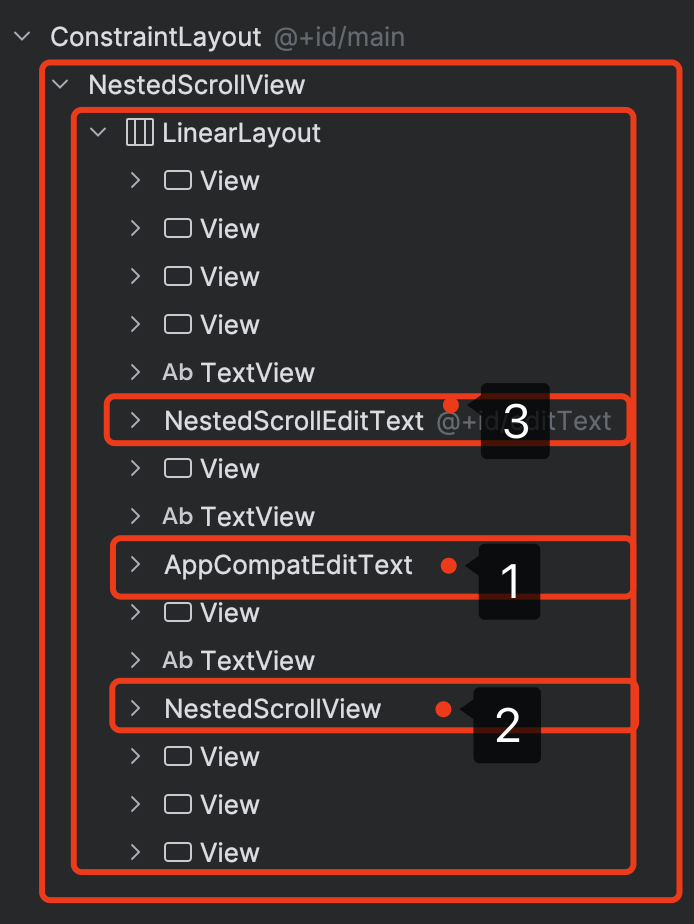
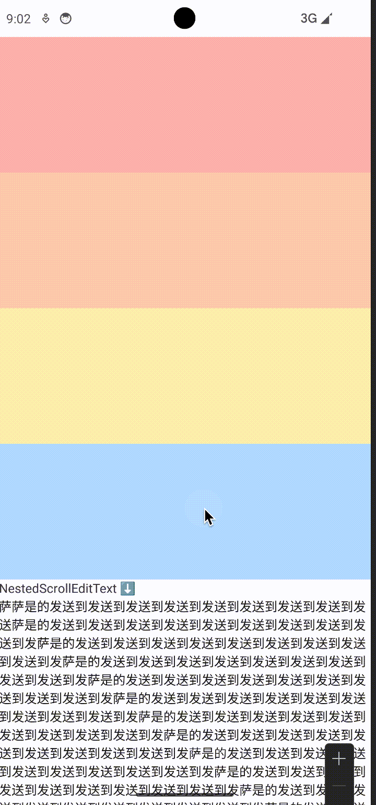
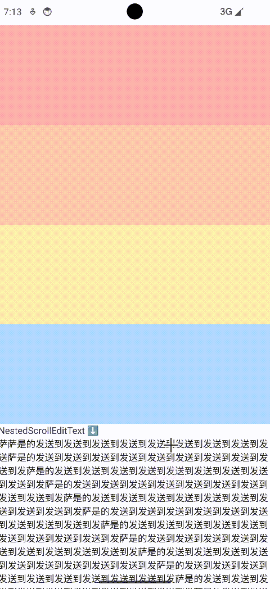
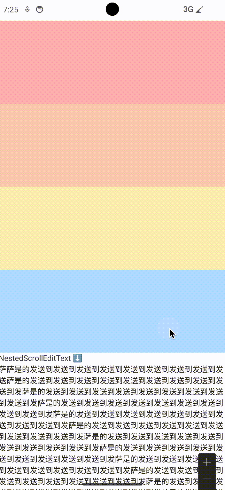
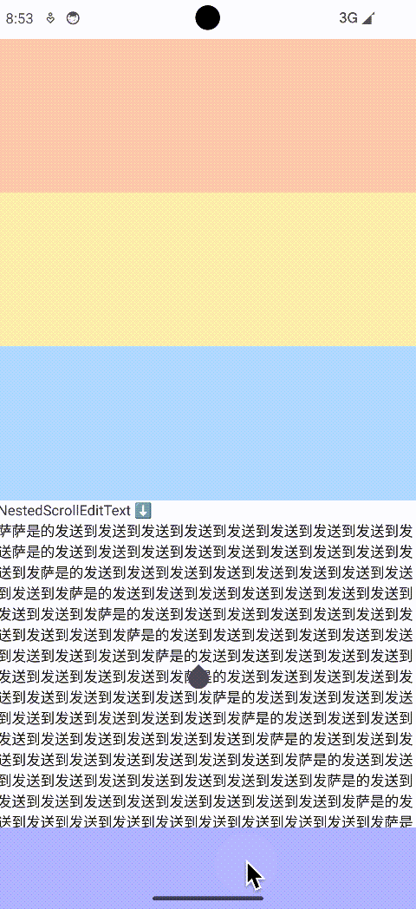
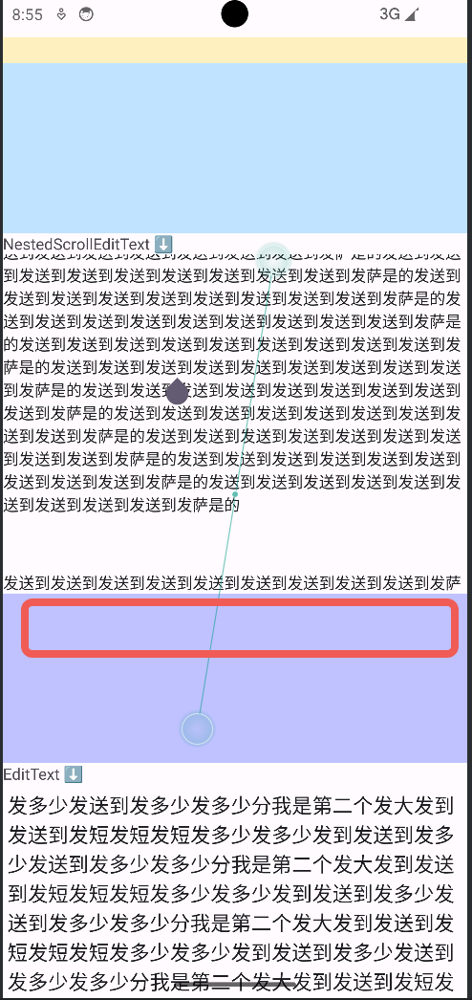
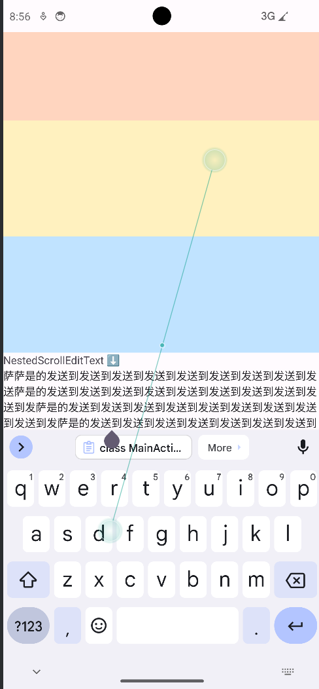

- NestedScrollView
  - LinearLayout
    - 3: NestedScrollEditText(这个是这次的例子，最后说)
    - 1: 这个是直接放一个EditText的情况
    - 2: 这个是NestedScrollView嵌套一个EditText的情况

## 最终效果



## 背景

```xml
        <activity
            android:name=".MainActivity"
            android:windowSoftInputMode="adjustResize|stateAlwaysHidden"
            android:exported="true">
            <intent-filter>
                <action android:name="android.intent.action.MAIN" />

                <category android:name="android.intent.category.LAUNCHER" />
            </intent-filter>
        </activity>
```

```kotlin
class MainActivity : AppCompatActivity() {
    override fun onCreate(savedInstanceState: Bundle?) {
        super.onCreate(savedInstanceState)
        enableEdgeToEdge()
        setContentView(R.layout.activity_main)
        ViewCompat.setOnApplyWindowInsetsListener(findViewById(R.id.main)) { v, insets ->
            val systemBars = insets.getInsets(WindowInsetsCompat.Type.systemBars())
            v.setPadding(systemBars.left, systemBars.top, systemBars.right, systemBars.bottom)
            val ime = insets.getInsets(WindowInsetsCompat.Type.ime())
            v.setPadding(v.paddingLeft, v.paddingTop, v.paddingRight, ime.bottom - ime.top)
            insets
        }
    }
}
```

1. windowSoftInputMode 设置为 adjustResize
2. 通过设置 contentView 的根view(R.id.main) 的底部padding 留出键盘高度，防止键盘遮挡


## 方案一：直接放EditText


存在问题：
1. EditText 内容无法滚动
2. 即是可以滚动，也没有fling效果

对于问题1，
```java
// NestedScrollView
    @Override
    public boolean onInterceptTouchEvent(@NonNull MotionEvent ev) {
        ...
        final int action = ev.getAction();
        if ((action == MotionEvent.ACTION_MOVE) && mIsBeingDragged) {
            return true;
        }
```
这里move事件会被NestedScrollView拦截，导致EditText内部无法滚动

这里可以通过处理onInterceptTouchEvent等方式让EditText可以滚动，但是EditTextmfling效果，所以放弃这个方案。

## 方案二：NestedScrollView嵌套EditText



存在问题
1. 点击EditText，弹出键盘，EditText会滚到屏幕最上面
2. 滚动EditText内容到下方，点击EditText，弹出键盘，EditText会被键盘遮挡

## 方案三：NestedScrollViewEditText

基于方案二优化

```kotlin
class NestedScrollEditText @JvmOverloads constructor(
    context: Context,
    attrs: AttributeSet? = null,
    defStyleAttr: Int = 0
) : NestedScrollView(context, attrs, defStyleAttr) {

    protected val editText: NestedScrollEditTextInner = NestedScrollEditTextInner(context).also {
        it.isFocusableInTouchMode = true
    }

    ...

    init {
        editText.setText(
            "萨萨是...到发到发"
        )
        this.addView(
            editText,
            LayoutParams(ViewGroup.LayoutParams.MATCH_PARENT, ViewGroup.LayoutParams.MATCH_PARENT)
        )
    }

    inner class NestedScrollEditTextInner @JvmOverloads constructor(
        context: Context,
        attrs: AttributeSet? = null,
        defStyleAttr: Int = 0
    ) : AppCompatEditText(context, attrs, defStyleAttr) {
        ...
    }

}

```

```kotlin
class AsParentNestedScrollView @JvmOverloads constructor(
    context: Context,
    attrs: AttributeSet? = null,
    defStyleAttr: Int = 0
) : NestedScrollView(context, attrs, defStyleAttr) {

}

```

结构: 
- AsParentNestedScrollView(替换到最外层的NestedScrollView)
  - NestedScrollEditTest(实际上是NestedScrollView)
    - NestedScrollEditTextInner(实际上是EditText)

### 问题1: 展开键盘EditText会不符合预期的滚动到可见区域上方/被键盘遮挡

这个是因为键盘展开时会调整contentView的paddingBottom，导致NestedScrollView高度变化

```java
// NestedScrollView
    @Override
    protected void onSizeChanged(int w, int h, int oldw, int oldh) {
        // 这里会尝试将当前focus的View滚动到可见位置
    }
```
所以这里覆写onSizedChanged——什么都不做 ⬇️

```kotlin
class AsParentNestedScrollView @JvmOverloads constructor(
    context: Context,
    attrs: AttributeSet? = null,
    defStyleAttr: Int = 0
) : NestedScrollView(context, attrs, defStyleAttr) {

    /**
     * ScrollView大小变化后，会找有没有focus的view，则会滚动到focus的EditText处
     */
    override fun onSizeChanged(w: Int, h: Int, oldw: Int, oldh: Int) {
    }

```



存在问题：EditText首次获取焦点时还是会滚动到最上面，之后就好了(保持原来的位置，虽然会被遮挡)


```java
// NestedScrollView
    @Override
    public void requestChildFocus(View child, View focused) {
        ...
            // 当EditText获取焦点时，会最终走到外层的`requestChildFocus`方法，这里会滚动到被focused的View
            scrollToChild(focused);
        ...
        super.requestChildFocus(child, focused);
    }
```

这里当获取焦点时的自动滚动并不符合我们的预期，滚动后的位置离键盘太远

```kotlin
class AsParentNestedScrollView @JvmOverloads constructor(
    context: Context,
    attrs: AttributeSet? = null,
    defStyleAttr: Int = 0
) : NestedScrollView(context, attrs, defStyleAttr) {

    /**
     * EditText requestFocus 会调用 parent的的requestChildFocus，NestedScrollView会自动滚动到focus child
     * 但是这里的没有考虑光标位置，导致不符合预期
     * 通过 [isRequestingChildFocus] 强制让 [computeScrollDeltaToGetChildRectOnScreen]——此次的滚动delta变为0
     */
    override fun requestChildFocus(child: View?, focused: View?) {
        isRequestingChildFocus = true
        super.requestChildFocus(child, focused)
        isRequestingChildFocus = false
    }

    override fun computeScrollDeltaToGetChildRectOnScreen(rect: Rect?): Int {
        return if (isRequestingChildFocus) {
            0
        } else {
            super.computeScrollDeltaToGetChildRectOnScreen(rect)
        }
    }
}
```

解决方式⬆️：由于父类并没有暴露一些变量，也无法直接调用 `super.super.requestChildFocus`，这里只要用一个变量记录 `isRequestingChildFocus`，`requestChildFocus` 会调用  `computeScrollDeltaToGetChildRectOnScreen` 计算滚动到哪里，所以这里强制让他返回 0，就不会滚动。

### 问题2: 让NesteScrollEditText贴在键盘上面

解决问题一之后，虽然不会不符合预期的自动滚动到奇怪的位置，但是会被键盘遮挡


⬆️测试发现，虽然点击editText展开键盘时内容会被遮挡，但是只要继续输入内容就会自动滚动到那一行，这是如何实现的⬇️？

```java
// TextView
    // 当输入内容时，会调用到该方法
    public boolean bringPointIntoView(int offset) {
        return bringPointIntoView(offset, false);
    }
```

```java
// TextView
    public boolean bringPointIntoView(@IntRange(from = 0) int offset,
            boolean requestRectWithoutFocus) {

            // 选中区域(光标位置左边，选中行上方，光标位置右边，选中行下方)
            mTempRect.set(x - 2, top, x + 2, bottom);
            // 这里根据选中区域 判断用户想要看第几行（不考虑scroll），这里会覆盖掉mTempRect
            getInterestingRect(mTempRect, line);
            // TextView内部可能滚动，上一步第几行没有考虑scroll，所以真正显示的位置需要考虑scorll
            mTempRect.offset(mScrollX, mScrollY);


            // 请求将选中区域滚为可见
            if (requestRectangleOnScreen(mTempRect)) 
            ...
    }
```

```java
// TextView
    public boolean requestRectangleOnScreen(Rect rectangle, boolean immediate) {
        if (mParent == null) {
            return false;
        }

        View child = this;

        // 2. position 用来记录 child 对于 parent的相对位置(child parent 会递归向上改变具体指向的view)
        RectF position = (mAttachInfo != null) ? mAttachInfo.mTmpTransformRect : new RectF();
        position.set(rectangle);

        ViewParent parent = mParent;
        boolean scrolled = false;

        // 0. 让parent滚动，从而让EditText可见，一层层的递归向上
        while (parent != null) {
            rectangle.set((int) position.left, (int) position.top,
                    (int) position.right, (int) position.bottom);

            // parent 根据child请求可见的位置(相对child的位置)，尝试滚动让其区域可见
            scrolled |= parent.requestChildRectangleOnScreen(child, rectangle, immediate);

            if (!(parent instanceof View)) {
                break;
            }

            // 考虑child的top 以及 child的scroll，偏移后才是child在parent上想要显示的区域，即 相对child的位置 转换成 相对parent的位置
            position.offset(child.mLeft - child.getScrollX(), child.mTop -child.getScrollY());

            // parent变成child
            child = (View) parent;
            // parent再找parent的parent
            parent = child.getParent();
        }

        return scrolled;
    }
```

上面会不断找parent，再尝试让parent滚动自身让请求可见区域可见，比如NestedScrollView 对 `requestChildRectangleOnScreen` 的处理如下

```java
    public boolean requestChildRectangleOnScreen(@NonNull View child, Rect rectangle,
            boolean immediate) {
        // 将 `相对child的位置` 转换为 `相对NestedScrollView` 的相对位置
        rectangle.offset(child.getLeft() - child.getScrollX(),
                child.getTop() - child.getScrollY());

        // 滚动至处理后的请求位置可见
        return scrollToChildRect(rectangle, immediate);
    }
```

所以只需要在键盘弹出后再调用一遍 `bringPointIntoView` 即可

```kotlin
class MainActivity : AppCompatActivity() {
    override fun onCreate(savedInstanceState: Bundle?) {
        super.onCreate(savedInstanceState)
        enableEdgeToEdge()
        setContentView(R.layout.activity_main)
        ViewCompat.setOnApplyWindowInsetsListener(findViewById(R.id.main)) { v, insets ->
            val systemBars = insets.getInsets(WindowInsetsCompat.Type.systemBars())
            v.setPadding(systemBars.left, systemBars.top, systemBars.right, systemBars.bottom)
            val ime = insets.getInsets(WindowInsetsCompat.Type.ime())
            v.setPadding(v.paddingLeft, v.paddingTop, v.paddingRight, ime.bottom - ime.top)
            // 开始
            v.post { // 等padding生效后，重新调用一次bringPointIntoView(editText自己其实也会调用一次，但是是在set padding之前)
                findViewById<NestedScrollEditText>(R.id.editText).bringPointIntoView()
            }
            // 结束
            insets
        }
    }
}
```

处理后的效果




### 问题3: 希望光标行和键盘顶部有一段距离



假设红框⬆️区域有一个确认按钮，如果像下图⬇️，光标行紧贴键盘顶部，则会遮挡按钮



在解决问题2的时候，已经知道弹出键盘/输入内容时光标行是如何自动定位的，不断告诉parent想要请求可见的位置，所以这里思路就是NestedScrollEditTextInner给NestedScrollEditText的请求可见位置是正常的，当NestedScrollEditText告诉它的parent(AsParentNestedScrollView)请求可见位置修改一下，将请求可见位置底部变成NestedScrollEditText的底部+额外给按钮流出的高度

```kotlin
// NestedScrollEditText
        override fun requestRectangleOnScreen(rectangle: Rect, immediate: Boolean): Boolean {
            val copyRect = Rect(rectangle)
            // 这里先正常走super的方法
            val scrolled = super.requestRectangleOnScreen(rectangle, immediate)

            val parentRect = Rect(copyRect)
            val parent = parent as NestedScrollEditText
            parent.post { // 这里一定要post，上面 immediate是false，所以parent.scrollY没有立即生效
                parentRect.bottom = parent.scrollY + parent.height + bottomGapPx
                parent.requestRectangleOnScreen(parentRect)
            }
            return scrolled
        }
```

最终效果


## 代码

