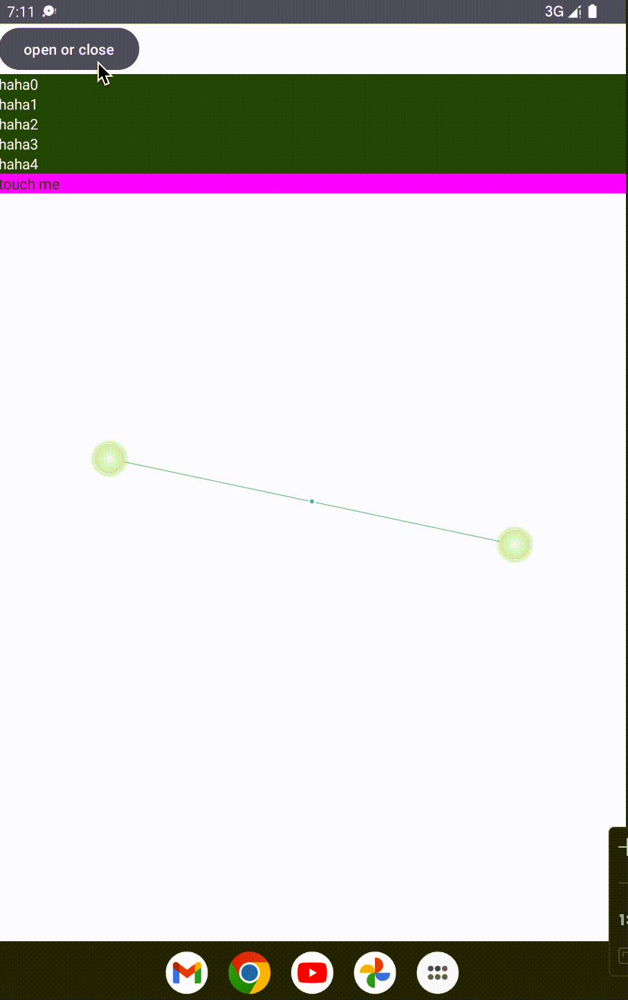
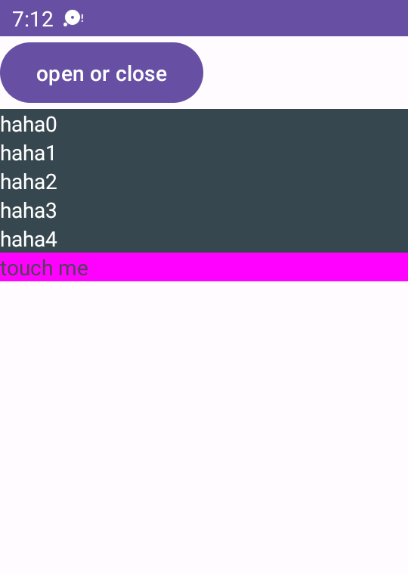

- 自定义View继承 `FrameLayout`

```kotlin
class ExpandPanel @JvmOverloads constructor(
    context: Context,
    attrs: AttributeSet? = null,
    defStyleAttr: Int = 0
) : FrameLayout(context, attrs, defStyleAttr) {
```

- 随便给面板加点东西

```kotlin
// ExpandPanel
    init {
        for (i in 0..4) {
            val tv = TextView(context).also {
                it.text = "haha${i}"
                it.setTextColor(resources.getColor(R.color.white))
            }
            bg.addView(tv)
        }
        val layoutParams = FrameLayout.LayoutParams(
            FrameLayout.LayoutParams.MATCH_PARENT,
            FrameLayout.LayoutParams.WRAP_CONTENT
        )
        bg.addView(touchBar, layoutParams)
        addView(bg, layoutParams)
        ...
```

5个 `textview` 作为内容，最后加一个 `LinearLayout` 作为拖拽条



- 增加两个 `ValueAnimator` 分别用来实现 展开动画/关闭动画

```kotlin
// ExpandPanel
    private var expandAnimation = ValueAnimator()
    private var closeAnimation = ValueAnimator()
```

展开动画
```kotlin
// ExpandPanel
    fun expand() {
        // 先停止所有动画
        closeAnimation.cancel()
        expandAnimation.cancel()
        // 当前内容(包含拖拽条)的高度
        val height = bg.height.takeUnless { it == 0 } ?: return
        // 当前展开占比
        val process = (height + bg.translationY) / height
        // 设置动画 开始-结束
        expandAnimation.setFloatValues(process, 1f)
        // 设置动画耗时
        expandAnimation.duration = ((1f - process) * animationTime).toLong()
        // 启动动画
        expandAnimation.start()
    }
```

关闭动画
```kotlin
// ExpandPanel
    fun close() {
        closeAnimation.cancel()
        expandAnimation.cancel()
        val height = bg.height.takeUnless { it == 0 } ?: return
        val process = Math.max((height + bg.translationY) / height, 0f)
        closeAnimation.setFloatValues(process, 0f)
        closeAnimation.duration = ((process * animationTime).toLong())
        closeAnimation.start()
    }
```

- 监听动画，移动内容实现展开关闭

```kotlin
// ExpandPanel
    init {
        ...

        expandAnimation.addUpdateListener(::onAnimationUpdate)
        closeAnimation.addUpdateListener(::onAnimationUpdate)

        ...
    }

```

```kotlin
// ExpandPanel
    private fun onAnimationUpdate(valueAnimator: ValueAnimator) {
        val process = valueAnimator.animatedValue as? Float ?: return
        // 根据动画进度，设置内容的偏移
        bg.translationY = (-bg.height).toFloat() * (1 - process)
    }
```

- 增加状态记录

```kotlin
// ExpandPanel
    var state = ExpandPanelState.CLOSED
    ...

    enum class ExpandPanelState {
        CLOSING,
        OPENING,
        CLOSED,
        OPENED
    }
```

```kotlin
// ExpandPanel
    init {
        ...
        expandAnimation.addListener(expandAnimatorListener)
        closeAnimation.addListener(closeAnimatorListener)
    }
```

```kotlin
// ExpandPanel
    private var expandAnimatorListener = object : Animator.AnimatorListener {
        override fun onAnimationStart(animation: Animator) {
            state = ExpandPanelState.OPENING
        }

        override fun onAnimationEnd(animation: Animator) {
            state = ExpandPanelState.OPENED
        }

        override fun onAnimationCancel(animation: Animator) {
        }

        override fun onAnimationRepeat(animation: Animator) {}
    }
```

```kotlin
// ExpandPanel
    private var closeAnimatorListener = object : Animator.AnimatorListener {
        override fun onAnimationStart(animation: Animator) {
            state = ExpandPanelState.CLOSING
        }

        override fun onAnimationEnd(animation: Animator) {
            state = ExpandPanelState.CLOSED
        }

        override fun onAnimationCancel(animation: Animator) {
        }

        override fun onAnimationRepeat(animation: Animator) {}

    }
```

- 增加按钮——展开开关

```kotlin
class MainActivity : AppCompatActivity() {

    override fun onCreate(savedInstanceState: Bundle?) {
        super.onCreate(savedInstanceState)
        val binding = ActivityMainBinding.inflate(LayoutInflater.from(this))
        setContentView(binding.root)

        binding.openCloseBtn.setOnClickListener {
            when (binding.panel.state) {
                ExpandPanel.ExpandPanelState.CLOSING, ExpandPanel.ExpandPanelState.CLOSED -> binding.panel.expand()
                ExpandPanel.ExpandPanelState.OPENING, ExpandPanel.ExpandPanelState.OPENED -> binding.panel.close()
            }
        }
    }
}
```

- 拖拽实现

```kotlin
// ExpandPanel
    init {
        ...
        touchBar.setOnTouchListener(::handelTouchBarTouch)
        ...
    }
```

```kotlin
// ExpandPanel
    private fun handelTouchBarTouch(view: View, motionEvent: MotionEvent): Boolean {
        when (motionEvent.action) {
            MotionEvent.ACTION_DOWN -> {
                // 记录 内容最开始的偏移量
                virtualTranslationY = bg.translationY
                // 记录位置
                lastY = motionEvent.rawY
            }

            MotionEvent.ACTION_MOVE -> {
                // 新位置
                val newY = motionEvent.rawY
                // 计算移动距离
                val moveY = newY - lastY

                // 记录同步偏移后的内容偏移量
                virtualTranslationY += moveY
                when {
                    // 内容移动偏移量不能大于0，将其偏移量设置为0
                    virtualTranslationY > 0f -> bg.translationY = 0f
                    // 内容移动偏移量不能小于(-高度)，将其偏移量设置为(-高度)
                    virtualTranslationY < -height.toFloat() -> bg.translationY =
                        -height.toFloat()
                    // 其他情况合法
                    else -> bg.translationY = virtualTranslationY
                }
                // 记录位置
                lastY = newY
            }

            // 松手后自动动画
            MotionEvent.ACTION_UP, MotionEvent.ACTION_CANCEL -> {
                // 当松手时不是完全展开，就关闭（0可调整为其他阈值，比如总高度*百分之多少）
                if (bg.translationY < 0) {
                    close()
                } else {
                    expand()
                }
            }
        }
        return true
    }

```