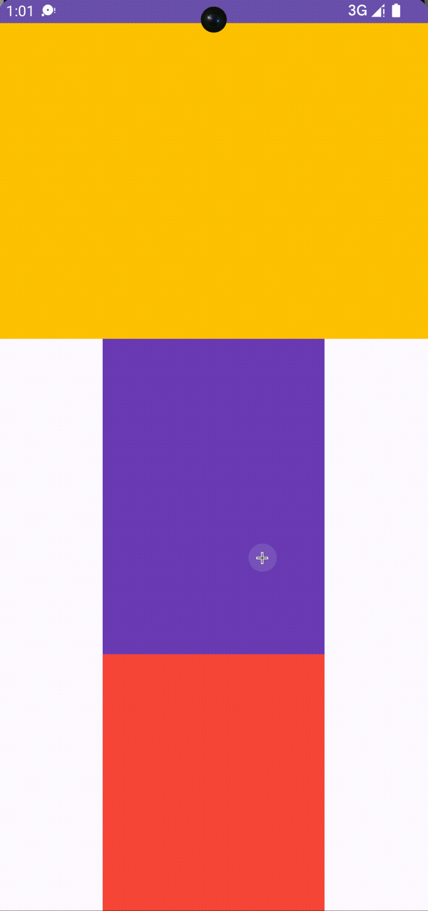

```kotlin
import android.content.Context
import android.util.AttributeSet
import android.util.Log
import android.view.MotionEvent
import android.view.VelocityTracker
import android.view.ViewConfiguration
import android.widget.FrameLayout
import android.widget.OverScroller
import androidx.core.view.NestedScrollingChild3
import androidx.core.view.NestedScrollingChildHelper
import androidx.core.view.ViewCompat
import androidx.core.view.children

## 子view

class ChildNestedScrollView @JvmOverloads constructor(
    context: Context, attrs: AttributeSet? = null, defStyleAttr: Int = 0
) : FrameLayout(context, attrs, defStyleAttr), NestedScrollingChild3 {

    private var lastTouchY = 0
    private var scrollConsumed = IntArray(2)
    private var scrollOffset = IntArray(2)
    private val childHelper by lazy {
        NestedScrollingChildHelper(this).apply { isNestedScrollingEnabled = true }
    }
    private var activePointerId = INVALID_POINTER

    // 第一个View
    private val firstView by lazy {
        children.first()
    }

    private val mScroller = OverScroller(context)

    override fun onTouchEvent(event: MotionEvent): Boolean {
        val touchY = event.y.toInt()

        when (event.actionMasked) {
            MotionEvent.ACTION_DOWN -> {
                // 停止fling
                run handleFling@{
                    if (!mScroller.isFinished) {
                        mScroller.abortAnimation()
                        stopNestedScroll(ViewCompat.TYPE_NON_TOUCH)
                    }
                }

                // 手动滚动处理
                run handleUserScroll@{
                    lastTouchY = touchY
                    activePointerId = event.getPointerId(0)
                    startNestedScroll(ViewCompat.SCROLL_AXIS_VERTICAL, ViewCompat.TYPE_TOUCH)
                }
            }

            MotionEvent.ACTION_MOVE -> {
                Log.d(TAG, "on ACTION_MOVE $lastTouchY $touchY")
                // 要滚多少
                val moveY = lastTouchY - touchY
                // 记录还能滚多少
                var unconsumedMoveY = moveY

                scrollConsumed[0] = 0
                scrollConsumed[1] = 0

                // [1] parent 滚吗
                run parentScrollFirst@ {
                    when (dispatchNestedPreScroll(
                        0,
                        moveY,
                        scrollConsumed,
                        scrollOffset,
                        ViewCompat.TYPE_TOUCH
                    )) {
                        // parent 滚
                        true -> {
                            Log.d(
                                TAG,
                                "[onTouchEvent]#[dispatchNestedPreScroll]#true $moveY ${scrollConsumed[1]}"
                            )
                            // 减去 parent消耗的
                            unconsumedMoveY -= scrollConsumed[1]
                        }
                        // parent 不滚
                        false -> {
                            Log.d(
                                TAG,
                                "[onTouchEvent]#[dispatchNestedPreScroll]#false $moveY ${scrollConsumed[1]}"
                            )
                        }
                    }
                }

                // [2] child 滚
                run childScrollNext@ {
                    val parentConsumed = moveY - unconsumedMoveY

                    if (unconsumedMoveY != 0) {
                        val childScroll = unconsumedMoveY
                        scrollBy(0, childScroll)
                        Log.d(TAG, "[onTouchEvent]#[child scrollBy]#true $moveY $parentConsumed | $lastTouchY $touchY | $childScroll")
                        lastTouchY = touchY
                    }
                }

                run parentScrollFinal@ {
                    // [3] child滚完了，如果剩下unconsumedMoveY，可以给parent滚
                    when (dispatchNestedScroll(
                        0,
                        moveY - unconsumedMoveY,
                        0,
                        unconsumedMoveY,
                        scrollOffset,
                        ViewCompat.TYPE_TOUCH,
                    )) {
                        true -> {
                            Log.d(
                                TAG,
                                "[onTouchEvent]#[dispatchNestedScroll]#true $scrollY $measuredHeight"
                            )
                        }

                        false -> {
                            Log.d(
                                TAG,
                                "[onTouchEvent]#[dispatchNestedScroll]#false $scrollY $measuredHeight"
                            )
                        }
                    }
                }
            }


            MotionEvent.ACTION_CANCEL,
            MotionEvent.ACTION_UP -> {
                // 停止滚动
                stopNestedScroll(ViewCompat.TYPE_TOUCH)

                // 开始fling
                velocityTracker.computeCurrentVelocity(1000, ViewConfiguration.get(context).scaledMaximumFlingVelocity.toFloat())
                val initialVelocity = velocityTracker.getYVelocity(activePointerId)
                fling(-initialVelocity)
                activePointerId = INVALID_POINTER
            }


        }
        velocityTracker.addMovement(event)
        return true
    }

    private val velocityTracker = VelocityTracker.obtain()


    private fun fling(fl: Float) {
        Log.d(TAG, "fling $fl")
        mScroller.fling(
            scrollX, scrollY,
            0, fl.toInt(),
            0, 0,
            Int.MIN_VALUE, Int.MAX_VALUE,
            0, 0
        )
        startNestedScroll(ViewCompat.SCROLL_AXIS_VERTICAL, ViewCompat.TYPE_NON_TOUCH)
        mScroller.computeScrollOffset()
        rememberLastScrollerY = mScroller.currY
        scrollByScroller()
    }

    private var rememberLastScrollerY = 0

    private fun scrollByScroller() {
        postOnAnimation {
           if (mScroller.isFinished)  return@postOnAnimation

            scrollConsumed[0] = 0
            scrollConsumed[1] = 0
            if (mScroller.computeScrollOffset()) {
                val moveY = mScroller.currY - rememberLastScrollerY
                Log.d(TAG, "[scrollByScroller]#[true] ${mScroller.currY} $rememberLastScrollerY [$moveY]")
                var unconsumedMoveY = moveY
                when (dispatchNestedPreScroll(
                    0,
                    moveY,
                    scrollConsumed,
                    scrollOffset,
                    ViewCompat.TYPE_NON_TOUCH
                )) {
                    // parent 滚
                    true -> {
                        Log.d(
                            TAG,
                            "[scrollByScroller]#[dispatchNestedPreScroll]#true $moveY ${scrollConsumed[1]}"
                        )
                        // 减去 parent消耗的
                        unconsumedMoveY -= scrollConsumed[1]
                    }
                    // parent 不滚
                    false -> {
                        Log.d(
                            TAG,
                            "[scrollByScroller]#[dispatchNestedPreScroll]#false $moveY ${scrollConsumed[1]}"
                        )
                    }
                }

                val parentConsumed = moveY - unconsumedMoveY

                // [2] child 滚
                if (unconsumedMoveY != 0) {
                    val childScroll = unconsumedMoveY
                    scrollBy(0, childScroll)
                    Log.d(TAG, "[onTouchEvent]#[child scrollBy]#true $moveY $parentConsumed| $childScroll")
                }

                rememberLastScrollerY = mScroller.currY

                scrollByScroller()
            } else {

                Log.d(TAG, "[scrollByScroller]#[false]")
            }
        }
    }

    override fun startNestedScroll(axes: Int, type: Int): Boolean {
        Log.i(TAG, "child startNestedScroll axes:$axes type:$type ")
        return childHelper.startNestedScroll(axes, type)
    }

    override fun stopNestedScroll(type: Int) {
        Log.i(TAG, "child stopNestedScroll $type")
        childHelper.stopNestedScroll(type)
    }

    override fun hasNestedScrollingParent(type: Int): Boolean {
        return childHelper.hasNestedScrollingParent(type)
    }

    override fun dispatchNestedScroll(
        dxConsumed: Int,
        dyConsumed: Int,
        dxUnconsumed: Int,
        dyUnconsumed: Int,
        offsetInWindow: IntArray?,
        type: Int,
        consumed: IntArray
    ) {

    }

    override fun dispatchNestedScroll(
        dxConsumed: Int,
        dyConsumed: Int,
        dxUnconsumed: Int,
        dyUnconsumed: Int,
        offsetInWindow: IntArray?,
        type: Int
    ): Boolean {
        return childHelper.dispatchNestedScroll(
            dxConsumed,
            dyConsumed,
            dxUnconsumed,
            dyUnconsumed, offsetInWindow, type
        )
    }

    override fun dispatchNestedPreScroll(
        dx: Int,
        dy: Int,
        consumed: IntArray?,
        offsetInWindow: IntArray?,
        type: Int
    ): Boolean {
        return childHelper.dispatchNestedPreScroll(dx, dy, consumed, offsetInWindow, type)
    }

    override fun onMeasure(widthMeasureSpec: Int, heightMeasureSpec: Int) {

        super.onMeasure(widthMeasureSpec, heightMeasureSpec)

        val height = MeasureSpec.makeMeasureSpec(0, MeasureSpec.UNSPECIFIED)
        children.forEach {
            measureChild(it, widthMeasureSpec, height)
        }
    }

    override fun scrollTo(x: Int, y: Int) {
        val minY = 0
        val maxY = firstView.height - height
        when (val safeY = y.coerceIn(minY..maxY)) {
            0 -> Log.d(TAG, "[scrollTo]#[false] $y  safeY${safeY} ${firstView.height}")
            else -> {
                Log.d(TAG, "[scrollTo]#[true] $y safeY${safeY} ${firstView.height}")
                super.scrollTo(x, safeY)
            }
        }
    }

    companion object {
        private const val TAG = "ChildNestedScrollView"
        private const val INVALID_POINTER = -1
    }

}
```

## 父View

```kotlin
import android.content.Context
import android.util.AttributeSet
import android.util.Log
import android.view.View
import android.widget.FrameLayout
import androidx.core.view.NestedScrollingParent3
import androidx.core.view.NestedScrollingParentHelper
import androidx.core.view.children

class ParentNestedScrollView @JvmOverloads constructor(
    context: Context, attrs: AttributeSet? = null, defStyleAttr: Int = 0
) : FrameLayout(context, attrs, defStyleAttr), NestedScrollingParent3 {

    private val parentHelper by lazy {
        NestedScrollingParentHelper(this)
    }

    // 第一个View
    private val firstView by lazy {
        children.first()
    }

    override fun onStartNestedScroll(child: View, target: View, axes: Int, type: Int): Boolean {
        return true
    }

    override fun onMeasure(widthMeasureSpec: Int, heightMeasureSpec: Int) {
        super.onMeasure(widthMeasureSpec, MeasureSpec.makeMeasureSpec(0, MeasureSpec.UNSPECIFIED))
    }

    override fun onNestedScrollAccepted(child: View, target: View, axes: Int, type: Int) {
        Log.i(TAG, "[onNestedScrollAccepted] $type")
        parentHelper.onNestedScrollAccepted(child, target, axes, type)
    }

    override fun onStopNestedScroll(target: View, type: Int) {
        Log.i(TAG, "[onStopNestedScroll] $type")
        parentHelper.onStopNestedScroll(target, type)
    }

    override fun onNestedScroll(
        target: View,
        dxConsumed: Int,
        dyConsumed: Int,
        dxUnconsumed: Int,
        dyUnconsumed: Int,
        type: Int,
        consumed: IntArray
    ) {
        Log.i(TAG, "[onNestedScroll]")
    }

    override fun onNestedScroll(
        target: View,
        dxConsumed: Int,
        dyConsumed: Int,
        dxUnconsumed: Int,
        dyUnconsumed: Int,
        type: Int
    ) {
        Log.i(TAG, "[onNestedScroll]2")
    }

    override fun onNestedPreScroll(target: View, dx: Int, dy: Int, consumed: IntArray, type: Int) {

        val parentWantToConsume = dy / 2
        val nextY = scrollY + parentWantToConsume
        val maxNextY = (firstView.height - height)
        val minNextY = 0
        val safeNextY = nextY.coerceIn(minNextY..maxNextY)

        when (val safePrentWantToConsume = safeNextY - scrollY) {
            0 -> Log.i(TAG, "[onNestedPreScroll]#false ($type)")
            else -> {
                Log.i(TAG, "[onNestedPreScroll]#true ($type) ${scrollY} ${firstView.height}")
                consumed[1] = safePrentWantToConsume
                scrollBy(0, safePrentWantToConsume)
            }
        }
    }

    override fun scrollTo(x: Int, y: Int) {
        if (y >= 0 && y <= (firstView.height - height)) {
            Log.d(TAG, "[scrollTo]#[true] $y ${firstView.height}")
            super.scrollTo(x, y)
        } else {
            Log.d(TAG, "[scrollTo]#[false] $y ${firstView.height}")
        }
    }

    companion object {
        private const val TAG = "ParentNestedScrollView"
    }

}
```

