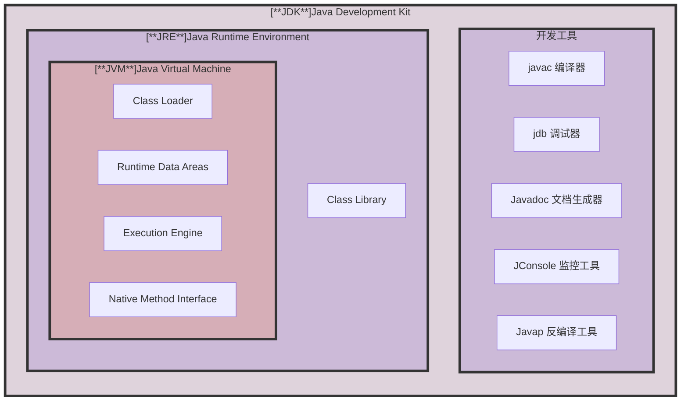
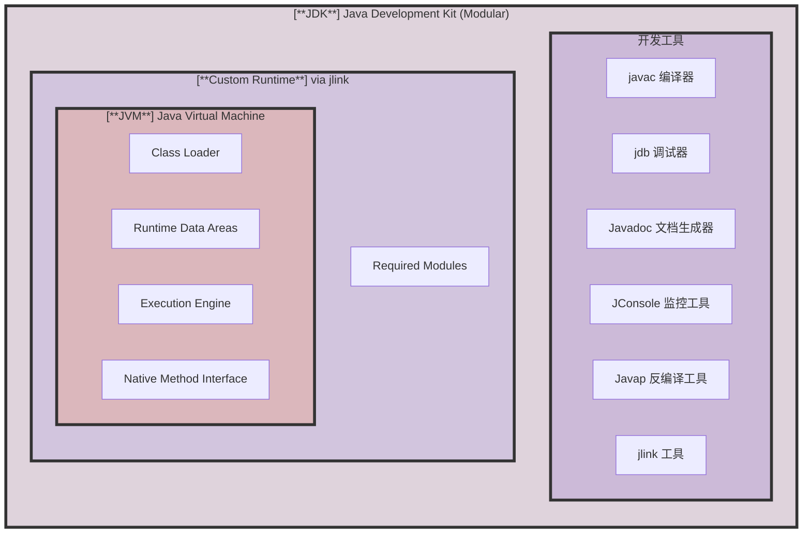

## JVM & JRE & JDK

### <Java9



### >=Java9




## 横竖屏切换时候Activity的生命周期

### **默认流程（未配置 `configChanges` 时）**
1. **当前 Activity 销毁：**
   • `onPause()` → `onStop()` → `onDestroy()`
   • 在 `onDestroy()` 前会调用 `onSaveInstanceState(Bundle)` 保存临时数据。

2. **新的 Activity 创建：**
   • `onCreate(Bundle)` → `onStart()` → `onRestoreInstanceState(Bundle)` → `onResume()`
   • 通过 `Bundle` 恢复之前保存的状态。

---

### **关键方法说明**
• **`onSaveInstanceState(Bundle)`**  
  在 Activity 销毁前调用，保存临时数据（如文本框内容）。
  
• **`onRestoreInstanceState(Bundle)`**  
  在 `onStart()` 后调用，恢复保存的数据（比在 `onCreate()` 中恢复更明确）。

---

### **避免 Activity 重建的方法**
如果不想让 Activity 在横竖屏切换时重建，可以通过 `AndroidManifest.xml` 配置 `configChanges`：
```xml
<activity
    android:name=".YourActivity"
    android:configChanges="orientation|screenSize|keyboardHidden" />
```
• **API 13+ 必须包含 `screenSize`**（因为屏幕尺寸变化也被视为配置变更）。

此时，横竖屏切换会触发：
1. **`onConfigurationChanged(Configuration)`**  
   开发者需在此方法中手动调整 UI（例如加载横屏布局）。

---

### **注意事项**
1. **临时数据保存：**  
   即使阻止了 Activity 重建，仍需处理动态数据（如网络请求），因为系统可能因内存不足回收 Activity。

2. **开发建议：**  
   • **默认行为更安全**：让系统重建 Activity，简化布局适配。
   • **手动处理需谨慎**：仅在对性能敏感或特殊需求时使用 `configChanges`。

---

### **代码示例**
```java
// 1. 保存数据
@Override
protected void onSaveInstanceState(Bundle outState) {
    super.onSaveInstanceState(outState);
    outState.putString("key", "value");
}

// 2. 恢复数据（两种方式）
// 方式一：在 onCreate() 中恢复
@Override
protected void onCreate(Bundle savedInstanceState) {
    super.onCreate(savedInstanceState);
    if (savedInstanceState != null) {
        String value = savedInstanceState.getString("key");
    }
}

// 方式二：在 onRestoreInstanceState() 中恢复
@Override
protected void onRestoreInstanceState(Bundle savedInstanceState) {
    super.onRestoreInstanceState(savedInstanceState);
    String value = savedInstanceState.getString("key");
}

// 3. 配置变更时手动处理
@Override
public void onConfigurationChanged(Configuration newConfig) {
    super.onConfigurationChanged(newConfig);
    if (newConfig.orientation == Configuration.ORIENTATION_LANDSCAPE) {
        // 加载横屏布局
    } else {
        // 加载竖屏布局
    }
}
```

---

### **总结**
| 场景                | 生命周期调用顺序                              | 数据保存与恢复               |
|---------------------|---------------------------------------|------------------------|
| 默认行为（重建 Activity） | `onPause()` → `onStop()` → `onDestroy()` → `onCreate()` → `onStart()` → `onResume()` | 通过 `Bundle` 保存/恢复 |
| 配置 `configChanges`  | 仅调用 `onConfigurationChanged()`       | 需手动处理 UI 逻辑       |


## Java中提供了抽象类还有接口，开发中如何去选择呢？

在 Java 开发中，**抽象类（Abstract Class）**和**接口（Interface）**都是实现抽象和多态的核心机制，但它们的适用场景和设计目的不同。以下是选择时的核心原则和对比：

---

### **1. 抽象类（Abstract Class）**
**核心特点**：
• 可以有 **具体方法（实现代码）** 和 **抽象方法**。
• 可以定义 **成员变量**、**构造方法**。
• 通过继承实现代码复用，但 Java 是单继承，一个类只能继承一个抽象类。

**适用场景**：
• **共享代码**：多个子类有**共同的代码逻辑或成员变量**时，用抽象类避免重复。
  ```java
  public abstract class Animal {
      private String name; // 共享成员变量
      
      public Animal(String name) { // 构造方法
          this.name = name;
      }
      
      public void eat() { // 具体方法
          System.out.println(name + " is eating.");
      }
      
      public abstract void makeSound(); // 抽象方法
  }
  ```

• **定义部分实现**：需要为子类提供**默认实现**，同时强制子类实现特定方法。
• **控制子类的构造过程**：通过抽象类的构造方法强制子类初始化某些状态。

---

### **2. 接口（Interface）**
**核心特点**：
• 从 Java 8 开始，接口可以包含 **默认方法（`default`）** 和 **静态方法**，但主要用途仍是定义行为契约。
• 一个类可以实现多个接口，实现多继承的效果。
• 接口不能定义成员变量（只能定义 `public static final` 常量），没有构造方法。

**适用场景**：
• **定义行为契约**：表示“**能做什么**”（如 `Runnable` 的 `run()`，`Comparable` 的 `compareTo()`）。
  ```java
  public interface Flyable {
      void fly(); // 定义行为契约
      
      default void land() { // 默认方法（Java 8+）
          System.out.println("Landing...");
      }
  }
  ```

• **实现多态**：让无关的类实现相同的行为（如 `Serializable`、`Cloneable`）。
• **解耦功能**：通过接口隔离不同模块，遵循 **接口隔离原则（ISP）**。

---

### **3. 如何选择？**
| **维度**               | **抽象类**                          | **接口**                          |
|------------------------|-----------------------------------|----------------------------------|
| **代码复用**             | ✅ 适合共享代码和状态                 | ❌ 不能共享代码（Java 8 后可通过默认方法部分实现） |
| **继承关系**             | 表示“**是什么**”（is-a 关系）       | 表示“**能做什么**”（has-a 关系） |
| **多继承能力**           | ❌ 单继承                          | ✅ 一个类可实现多个接口             |
| **设计目标**             | 提供基础实现，约束子类结构           | 定义行为契约，解耦功能模块           |
| **成员变量**             | ✅ 可以定义非静态成员变量             | ❌ 只能定义常量                   |
| **构造方法**             | ✅ 可以定义构造方法                  | ❌ 不能定义构造方法                |

**实际开发中的选择策略**：
1. **优先用接口**：
   • 需要定义**多组无关的行为**（如一个类既能 `Fly` 又能 `Swim`）。
   • 需要实现**多态**，且不依赖共享代码。
   • 遵循“**面向接口编程**”原则，降低耦合。

2. **用抽象类**：
   • 多个子类有**共同的代码逻辑或状态**。
   • 需要提供**部分默认实现**，同时约束子类结构（如模板方法模式）。
   • 需要**控制子类的构造过程**。

---

### **4. 经典场景示例**
#### **(1) 抽象类示例：模板方法模式**
```java
public abstract class Game {
    // 模板方法（定义算法骨架）
    public final void play() {
        initialize();
        start();
        end();
    }
    
    protected abstract void initialize();
    protected abstract void start();
    protected void end() { // 默认实现
        System.out.println("Game over!");
    }
}

public class Chess extends Game {
    @Override
    protected void initialize() {
        System.out.println("Chess initialized.");
    }
    
    @Override
    protected void start() {
        System.out.println("Chess started.");
    }
}
```

#### **(2) 接口示例：策略模式**
```java
public interface PaymentStrategy {
    void pay(int amount);
}

public class CreditCardPayment implements PaymentStrategy {
    @Override
    public void pay(int amount) {
        System.out.println("Paid " + amount + " via Credit Card.");
    }
}

public class PayPalPayment implements PaymentStrategy {
    @Override
    public void pay(int amount) {
        System.out.println("Paid " + amount + " via PayPal.");
    }
}
```

---

### **5. Java 8+ 的接口默认方法**
从 Java 8 开始，接口可以定义 **默认方法（`default`）**，这使得接口也能提供部分实现，但核心设计目的仍不同：
```java
public interface Logger {
    default void log(String message) { // 默认方法
        System.out.println("Log: " + message);
    }
    
    void error(String message); // 抽象方法
}

public class FileLogger implements Logger {
    @Override
    public void error(String message) {
        System.err.println("ERROR: " + message);
    }
}
```

---

### **总结**
• **抽象类**：用于**代码复用和定义类层次结构**（是什么）。
• **接口**：用于**定义行为契约和解耦功能**（能做什么）。
• **优先使用接口**，尤其是需要多继承或定义行为时；当需要共享代码或状态时，选择抽象类。

## Java中在传参数时是将值进行传递，还是传递引用？ 如果是kotlin呢


| **语言** | **数据类型**       | **传递方式**                     | **能否通过参数修改原数据**       |
|----------|--------------------|----------------------------------|------------------------------|
| Java     | 基本类型（`int`）   | 按值传递（副本）                 | ❌                            |
| Java     | 对象类型           | 按值传递对象引用的副本           | ✅ 修改属性有效，重新赋值无效   |
| Kotlin   | 基本类型（`Int`）   | 按值传递（副本）                 | ❌                            |
| Kotlin   | 对象类型           | 按值传递对象引用的副本           | ✅ 修改属性有效，重新赋值无效   |

---

### **关键结论**
• **Java 和 Kotlin 的参数传递本质都是按值传递**。
• **对象类型传递的是引用的副本**，因此可以通过引用修改对象属性，但无法通过参数重新赋值原引用。

## Android中为什么主线程不会因为Looper.loop()的死循环导致卡死

嗯，用户问的是为什么Android的主线程在运行Looper.loop()的死循环时不会卡死。这个问题看起来涉及Android的消息机制和主线程的工作原理。用户可能已经知道Looper.loop()里面有一个无限循环，所以会疑惑为什么这个循环不会导致ANR或者界面卡死。

首先，我需要回顾一下Android的主线程（UI线程）如何处理消息循环。主线程的Looper会不断从消息队列中取出消息并处理，比如处理UI更新、用户输入事件等。那这个死循环本身是不是会导致CPU一直占用，进而卡死呢？

然后想到，这可能涉及到事件驱动模型。在事件驱动的系统中，主线程在没有消息时会进入休眠状态，释放CPU资源，直到有新的消息到来才会被唤醒。也就是说，这个循环并不是一直在空转，而是通过某种机制在无消息时阻塞，避免消耗资源。

接着，应该考虑Linux的epoll机制。Looper可能使用了epoll来管理消息队列，当没有消息时，线程会阻塞在epoll_wait上，这样就不会占用CPU。当有新的消息加入队列时，会通过写入管道文件描述符来唤醒线程，处理消息。这样既保证了实时处理消息，又避免了资源浪费。

另外，ANR的发生是因为主线程在处理某个消息时耗时过长，导致无法及时响应其他事件，比如点击事件或者Activity的生命周期回调。而Looper.loop()本身并不会导致ANR，因为它只是消息循环的框架，真正的问题出在处理单个消息的时间过长。

可能用户混淆了Looper的死循环和ANR的关系，认为死循环本身会导致卡死，但实际上卡死是因为某个消息处理时间太长，而不是循环本身的问题。

还需要解释一下，为什么这个循环不会导致主线程退出。因为主线程的Looper.loop()是无限循环，所以主线程会一直运行，处理消息，直到应用退出。如果没有这个循环，主线程一启动就会结束，无法持续处理事件。

总结的话，应该分点说明：1. 事件驱动模型，阻塞而非空转；2. 使用epoll机制管理消息队列，无消息时休眠；3. ANR的原因不是循环本身，而是消息处理超时；4. 主线程需要持续运行处理事件，因此循环是必要的。


在 Android 中，主线程通过 `Looper.loop()` 进入一个**无限循环**来持续处理消息，但并不会导致卡死或 ANR（Application Not Responding），其核心原因在于 **事件驱动模型** 和 **Linux 的 epoll 机制**。以下是详细解释：

---

### **1. 主线程的消息循环机制**
#### **(1) 消息队列（MessageQueue）**
• 主线程的 `Looper.loop()` 会不断从 `MessageQueue` 中取出消息（如 UI 更新、触摸事件、生命周期回调等），并分发给对应的 `Handler` 处理。
• **关键流程**：
  ```java
  public static void loop() {
      for (;;) {
          Message msg = queue.next(); // 无消息时阻塞
          if (msg == null) return;    // 只有退出时返回 null
          msg.target.dispatchMessage(msg); // 处理消息
      }
  }
  ```

#### **(2) 阻塞与唤醒**
• **无消息时阻塞**：当 `MessageQueue` 为空时，`queue.next()` 会调用 `nativePollOnce()`，使线程进入**休眠状态**，释放 CPU 资源。
• **有消息时唤醒**：当新消息加入队列时（如点击事件、定时任务等），通过 `nativeWake()` 唤醒线程继续处理。

---

### **2. 底层原理：Linux 的 epoll 机制**

| **关键点**                | **说明**                                                                 |
|---------------------------|-------------------------------------------------------------------------|
| **事件驱动模型**           | 主线程通过消息队列按顺序处理事件，无消息时休眠，避免空转消耗 CPU。         |
| **epoll 机制**             | 利用 Linux 的 epoll 实现高效阻塞与唤醒，保障线程休眠时释放 CPU。          |
| **ANR 的根源**             | 单条消息处理时间过长，而非消息循环本身。                                  |
| **无限循环的必要性**       | 保持主线程存活，确保应用持续响应事件。                                    |

**核心结论**：  
主线程的 `Looper.loop()` 通过高效的消息队列管理和底层阻塞唤醒机制，既保证了实时事件处理，又避免了资源浪费。开发者应避免在主线程执行耗时操作，以预防 ANR。


## Handler和Looper的关系


我们可以用一个 **快递站** 的比喻来理解整个过程，把 Android 的消息机制拆解得更简单：

---

### **1. 快递站的工作流程**
想象你开了一个快递站，整个流程是这样的：

| **角色**       | **比喻**              | **作用**                                                                 |
|----------------|-----------------------|--------------------------------------------------------------------------|
| **主线程**     | 快递站                | 负责处理所有包裹（消息），但一次只能处理一个包裹。                          |
| **Looper**     | 传送带                | 让快递站一直运转，检查有没有新包裹。没有包裹时，传送带暂停（线程休眠）。      |
| **MessageQueue** | 传送带上的包裹队列     | 所有包裹按顺序排好队，等待处理。                                            |
| **Handler**    | 快递员                | 负责把包裹放到传送带上（发送消息），或者从传送带取下包裹处理（处理消息）。     |

---

### **2. 快递站的一天（流程详解）**
#### **(1) 早晨：快递站开门（主线程启动）**
• 快递站的传送带（`Looper`）开始转动（调用 `Looper.loop()`）。
• 此时传送带是空的，快递站工作人员（主线程）开始等待包裹。

#### **(2) 上午：快递员送来包裹（发送消息）**
• 快递员A（`Handler1`）把一个包裹（`Message`）放到传送带上（`MessageQueue`）。
  ```java
  handler1.sendMessage(msg1); // 快递员A放包裹
  ```
• 快递员B（`Handler2`）也放了一个包裹。
  ```java
  handler2.sendMessage(msg2); // 快递员B放包裹
  ```

#### **(3) 中午：传送带处理包裹（处理消息）**
• 传送带（`Looper`）转动时，发现第一个包裹（`msg1`），检查包裹上的标签：
  • **标签写着：“由快递员A处理”**（`msg1.target = handler1`）。
• 传送带把包裹交给快递员A处理：
  ```java
  handler1.handleMessage(msg1); // 快递员A拆包裹
  ```
• 接着处理第二个包裹（`msg2`），交给快递员B处理。

#### **(4) 下午：没有包裹时（线程休眠）**
• 传送带（`Looper`）检查发现没有包裹了，暂时停止转动（线程休眠，不消耗 CPU）。
• 快递站工作人员（主线程）可以休息，直到有新包裹。

#### **(5) 傍晚：新包裹到达（唤醒线程）**
• 快递员C（`Handler3`）突然送来一个加急包裹。
• 传送带被重新启动，继续处理新包裹。

---

### **3. 为什么不会卡死？**
• **传送带只在有包裹时工作**：没有包裹时快递站“休眠”，不消耗资源。
• **每个包裹独立处理**：处理完一个包裹后，才会处理下一个（保证顺序）。

---

### **4. 快递站的崩溃（ANR 场景）**
如果某个包裹里装了一吨重的货物（**主线程执行耗时操作**），比如：
```java
handler1.post(() -> {
    // 模拟处理一个耗时包裹（比如下载文件）
    Thread.sleep(10_000); // 主线程卡住 10 秒！
});
```
• **后果**：传送带被卡住 10 秒，后续所有包裹无法处理，客户投诉（ANR 弹窗）。

---

### **5. 如何避免崩溃？**
• **耗时包裹交给分拣中心（子线程）**：
  ```java
  // 快递员发现包裹太重，转交给分拣中心（子线程）
  handler1.post(() -> {
      // 主线程：通知分拣中心处理
      new Thread(() -> {
          // 子线程：处理耗时操作（比如下载文件）
          downloadFile();
          // 处理完通知主线程更新
          handler1.post(() -> updateUI());
      }).start();
  });
  ```

---

### **总结**
• **Looper = 传送带**：让线程持续运转，但只在有任务时工作。
• **Handler = 快递员**：负责投递任务和处理任务。
• **ANR 就是快递站被卡死**：主线程处理耗时任务时，无法处理新任务。