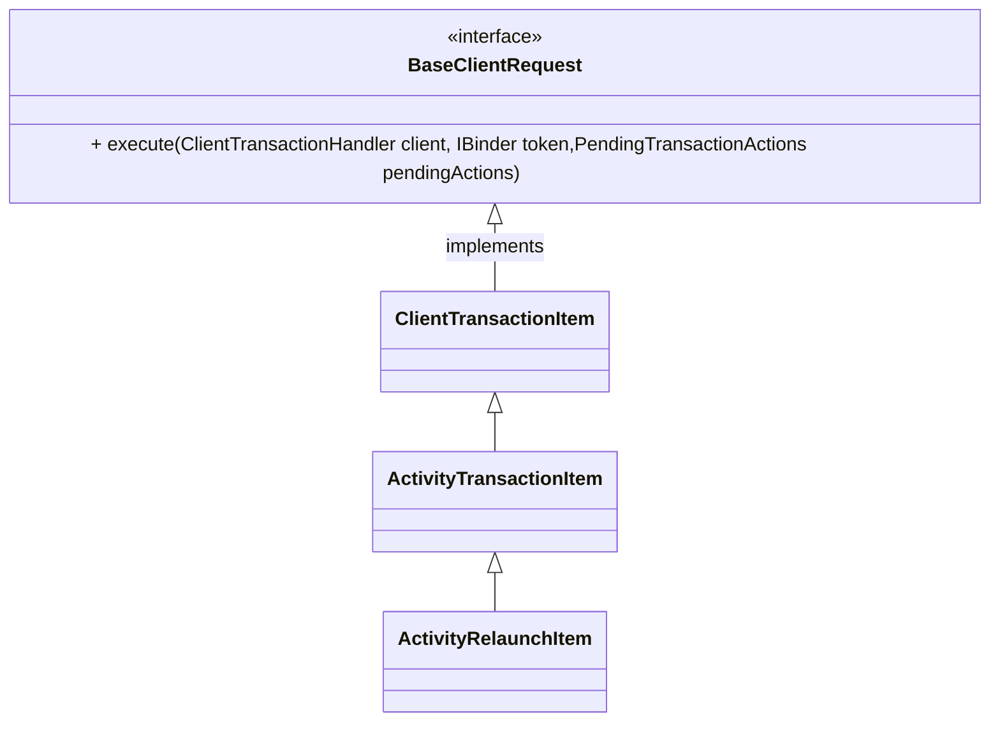

A ${\xrightarrow{test}} B

$$\xrightarrow{test2}$$


A $\xrightarrow{test}$ B




```java

val mainViewModel = 
                [V1]   ViewModelProvider(this)
                  [V2]       .get(MainViewModel::class.java)
```

```java
class A {
  System
}
```
