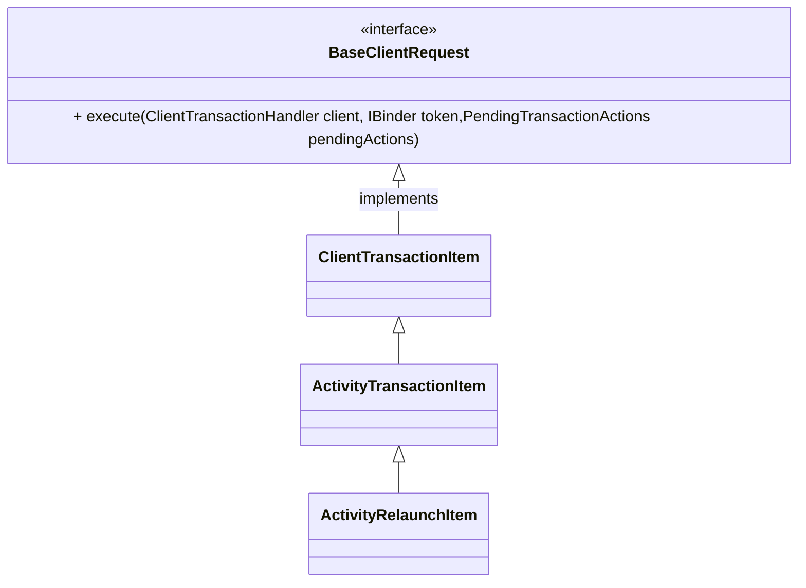

A ${\xrightarrow{test}} B

$$\xrightarrow{test2}$$

A $\xrightarrow{test}$ B

```mermaid
classDiagram
      class ClientTransactionItem {
      }
      class ActivityTransactionItem {
      }
      class ActivityRelaunchItem {
      }
      class BaseClientRequest {
         <<interface>>
         + execute(ClientTransactionHandler client, IBinder token,PendingTransactionActions pendingActions)
      }
      ClientTransactionItem <|-- ActivityTransactionItem
      ActivityTransactionItem <|-- ActivityRelaunchItem
      BaseClientRequest <|-- ClientTransactionItem: implements
```

```mermaid
classDiagram
      class ClientTransactionItem
      class ActivityTransactionItem
      class ActivityRelaunchItem
      class BaseClientRequest {
         <<interface>>
         + execute(ClientTransactionHandler client, IBinder token,PendingTransactionActions pendingActions)
      }
      ClientTransactionItem <|-- ActivityTransactionItem
      ActivityTransactionItem <|-- ActivityRelaunchItem
      BaseClientRequest <|-- ClientTransactionItem: implements
```
