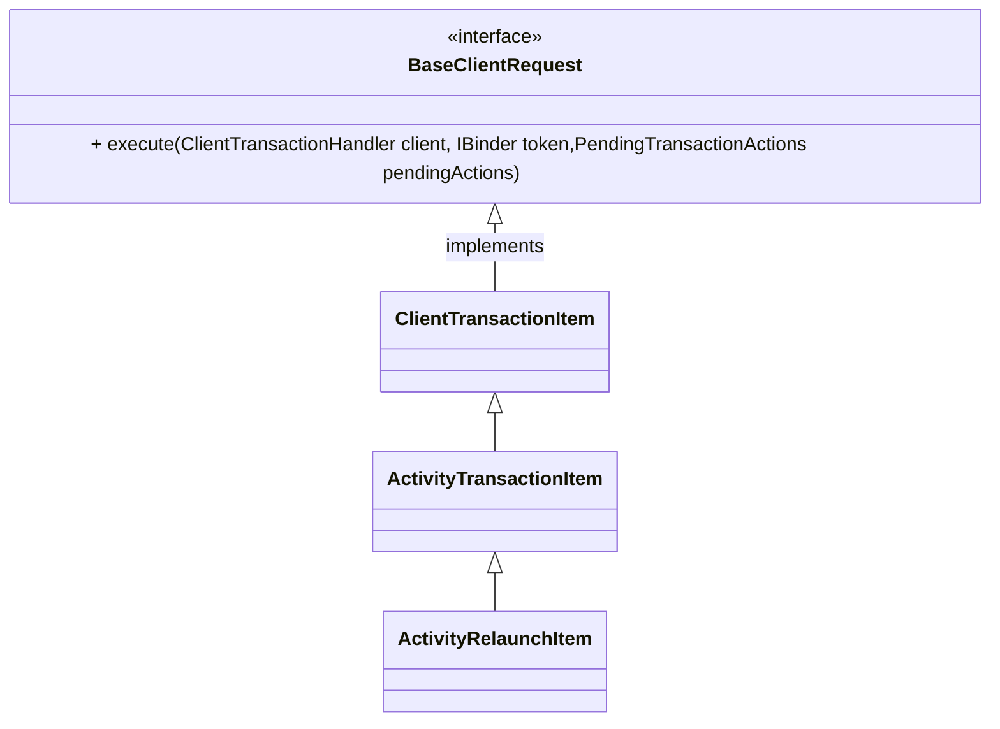

## math

- inline : A $\xrightarrow{test}$ B
- block: 
$$\xrightarrow{test2}$$

## mermaid


## code

this is `inline code`

java

```java
class A {
  System
}
```

kotlin
```kotlin
class B {
    fun test() {

    }
}
```