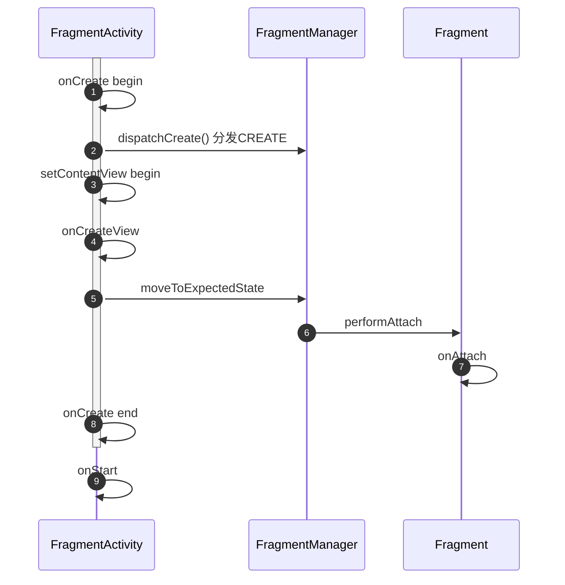

```mermaid
sequenceDiagram
autonumber

participant FragmentActivity
participant FragmentManager
participant Fragment

activate FragmentActivity
FragmentActivity->>FragmentActivity: onCreate begin
FragmentActivity->>FragmentManager: dispatchCreate() 分发CREATE
FragmentActivity->>FragmentActivity: setContentView begin
FragmentActivity->>FragmentActivity: onCreateView
FragmentActivity->>FragmentManager: moveToExpectedState
FragmentManager->>Fragment: performAttach
Fragment->>Fragment: onAttach
FragmentActivity->>FragmentActivity: onCreate end 
deactivate FragmentActivity

FragmentActivity->>FragmentActivity: onStart
```