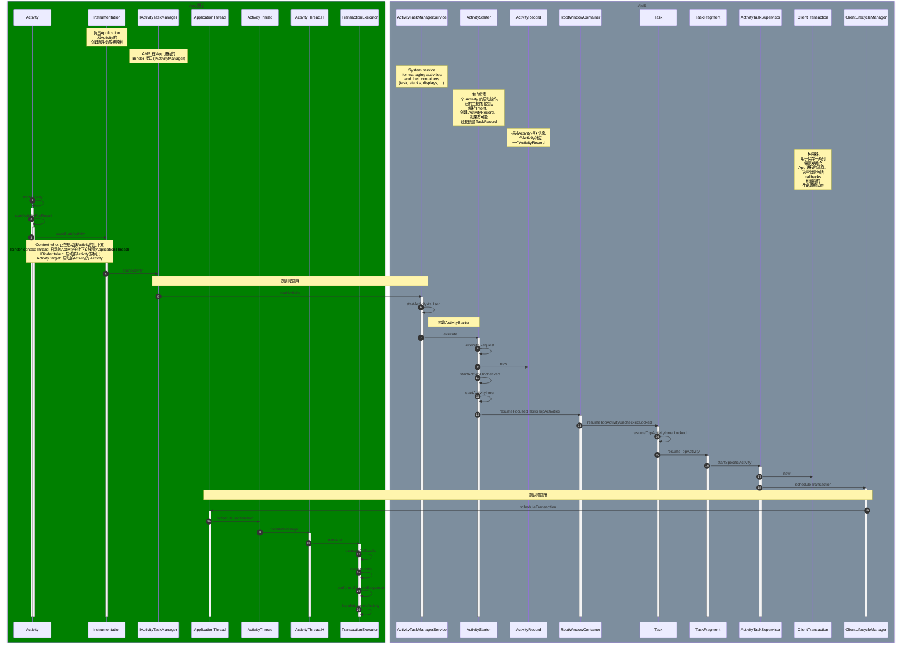
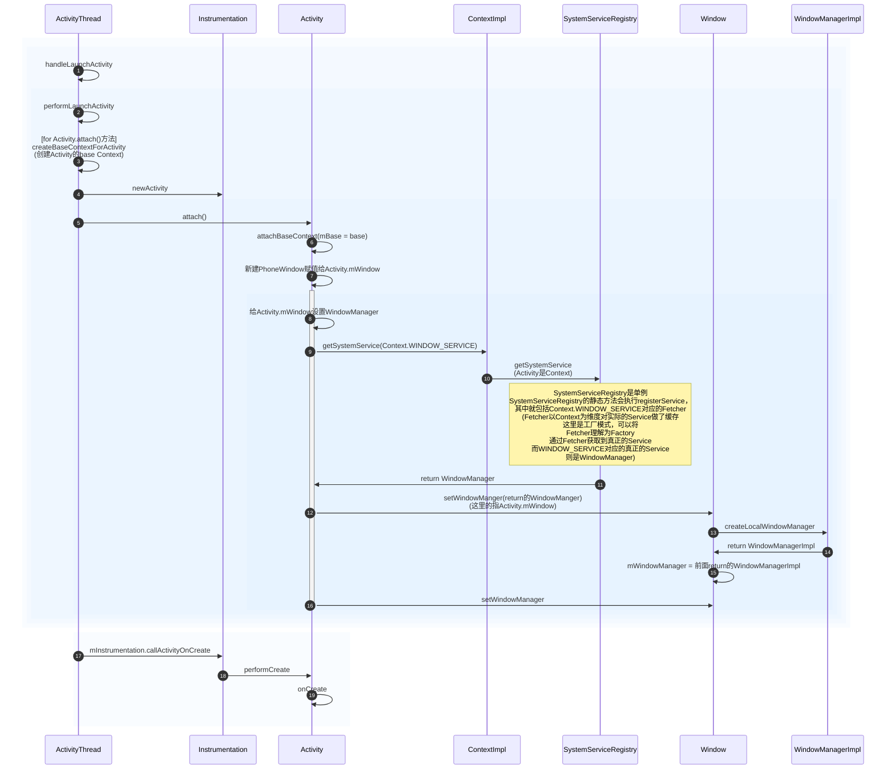
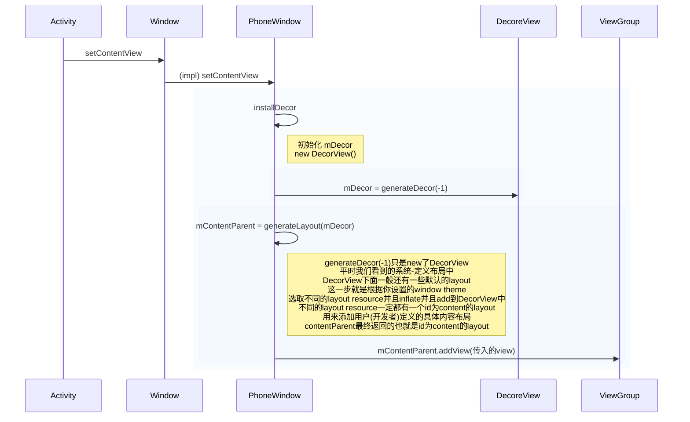

## startActivity

## handleLaunchActivity

## setContentView

## 参考

- [Android窗口机制（一）初识Android的窗口结构](https://www.jianshu.com/p/40a9c93b5a8d)
- [Android -- Activity启动过程中的上下文环境初始化分析](https://blog.csdn.net/csdn_of_coder/article/details/78147399)
- [Android 11源码分析： Activity的启动流程](https://juejin.cn/post/6994823348190445604#heading-1)
- [【Android 14源码分析】Activity启动流程-1](https://juejin.cn/post/7340301649766727721)
- [Activity 启动的整体流程](https://juejin.cn/post/6990297933790838798?searchId=20241027121056BD6132D4CC1C5176D170)
- [Android activity 启动流程](https://juejin.cn/post/7429188498850037795?searchId=20241201200856B3BFAC4094BECA3B7711)