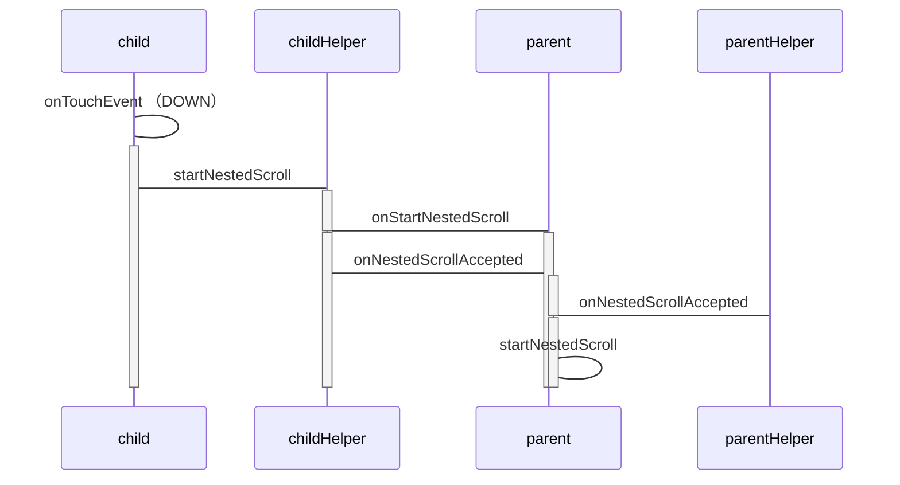
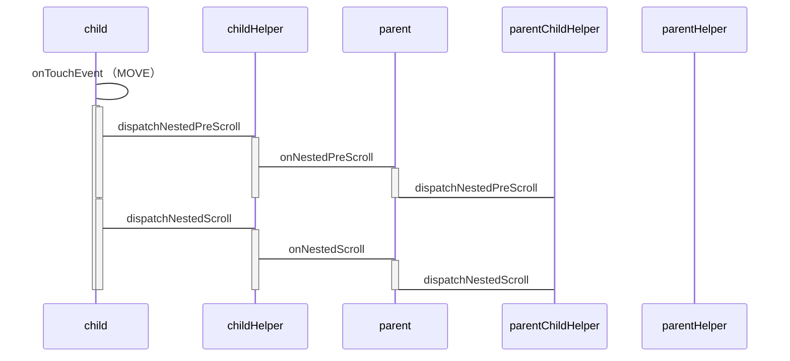
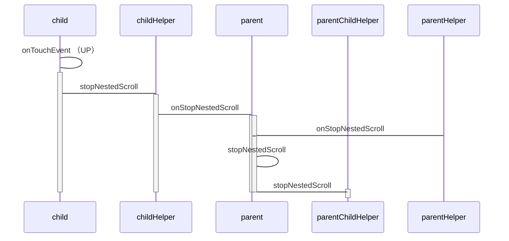

[android MD进阶[四] NestedScrollView 从源码到实战..
](https://juejin.cn/post/7084926146675998756)

[基础精读：NestedScrolling机制详解](https://juejin.cn/post/7141723017914089508)

```
parent I  PARENT-2: onStartNestedScroll true
parent I  PARENT-2: onNestedScrollAccepted kotlin.Unit
child  D  CHILD-1: stopNestedScroll
parent I  PARENT-2: onStartNestedScroll true
parent I  PARENT-2: onNestedScrollAccepted kotlin.Unit
parent D  CHILD-2: dispatchNestedPreScroll false
parent I  PARENT-2: onNestedPreScroll kotlin.Unit
child  D  CHILD-2: dispatchNestedPreScroll false
parent I  PARENT-3: onNestedScroll kotlin.Unit
child  D  CHILD-3: dispatchNestedScroll kotlin.Unit
parent D  CHILD-2: dispatchNestedPreScroll false
parent I  PARENT-2: onNestedPreScroll kotlin.Unit
child  D  CHILD-2: dispatchNestedPreScroll false
parent I  PARENT-3: onNestedScroll kotlin.Unit
child  D  CHILD-3: dispatchNestedScroll kotlin.Unit
parent D  CHILD-2: dispatchNestedPreScroll false
parent I  PARENT-2: onNestedPreScroll kotlin.Unit
child  D  CHILD-2: dispatchNestedPreScroll false
parent I  PARENT-3: onNestedScroll kotlin.Unit
child  D  CHILD-3: dispatchNestedScroll kotlin.Unit
parent D  CHILD-2: dispatchNestedPreScroll false
parent I  PARENT-2: onNestedPreScroll kotlin.Unit
child  D  CHILD-2: dispatchNestedPreScroll false
parent I  PARENT-3: onNestedScroll kotlin.Unit
child  D  CHILD-3: dispatchNestedScroll kotlin.Unit
parent D  CHILD-1: dispatchNestedPreFling false
parent I  PARENT-1: onNestedPreFling false
child  D  CHILD-1: dispatchNestedPreFling false
parent I  PARENT-1: onNestedFling false
child  D  CHILD-1: dispatchNestedFling false
parent I  PARENT-2: onStartNestedScroll true
parent I  PARENT-2: onNestedScrollAccepted kotlin.Unit
child  D  CHILD-1: stopNestedScroll
child  D  CHILD-2: dispatchNestedPreScroll false
parent D  CHILD-2: dispatchNestedPreScroll false
parent I  PARENT-2: onNestedPreScroll kotlin.Unit
child  D  CHILD-2: dispatchNestedPreScroll false
parent I  PARENT-3: onNestedScroll kotlin.Unit
child  D  CHILD-3: dispatchNestedScroll kotlin.Unit
parent D  CHILD-2: dispatchNestedPreScroll false
parent I  PARENT-2: onNestedPreScroll kotlin.Unit
child  D  CHILD-2: dispatchNestedPreScroll false
parent I  PARENT-3: onNestedScroll kotlin.Unit
child  D  CHILD-3: dispatchNestedScroll kotlin.Unit
parent D  CHILD-2: dispatchNestedPreScroll false
parent I  PARENT-2: onNestedPreScroll kotlin.Unit
child  D  CHILD-2: dispatchNestedPreScroll false
parent I  PARENT-3: onNestedScroll kotlin.Unit
child  D  CHILD-3: dispatchNestedScroll kotlin.Unit
parent D  CHILD-2: dispatchNestedPreScroll false
parent I  PARENT-2: onNestedPreScroll kotlin.Unit
child  D  CHILD-2: dispatchNestedPreScroll false
parent I  PARENT-3: onNestedScroll kotlin.Unit
child  D  CHILD-3: dispatchNestedScroll kotlin.Unit
parent D  CHILD-2: dispatchNestedPreScroll false
parent I  PARENT-2: onNestedPreScroll kotlin.Unit
child  D  CHILD-2: dispatchNestedPreScroll false
parent I  PARENT-3: onNestedScroll kotlin.Unit
child  D  CHILD-3: dispatchNestedScroll kotlin.Unit
parent D  CHILD-2: dispatchNestedPreScroll false
parent I  PARENT-2: onNestedPreScroll kotlin.Unit
child  D  CHILD-2: dispatchNestedPreScroll false
parent I  PARENT-3: onNestedScroll kotlin.Unit
child  D  CHILD-3: dispatchNestedScroll kotlin.Unit
parent D  CHILD-2: dispatchNestedPreScroll false
parent I  PARENT-2: onNestedPreScroll kotlin.Unit
child  D  CHILD-2: dispatchNestedPreScroll false
parent I  PARENT-3: onNestedScroll kotlin.Unit
child  D  CHILD-3: dispatchNestedScroll kotlin.Unit
parent D  CHILD-2: dispatchNestedPreScroll false
parent I  PARENT-2: onNestedPreScroll kotlin.Unit
child  D  CHILD-2: dispatchNestedPreScroll false
parent I  PARENT-3: onNestedScroll kotlin.Unit
child  D  CHILD-3: dispatchNestedScroll kotlin.Unit
parent D  CHILD-2: dispatchNestedPreScroll false
parent I  PARENT-2: onNestedPreScroll kotlin.Unit
child  D  CHILD-2: dispatchNestedPreScroll false
parent I  PARENT-3: onNestedScroll kotlin.Unit
child  D  CHILD-3: dispatchNestedScroll kotlin.Unit
parent D  CHILD-2: dispatchNestedPreScroll false
parent I  PARENT-2: onNestedPreScroll kotlin.Unit
child  D  CHILD-2: dispatchNestedPreScroll false
parent I  PARENT-3: onNestedScroll kotlin.Unit
child  D  CHILD-3: dispatchNestedScroll kotlin.Unit
parent D  CHILD-2: dispatchNestedPreScroll false
parent I  PARENT-2: onNestedPreScroll kotlin.Unit
child  D  CHILD-2: dispatchNestedPreScroll false
parent I  PARENT-3: onNestedScroll kotlin.Unit
child  D  CHILD-3: dispatchNestedScroll kotlin.Unit
parent D  CHILD-2: dispatchNestedPreScroll false
parent I  PARENT-2: onNestedPreScroll kotlin.Unit
child  D  CHILD-2: dispatchNestedPreScroll false
parent I  PARENT-3: onNestedScroll kotlin.Unit
child  D  CHILD-3: dispatchNestedScroll kotlin.Unit
parent D  CHILD-2: dispatchNestedPreScroll false
parent I  PARENT-2: onNestedPreScroll kotlin.Unit
child  D  CHILD-2: dispatchNestedPreScroll false
parent I  PARENT-3: onNestedScroll kotlin.Unit
child  D  CHILD-3: dispatchNestedScroll kotlin.Unit
parent D  CHILD-2: dispatchNestedPreScroll false
parent I  PARENT-2: onNestedPreScroll kotlin.Unit
child  D  CHILD-2: dispatchNestedPreScroll false
parent I  PARENT-3: onNestedScroll kotlin.Unit
child  D  CHILD-3: dispatchNestedScroll kotlin.Unit
parent D  CHILD-2: dispatchNestedPreScroll false
parent I  PARENT-2: onNestedPreScroll kotlin.Unit
child  D  CHILD-2: dispatchNestedPreScroll false
parent I  PARENT-3: onNestedScroll kotlin.Unit
child  D  CHILD-3: dispatchNestedScroll kotlin.Unit
parent D  CHILD-2: dispatchNestedPreScroll false
parent I  PARENT-2: onNestedPreScroll kotlin.Unit
child  D  CHILD-2: dispatchNestedPreScroll false
parent I  PARENT-3: onNestedScroll kotlin.Unit
child  D  CHILD-3: dispatchNestedScroll kotlin.Unit
parent D  CHILD-2: dispatchNestedPreScroll false
parent I  PARENT-2: onNestedPreScroll kotlin.Unit
child  D  CHILD-2: dispatchNestedPreScroll false
parent I  PARENT-3: onNestedScroll kotlin.Unit
child  D  CHILD-3: dispatchNestedScroll kotlin.Unit
parent D  CHILD-2: dispatchNestedPreScroll false
parent I  PARENT-2: onNestedPreScroll kotlin.Unit
child  D  CHILD-2: dispatchNestedPreScroll false
parent I  PARENT-3: onNestedScroll kotlin.Unit
child  D  CHILD-3: dispatchNestedScroll kotlin.Unit
parent D  CHILD-2: dispatchNestedPreScroll false
parent I  PARENT-2: onNestedPreScroll kotlin.Unit
child  D  CHILD-2: dispatchNestedPreScroll false
parent I  PARENT-3: onNestedScroll kotlin.Unit
child  D  CHILD-3: dispatchNestedScroll kotlin.Unit
parent D  CHILD-2: dispatchNestedPreScroll false
parent I  PARENT-2: onNestedPreScroll kotlin.Unit
child  D  CHILD-2: dispatchNestedPreScroll false
parent I  PARENT-3: onNestedScroll kotlin.Unit
child  D  CHILD-3: dispatchNestedScroll kotlin.Unit
parent D  CHILD-2: dispatchNestedPreScroll false
parent I  PARENT-2: onNestedPreScroll kotlin.Unit
child  D  CHILD-2: dispatchNestedPreScroll false
parent I  PARENT-3: onNestedScroll kotlin.Unit
child  D  CHILD-3: dispatchNestedScroll kotlin.Unit
parent D  CHILD-2: dispatchNestedPreScroll false
parent I  PARENT-2: onNestedPreScroll kotlin.Unit
child  D  CHILD-2: dispatchNestedPreScroll false
parent I  PARENT-3: onNestedScroll kotlin.Unit
child  D  CHILD-3: dispatchNestedScroll kotlin.Unit
parent D  CHILD-2: dispatchNestedPreScroll false
parent I  PARENT-2: onNestedPreScroll kotlin.Unit
child  D  CHILD-2: dispatchNestedPreScroll false
parent I  PARENT-3: onNestedScroll kotlin.Unit
child  D  CHILD-3: dispatchNestedScroll kotlin.Unit
parent D  CHILD-2: dispatchNestedPreScroll false
parent I  PARENT-2: onNestedPreScroll kotlin.Unit
child  D  CHILD-2: dispatchNestedPreScroll false
parent I  PARENT-3: onNestedScroll kotlin.Unit
child  D  CHILD-3: dispatchNestedScroll kotlin.Unit
parent D  CHILD-2: dispatchNestedPreScroll false
parent I  PARENT-2: onNestedPreScroll kotlin.Unit
child  D  CHILD-2: dispatchNestedPreScroll false
parent I  PARENT-3: onNestedScroll kotlin.Unit
child  D  CHILD-3: dispatchNestedScroll kotlin.Unit
parent D  CHILD-2: dispatchNestedPreScroll false
parent I  PARENT-2: onNestedPreScroll kotlin.Unit
child  D  CHILD-2: dispatchNestedPreScroll false
parent I  PARENT-3: onNestedScroll kotlin.Unit
child  D  CHILD-3: dispatchNestedScroll kotlin.Unit
parent D  CHILD-2: dispatchNestedPreScroll false
parent I  PARENT-2: onNestedPreScroll kotlin.Unit
child  D  CHILD-2: dispatchNestedPreScroll false
parent I  PARENT-3: onNestedScroll kotlin.Unit
child  D  CHILD-3: dispatchNestedScroll kotlin.Unit
parent D  CHILD-2: dispatchNestedPreScroll false
parent I  PARENT-2: onNestedPreScroll kotlin.Unit
child  D  CHILD-2: dispatchNestedPreScroll false
parent I  PARENT-3: onNestedScroll kotlin.Unit
child  D  CHILD-3: dispatchNestedScroll kotlin.Unit
parent D  CHILD-2: dispatchNestedPreScroll false
parent I  PARENT-2: onNestedPreScroll kotlin.Unit
child  D  CHILD-2: dispatchNestedPreScroll false
parent I  PARENT-3: onNestedScroll kotlin.Unit
child  D  CHILD-3: dispatchNestedScroll kotlin.Unit
parent D  CHILD-2: dispatchNestedPreScroll false
parent I  PARENT-2: onNestedPreScroll kotlin.Unit
child  D  CHILD-2: dispatchNestedPreScroll false
parent I  PARENT-3: onNestedScroll kotlin.Unit
child  D  CHILD-3: dispatchNestedScroll kotlin.Unit
parent D  CHILD-2: dispatchNestedPreScroll false
parent I  PARENT-2: onNestedPreScroll kotlin.Unit
child  D  CHILD-2: dispatchNestedPreScroll false
parent I  PARENT-3: onNestedScroll kotlin.Unit
child  D  CHILD-3: dispatchNestedScroll kotlin.Unit
parent D  CHILD-2: dispatchNestedPreScroll false
parent I  PARENT-2: onNestedPreScroll kotlin.Unit
child  D  CHILD-2: dispatchNestedPreScroll false
parent I  PARENT-3: onNestedScroll kotlin.Unit
child  D  CHILD-3: dispatchNestedScroll kotlin.Unit
parent D  CHILD-2: dispatchNestedPreScroll false
parent I  PARENT-2: onNestedPreScroll kotlin.Unit
child  D  CHILD-2: dispatchNestedPreScroll false
parent I  PARENT-3: onNestedScroll kotlin.Unit
child  D  CHILD-3: dispatchNestedScroll kotlin.Unit
parent D  CHILD-2: dispatchNestedPreScroll false
parent I  PARENT-2: onNestedPreScroll kotlin.Unit
child  D  CHILD-2: dispatchNestedPreScroll false
parent I  PARENT-3: onNestedScroll kotlin.Unit
child  D  CHILD-3: dispatchNestedScroll kotlin.Unit
parent D  CHILD-2: dispatchNestedPreScroll false
parent I  PARENT-2: onNestedPreScroll kotlin.Unit
child  D  CHILD-2: dispatchNestedPreScroll false
parent I  PARENT-3: onNestedScroll kotlin.Unit
child  D  CHILD-3: dispatchNestedScroll kotlin.Unit
parent D  CHILD-2: dispatchNestedPreScroll false
parent I  PARENT-2: onNestedPreScroll kotlin.Unit
child  D  CHILD-2: dispatchNestedPreScroll false
parent I  PARENT-3: onNestedScroll kotlin.Unit
child  D  CHILD-3: dispatchNestedScroll kotlin.Unit
parent D  CHILD-2: dispatchNestedPreScroll false
parent I  PARENT-2: onNestedPreScroll kotlin.Unit
child  D  CHILD-2: dispatchNestedPreScroll false
parent I  PARENT-3: onNestedScroll kotlin.Unit
child  D  CHILD-3: dispatchNestedScroll kotlin.Unit
parent D  CHILD-2: dispatchNestedPreScroll false
parent I  PARENT-2: onNestedPreScroll kotlin.Unit
child  D  CHILD-2: dispatchNestedPreScroll false
parent I  PARENT-3: onNestedScroll kotlin.Unit
child  D  CHILD-3: dispatchNestedScroll kotlin.Unit
parent D  CHILD-2: dispatchNestedPreScroll false
parent I  PARENT-2: onNestedPreScroll kotlin.Unit
child  D  CHILD-2: dispatchNestedPreScroll false
parent I  PARENT-3: onNestedScroll kotlin.Unit
child  D  CHILD-3: dispatchNestedScroll kotlin.Unit
parent D  CHILD-2: dispatchNestedPreScroll false
parent I  PARENT-2: onNestedPreScroll kotlin.Unit
child  D  CHILD-2: dispatchNestedPreScroll false
parent I  PARENT-3: onNestedScroll kotlin.Unit
child  D  CHILD-3: dispatchNestedScroll kotlin.Unit
parent D  CHILD-2: dispatchNestedPreScroll false
parent I  PARENT-2: onNestedPreScroll kotlin.Unit
child  D  CHILD-2: dispatchNestedPreScroll false
parent I  PARENT-3: onNestedScroll kotlin.Unit
child  D  CHILD-3: dispatchNestedScroll kotlin.Unit
parent D  CHILD-2: dispatchNestedPreScroll false
parent I  PARENT-2: onNestedPreScroll kotlin.Unit
child  D  CHILD-2: dispatchNestedPreScroll false
parent I  PARENT-3: onNestedScroll kotlin.Unit
child  D  CHILD-3: dispatchNestedScroll kotlin.Unit
parent D  CHILD-2: dispatchNestedPreScroll false
parent I  PARENT-2: onNestedPreScroll kotlin.Unit
child  D  CHILD-2: dispatchNestedPreScroll false
parent I  PARENT-3: onNestedScroll kotlin.Unit
child  D  CHILD-3: dispatchNestedScroll kotlin.Unit
parent D  CHILD-2: dispatchNestedPreScroll false
parent I  PARENT-2: onNestedPreScroll kotlin.Unit
child  D  CHILD-2: dispatchNestedPreScroll false
parent I  PARENT-3: onNestedScroll kotlin.Unit
child  D  CHILD-3: dispatchNestedScroll kotlin.Unit
parent D  CHILD-2: dispatchNestedPreScroll false
parent I  PARENT-2: onNestedPreScroll kotlin.Unit
child  D  CHILD-2: dispatchNestedPreScroll false
parent I  PARENT-3: onNestedScroll kotlin.Unit
child  D  CHILD-3: dispatchNestedScroll kotlin.Unit
parent D  CHILD-2: dispatchNestedPreScroll false
parent I  PARENT-2: onNestedPreScroll kotlin.Unit
child  D  CHILD-2: dispatchNestedPreScroll false
parent I  PARENT-3: onNestedScroll kotlin.Unit
child  D  CHILD-3: dispatchNestedScroll kotlin.Unit
parent D  CHILD-2: dispatchNestedPreScroll false
parent I  PARENT-2: onNestedPreScroll kotlin.Unit
child  D  CHILD-2: dispatchNestedPreScroll false
parent I  PARENT-3: onNestedScroll kotlin.Unit
child  D  CHILD-3: dispatchNestedScroll kotlin.Unit
parent D  CHILD-2: dispatchNestedPreScroll false
parent I  PARENT-2: onNestedPreScroll kotlin.Unit
child  D  CHILD-2: dispatchNestedPreScroll false
parent I  PARENT-3: onNestedScroll kotlin.Unit
child  D  CHILD-3: dispatchNestedScroll kotlin.Unit
parent D  CHILD-2: dispatchNestedPreScroll false
parent I  PARENT-2: onNestedPreScroll kotlin.Unit
child  D  CHILD-2: dispatchNestedPreScroll false
parent I  PARENT-3: onNestedScroll kotlin.Unit
child  D  CHILD-3: dispatchNestedScroll kotlin.Unit
parent D  CHILD-2: dispatchNestedPreScroll false
parent I  PARENT-2: onNestedPreScroll kotlin.Unit
child  D  CHILD-2: dispatchNestedPreScroll false
parent I  PARENT-3: onNestedScroll kotlin.Unit
child  D  CHILD-3: dispatchNestedScroll kotlin.Unit
child  D  CHILD-2: dispatchNestedPreScroll false
child  D  CHILD-2: dispatchNestedPreScroll false
```





