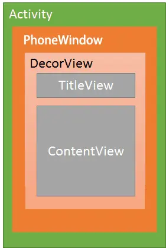
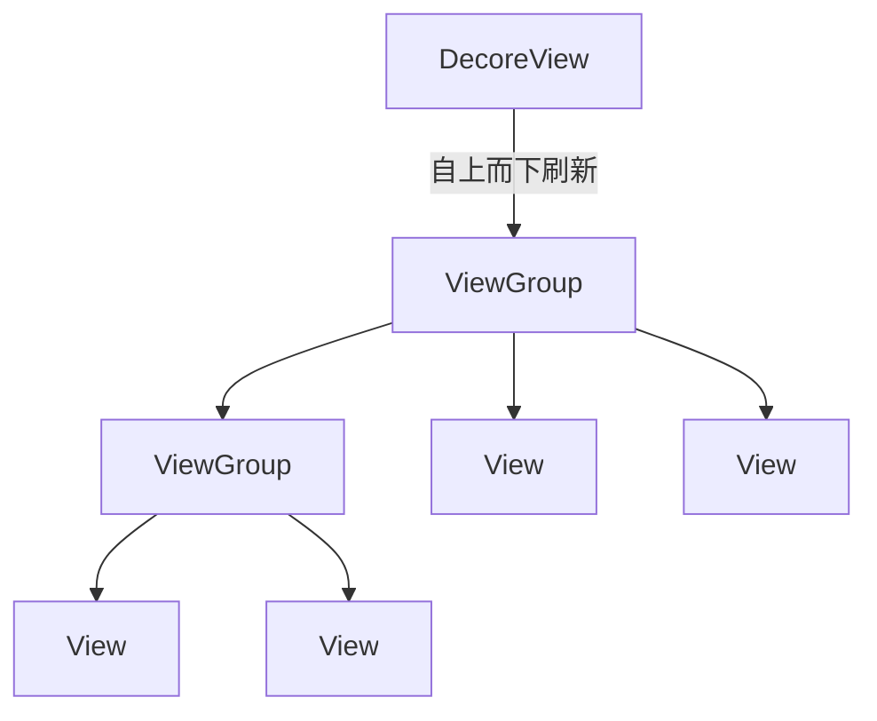
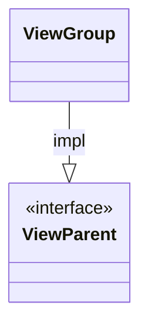
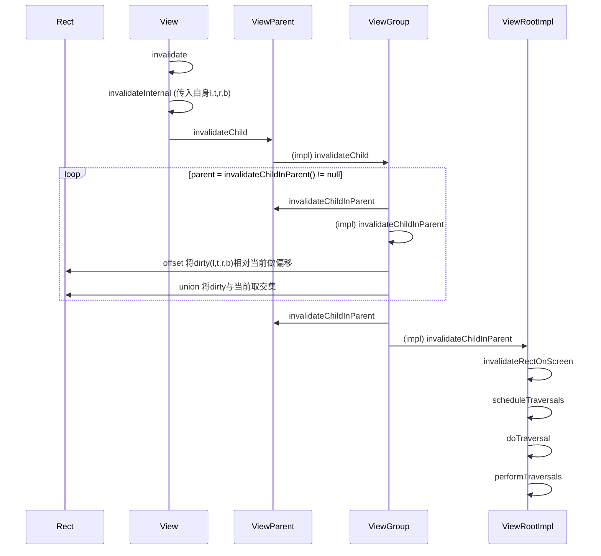
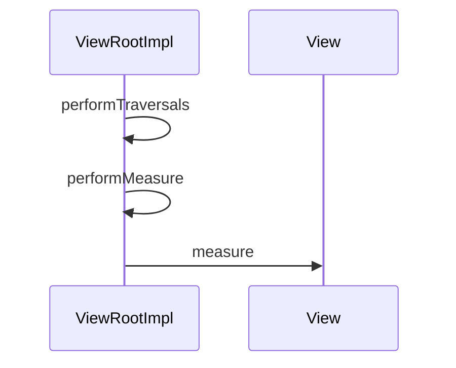

> 基于android api-33








## [1709475090] `invalidate`
```java
// android.view.View
    @UnsupportedAppUsage
    public void invalidate(boolean invalidateCache) {
       [1709475107] invalidateInternal(0, 0, mRight - mLeft, mBottom - mTop, invalidateCache, true);
    }
```

## [1709475107] `invalidateInternal`
```java
// android.view.View
    void invalidateInternal(int l, int t, int r, int b, boolean invalidateCache,
            boolean fullInvalidate) {
        if (mGhostView != null) {
            mGhostView.invalidate(true);
            return;
        }

        if (skipInvalidate()) {
            return;
        }

        // Reset content capture caches
        mPrivateFlags4 &= ~PFLAG4_CONTENT_CAPTURE_IMPORTANCE_MASK;
        mContentCaptureSessionCached = false;

        if ((mPrivateFlags & (PFLAG_DRAWN | PFLAG_HAS_BOUNDS)) == (PFLAG_DRAWN | PFLAG_HAS_BOUNDS)
                || (invalidateCache && (mPrivateFlags & PFLAG_DRAWING_CACHE_VALID) == PFLAG_DRAWING_CACHE_VALID)
                || (mPrivateFlags & PFLAG_INVALIDATED) != PFLAG_INVALIDATED
                || (fullInvalidate && isOpaque() != mLastIsOpaque)) {
            if (fullInvalidate) {
                mLastIsOpaque = isOpaque();
                mPrivateFlags &= ~PFLAG_DRAWN;
            }

            [1709477262] mPrivateFlags |= PFLAG_DIRTY;

            if (invalidateCache) {
                mPrivateFlags |= PFLAG_INVALIDATED;
                mPrivateFlags &= ~PFLAG_DRAWING_CACHE_VALID;
            }

            // Propagate the damage rectangle to the parent view.
            final AttachInfo ai = mAttachInfo;
            [1709475296] final ViewParent p = mParent;
            if (p != null && ai != null && l < r && t < b) {
                final Rect damage = ai.mTmpInvalRect;
                [1709479770] damage.set(l, t, r, b);
                [1709475402] p.invalidateChild(this, damage);
            }

            // Damage the entire projection receiver, if necessary.
            if (mBackground != null && mBackground.isProjected()) {
                final View receiver = getProjectionReceiver();
                if (receiver != null) {
                    receiver.damageInParent();
                }
            }
        }
    }
```

[1709479625]l, r, t, b传入的就是调用invalidate的View 需要重绘的区域，注意这里传入的 l, r都是0，t是宽，b是高度，所以传入的不是相对 mParent 的位置。

## [1709477262] `mPrivateFlags |= PFLAG_DIRTY;`

标记dirty——`View`正在被重绘

## [1709479770] `damage.set(l, t, r, b);`

设置重绘区域, l,t,r,b来自[1709479625]

## [1709475296] `final ViewParent p = mParent`

这个View所附加到的父级View
```java
// android.view.View
    /**
     * The parent this view is attached to.
     * {@hide}
     *
     * @see #getParent()
     */
    @UnsupportedAppUsage(maxTargetSdk = Build.VERSION_CODES.P)
    protected ViewParent mParent;
```

## [1709475402] `p.invalidateChild(this, damage)`  

子视图的全部或部分内容已变脏，需要重新绘制。
```java
// android.view.ViewParent
    /**
     * All or part of a child is dirty and needs to be redrawn.
     * 
     * @param child The child which is dirty
     * @param r The area within the child that is invalid
     *
     * @deprecated Use {@link #onDescendantInvalidated(View, View)} instead.
     */
    @Deprecated
    public void invalidateChild(View child, Rect r);
```
实现该方法的`ViewParent`实现类只有`ViewGroup`



## [1709475903] `ViewGroup.invalidateChild`
```java
//android.view.ViewGroup 
    @Deprecated
    @Override
    public final void invalidateChild(View child, final Rect dirty) {
        final AttachInfo attachInfo = mAttachInfo;
        if (attachInfo != null && attachInfo.mHardwareAccelerated) {
            // HW accelerated fast path
            onDescendantInvalidated(child, child);
            return;
        }

        [1709476329] ViewParent parent = this;
        if (attachInfo != null) {
            // If the child is drawing an animation, we want to copy this flag onto
            // ourselves and the parent to make sure the invalidate request goes
            // through
            final boolean drawAnimation = (child.mPrivateFlags & PFLAG_DRAW_ANIMATION) != 0;

            // Check whether the child that requests the invalidate is fully opaque
            // Views being animated or transformed are not considered opaque because we may
            // be invalidating their old position and need the parent to paint behind them.
            Matrix childMatrix = child.getMatrix();
            // Mark the child as dirty, using the appropriate flag
            // Make sure we do not set both flags at the same time

            if (child.mLayerType != LAYER_TYPE_NONE) {
                mPrivateFlags |= PFLAG_INVALIDATED;
                mPrivateFlags &= ~PFLAG_DRAWING_CACHE_VALID;
            }

            final int[] location = attachInfo.mInvalidateChildLocation;
            location[CHILD_LEFT_INDEX] = child.mLeft;
            location[CHILD_TOP_INDEX] = child.mTop;
            if (!childMatrix.isIdentity() ||
                    (mGroupFlags & ViewGroup.FLAG_SUPPORT_STATIC_TRANSFORMATIONS) != 0) {
                RectF boundingRect = attachInfo.mTmpTransformRect;
                boundingRect.set(dirty);
                Matrix transformMatrix;
                if ((mGroupFlags & ViewGroup.FLAG_SUPPORT_STATIC_TRANSFORMATIONS) != 0) {
                    Transformation t = attachInfo.mTmpTransformation;
                    boolean transformed = getChildStaticTransformation(child, t);
                    if (transformed) {
                        transformMatrix = attachInfo.mTmpMatrix;
                        transformMatrix.set(t.getMatrix());
                        if (!childMatrix.isIdentity()) {
                            transformMatrix.preConcat(childMatrix);
                        }
                    } else {
                        transformMatrix = childMatrix;
                    }
                } else {
                    transformMatrix = childMatrix;
                }
                transformMatrix.mapRect(boundingRect);
                dirty.set((int) Math.floor(boundingRect.left),
                        (int) Math.floor(boundingRect.top),
                        (int) Math.ceil(boundingRect.right),
                        (int) Math.ceil(boundingRect.bottom));
            }

            do {
                View view = null;
                if (parent instanceof View) {
                    view = (View) parent;
                }

                if (drawAnimation) {
                    if (view != null) {
                        view.mPrivateFlags |= PFLAG_DRAW_ANIMATION;
                    } else if (parent instanceof ViewRootImpl) {
                        ((ViewRootImpl) parent).mIsAnimating = true;
                    }
                }

                // If the parent is dirty opaque or not dirty, mark it dirty with the opaque
                // flag coming from the child that initiated the invalidate
                if (view != null) {
                    if ((view.mPrivateFlags & PFLAG_DIRTY_MASK) != PFLAG_DIRTY) {
                        view.mPrivateFlags = (view.mPrivateFlags & ~PFLAG_DIRTY_MASK) | PFLAG_DIRTY;
                    }
                }

                [1709476371] parent = parent.invalidateChildInParent(location, dirty);
                if (view != null) {
                    // Account for transform on current parent
                    Matrix m = view.getMatrix();
                    if (!m.isIdentity()) {
                        RectF boundingRect = attachInfo.mTmpTransformRect;
                        boundingRect.set(dirty);
                        m.mapRect(boundingRect);
                        dirty.set((int) Math.floor(boundingRect.left),
                                (int) Math.floor(boundingRect.top),
                                (int) Math.ceil(boundingRect.right),
                                (int) Math.ceil(boundingRect.bottom));
                    }
                }
            } while (parent != null);
        }
    }
```

## [1709476371] `parent = parent.invalidateChildInParent(location, dirty);`

最开始parent就是View的mParent - ViewGroup自己 `[1709476329] ViewParent parent = this;`
不断循环，parent赋值为`invalidateChildInParent`的返回值

## [1709476540] `ViewParent.invalidateChildInParent(int[] location, Rect r)`

```java
// android.view.ViewParent
    @Deprecated
    public ViewParent invalidateChildInParent(int[] location, Rect r);
```

```java
//android.view.ViewGroup 
    @Deprecated
    @Override
    public ViewParent invalidateChildInParent(final int[] location, final Rect dirty) {
        if ((mPrivateFlags & (PFLAG_DRAWN | PFLAG_DRAWING_CACHE_VALID)) != 0) {
            // either DRAWN, or DRAWING_CACHE_VALID
            if ((mGroupFlags & (FLAG_OPTIMIZE_INVALIDATE | FLAG_ANIMATION_DONE))
                    != FLAG_OPTIMIZE_INVALIDATE) {
                [1709480037] dirty.offset(location[CHILD_LEFT_INDEX] - mScrollX,
                        location[CHILD_TOP_INDEX] - mScrollY);
                if ((mGroupFlags & FLAG_CLIP_CHILDREN) == 0) {
                    [1709481021] dirty.union(0, 0, mRight - mLeft, mBottom - mTop);
                }

                final int left = mLeft;
                final int top = mTop;

                if ((mGroupFlags & FLAG_CLIP_CHILDREN) == FLAG_CLIP_CHILDREN) {
                    if (!dirty.intersect(0, 0, mRight - left, mBottom - top)) {
                        dirty.setEmpty();
                    }
                }

                location[CHILD_LEFT_INDEX] = left;
                location[CHILD_TOP_INDEX] = top;
            } else {

                if ((mGroupFlags & FLAG_CLIP_CHILDREN) == FLAG_CLIP_CHILDREN) {
                    dirty.set(0, 0, mRight - mLeft, mBottom - mTop);
                } else {
                    // in case the dirty rect extends outside the bounds of this container
                    dirty.union(0, 0, mRight - mLeft, mBottom - mTop);
                }
                location[CHILD_LEFT_INDEX] = mLeft;
                location[CHILD_TOP_INDEX] = mTop;

                mPrivateFlags &= ~PFLAG_DRAWN;
            }
            mPrivateFlags &= ~PFLAG_DRAWING_CACHE_VALID;
            if (mLayerType != LAYER_TYPE_NONE) {
                mPrivateFlags |= PFLAG_INVALIDATED;
            }

            [1710057745] return mParent;
        }

        return null;
    }
```

## [1709480037] `dirty.offset(location[CHILD_LEFT_INDEX] - mScrollX, location[CHILD_TOP_INDEX] - mScrollY);`

[1709479625]说过传入的重绘区域不是相对父布局的位置，所以这里转换为相对父布局(当前View)的位置;  
这里还考虑的mScrollX，和mScrollY，因为子View可能已经不在可视区域了

## [1709481021] `dirty.union(0, 0, mRight - mLeft, mBottom - mTop);`

[1709480037]将重绘位置转换为相对相对父布局(当前View)的位置，然后与当前View的绘制范围取交集，所以union之后一定<=之前传入的重绘范围，比如子View已经滚出当前ViewGroup，那就没有要重绘的区域了。

## [1710057745] `return mParent`

返回自己的mParent

## [1709476540] `ViewParent.invalidateChildInParent(int[] location, Rect r)` 

```java
// android.view.ViewRootImpl
    public ViewParent invalidateChildInParent(int[] location, Rect dirty) {
        checkThread();
        if (DEBUG_DRAW) Log.v(mTag, "Invalidate child: " + dirty);

        if (dirty == null) {
            invalidate();
            return null;
        } else if (dirty.isEmpty() && !mIsAnimating) {
            return null;
        }

        if (mCurScrollY != 0 || mTranslator != null) {
            mTempRect.set(dirty);
            dirty = mTempRect;
            if (mCurScrollY != 0) {
                dirty.offset(0, -mCurScrollY);
            }
            if (mTranslator != null) {
                mTranslator.translateRectInAppWindowToScreen(dirty);
            }
            if (mAttachInfo.mScalingRequired) {
                dirty.inset(-1, -1);
            }
        }

        [1710057983] invalidateRectOnScreen(dirty);

        return null;
    }
```
实现 `ViewParent` 接口的还有 `ViewRootImpl`，`ViewParent` 不断返回 `mParent`，最终就会来到 `ViewRootImpl`

## [1710057983] `invalidateRectOnScreen(dirty);`

```java
// android.view.ViewRootImpl
    private void invalidateRectOnScreen(Rect dirty) {
        final Rect localDirty = mDirty;

        // Add the new dirty rect to the current one
        localDirty.union(dirty.left, dirty.top, dirty.right, dirty.bottom);
        // Intersect with the bounds of the window to skip
        // updates that lie outside of the visible region
        final float appScale = mAttachInfo.mApplicationScale;
        final boolean intersected = localDirty.intersect(0, 0,
                (int) (mWidth * appScale + 0.5f), (int) (mHeight * appScale + 0.5f));
        if (!intersected) {
            localDirty.setEmpty();
        }
        if (!mWillDrawSoon && (intersected || mIsAnimating)) {
            [1710058154] scheduleTraversals();
        }
    }
```

## [1710058154] `scheduleTraversals();`

```java
// android.view.ViewRootImpl
    @UnsupportedAppUsage(maxTargetSdk = Build.VERSION_CODES.R, trackingBug = 170729553)
    void scheduleTraversals() {
        if (!mTraversalScheduled) {
            mTraversalScheduled = true;
            mTraversalBarrier = mHandler.getLooper().getQueue().postSyncBarrier();
            [1710058425] mChoreographer.postCallback(
                    Choreographer.CALLBACK_TRAVERSAL, [1710058293] mTraversalRunnable, null);
            notifyRendererOfFramePending();
            pokeDrawLockIfNeeded();
        }
    }
```

## [1710058425] `mChoreographer.postCallback(`

```java
// android.view.Choreographer
    public void postCallback(int callbackType, Runnable action, Object token) {
        postCallbackDelayed(callbackType, action, token, 0);
    }
```

将action排队执行，所以回去看  [1710058293] `mTraversalRunnable` 是什么


## [1710058293] `mTraversalRunnable`


```java
// android.view.ViewRootImpl
    final TraversalRunnable mTraversalRunnable = new TraversalRunnable();
```

```java
// android.view.ViewRootImpl
    final class TraversalRunnable implements Runnable {
        @Override
        public void run() {
            [1710058592] doTraversal();
        }
    }
```
## [1710058592] `doTraversal();`

```java
// android.view.ViewRootImpl
    void doTraversal() {
        if (mTraversalScheduled) {
            mTraversalScheduled = false;
            mHandler.getLooper().getQueue().removeSyncBarrier(mTraversalBarrier);

            if (mProfile) {
                Debug.startMethodTracing("ViewAncestor");
            }

            [1710058976] performTraversals();

            if (mProfile) {
                Debug.stopMethodTracing();
                mProfile = false;
            }
        }
    }
```

## [1710058976] `performTraversals();`

```java
// android.view.ViewRootImpl
    private void performTraversals() {
        ...
                   [1710059482] performMeasure(childWidthMeasureSpec, childHeightMeasureSpec);
```

## [1710059482] `performMeasure(childWidthMeasureSpec, childHeightMeasureSpec);`

```java
// android.view.ViewRootImpl
    private void performMeasure(int childWidthMeasureSpec, int childHeightMeasureSpec) {
        if (mView == null) {
            return;
        }
        Trace.traceBegin(Trace.TRACE_TAG_VIEW, "measure");
        try {
            [1710059534] mView.measure(childWidthMeasureSpec, childHeightMeasureSpec);
        } finally {
            Trace.traceEnd(Trace.TRACE_TAG_VIEW);
        }
    }
```

## [1710059534] `mView.measure(childWidthMeasureSpec, childHeightMeasureSpec);`






# 参考

- [View Invalidate流程](https://juejin.cn/post/6854573222386958344)
- [android invalidate 执行流程详解](https://blog.51cto.com/u_15127673/4252441)