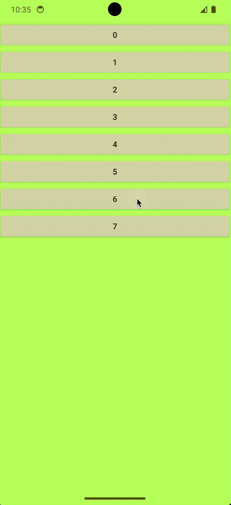

## 特点

- 可自定义展开段数(即自动吸附的高度)
- 到达吸附位置有仿 iOS 的回弹效果（可以参考apple地图）
- 可自定义背景半透明蒙层颜色
- 实现了 `NestedScrollingParent` 接口——支持嵌套滚动

## 演示

- 常见的 关闭 -> 半展开 -> 全展开效果


- 1. 嵌套滚动 2. 背景蒙层颜色修改为更深的紫色



- 自定义为4段吸附


## 代码

### BottomSheetDialog -- 继承该类实现自己的Dialog

```kotlin
import android.os.Bundle
import android.view.LayoutInflater
import android.view.View
import android.view.ViewGroup
import androidx.fragment.app.DialogFragment

abstract class BottomSheetDialog: DialogFragment() {

    private var contentView: View? = null

    override fun getTheme(): Int {
        return R.style.com_SwithunBottomSheetDialog
    }

    override fun onCreateView(
        inflater: LayoutInflater,
        container: ViewGroup?,
        savedInstanceState: Bundle?
    ): View? {
        val contentViewWrapper = inflater.inflate(R.layout.bottom_sheet_dialog_layout, container, false)
        contentView = contentViewWrapper
        onCreateContentView(inflater, contentViewWrapper as BottomSheetDialogLayout, savedInstanceState)
        contentViewWrapper.asIBottomSheetDialogLayoutSetting().init()
        return contentView
    }

    abstract fun onCreateContentView(
        inflater: LayoutInflater,
        contentViewWrapper: BottomSheetDialogLayout,
        savedInstanceState: Bundle?
    )

}

```

### bottom_sheet_dialog_layout -- Dialog基本布局

```xml
<?xml version="1.0" encoding="utf-8"?>
<com.swithun.swithunbottomsheetdialog.BottomSheetDialogLayout xmlns:android="http://schemas.android.com/apk/res/android"
    android:id="@+id/root"
    android:layout_width="match_parent"
    android:layout_height="match_parent"
    android:background="#6BD001FF">

</com.swithun.swithunbottomsheetdialog.BottomSheetDialogLayout>
```

### BottomSheetDialogLayout -- 实现Dialog的关键layout

```kotlin
import android.animation.ValueAnimator
import android.content.Context
import android.graphics.drawable.Drawable
import android.util.AttributeSet
import android.util.Log
import android.view.MotionEvent
import android.view.VelocityTracker
import android.view.View
import android.view.ViewConfiguration
import android.view.animation.OvershootInterpolator
import android.widget.FrameLayout
import androidx.core.view.NestedScrollingParent3
import androidx.core.view.NestedScrollingParentHelper
import androidx.core.view.ViewCompat
import androidx.core.view.ViewCompat.NestedScrollType
import androidx.core.view.children
import androidx.customview.widget.ViewDragHelper.INVALID_POINTER
import kotlin.math.abs

class BottomSheetDialogLayout @JvmOverloads constructor(
    context: Context, attrs: AttributeSet? = null, defStyleAttr: Int = 0
) : FrameLayout(context, attrs, defStyleAttr), NestedScrollingParent3, IBottomSheetDialogLayoutSetting {

    /** 第一个View */
    private val firstView: View?
        get() = children.firstOrNull()

    //// Event 记录
    /** [onTouchEvent]记录上一个EventY */
    private var lastMotionYForOnTouchEvent = 0

    /** [onTouchEvent]记录上一个DownEventY */
    private var lastDownYForOnTouchEvent = 0

    /** [onInterceptTouchEvent]记录上一个EventY */
    private var lastMotionYForInterceptTouchEvent = 0

    /** [onInterceptTouchEvent]记录上一个DownEventY */
    private var lastDownYForInterceptEvent: Int = 0

    /** 造成滚动的原因 */
    private var scrollCauser: ScrollCauser = ScrollCauser.NONE

    //// 吸附位置
    /** 默认的最低吸附位置 */
    private val stateLowest get() = -height

    /** 默认的最高吸附位置 */
    private val stateHighest get() = 0

    /** 自定义的吸附位置列表 */
    override var customStateList: List<CustomHeight>? = null

    /** 初始化时到哪个state */
    override var initState: Int = 0
    override var stateListener: ((Int) -> Unit)? = null

    /** 想要的吸附位置列表 */
    private val wantStateList: List<Int>
        get() {
            val custom: List<CustomHeight>? = customStateList
            return custom?.map {
                when (it) {
                    is CustomHeight.Bottom -> stateLowest + it.add
                    is CustomHeight.Highest -> stateHighest - it.reduce
                    is CustomHeight.Number -> -it.value
                    is CustomHeight.Percent -> (stateLowest * it.f).toInt()
                }
            } ?: listOf(
                stateLowest + 200, // -2691
                (stateLowest * 0.4).toInt(), // -1000
                stateHighest // 0
            )
        }

    /** 当contentView太矮可能无法满足[wantStateList]，需要check一下 */
    private val safeStateList: List<Int>
        get() {
            val firstView = firstView ?: return wantStateList
            val firstViewHeight = firstView.height
            val list = mutableListOf<Int>()
            val sortedStateList = wantStateList.sorted()
            for (i in sortedStateList.indices) {
                if (-(height - firstViewHeight) > sortedStateList[i]) {
                    list.add(sortedStateList[i])
                }
            }
            if (list.size < sortedStateList.size) {
                list.add(-(height - firstViewHeight))
            }
            return list
        }

    /** <当前State，更高的State> */
    private val openState: Pair<Int, Int>
        get() {
            var oldState = safeStateList.size - 1
            for (i in safeStateList.indices.reversed()) {
                if (scrollY >= safeStateList[i]) {
                    return i to oldState
                }
                oldState = i
            }
            return 0 to oldState
        }

    private val parentHelper by lazy {
        NestedScrollingParentHelper(this)
    }
    private val interceptTouchEventHelper = BottomSheetDialogInterceptTouchEventHelper()

    /// fling 检测
    private val velocityTracker = VelocityTracker.obtain()
    private var activePointerId = INVALID_POINTER

    // autoSettle动画相关
    private var animateStartY2EndY = AnimateValue(0, 0)
    private val autoSettleAnimator = ValueAnimator().also {
        it.interpolator = OvershootInterpolator(1f)
    }

    private var disableTouch = false

    override var bgMask: Drawable
        get() = this.background
        set(value) {
            this.background = value
        }

    override fun init() {
        this.post {
            val initState = initState

            val list = safeStateList
            scrollTo(scrollX, safeStateList[0] + 1)
            val initScrollY = when {
                initState >= list.size -> list.size - 1
                initState < 0 -> 0
                else -> initState
            }
            innerDoSettle(list[initScrollY])
        }

        autoSettleAnimator.addUpdateListener {
            val process = (it.animatedValue as Float)
            val passed = (animateStartY2EndY.endY - animateStartY2EndY.startY) * process
            val newScrollY = animateStartY2EndY.startY + passed
            Log.d(TAG, "[AUTO_SETTLE_ANIM] listener $process | $newScrollY")
            Log.d(
                TAG,
                "[Fling Animate] $process $process | ${animateStartY2EndY.endY}, ${animateStartY2EndY.startY} | $passed $newScrollY"
            )
            this.scrollTo(scrollX, newScrollY.toInt())
        }
    }

    override fun onScrollChanged(l: Int, t: Int, oldl: Int, oldt: Int) {
        super.onScrollChanged(l, t, oldl, oldt)
        for ((i, v) in safeStateList.withIndex()) {
            if (v == t) {
                stateListener?.invoke(i)
            }
        }
    }

    override fun onStartNestedScroll(child: View, target: View, axes: Int, type: Int): Boolean {
        return true
    }

    override fun onMeasure(widthMeasureSpec: Int, heightMeasureSpec: Int) {
        super.onMeasure(widthMeasureSpec, heightMeasureSpec)
        measureChildren(widthMeasureSpec, MeasureSpec.makeMeasureSpec(0, MeasureSpec.UNSPECIFIED))
    }

    override fun onNestedScrollAccepted(child: View, target: View, axes: Int, type: Int) {
        Log.i(TAG, "[onNestedScrollAccepted] $type")
        parentHelper.onNestedScrollAccepted(child, target, axes, type)
    }

    override fun onTouchEvent(event: MotionEvent): Boolean {
        Log.d(TAG, "「onTouchEvent」 [t: ${event.actionMasked}] [y: ${event.y}]")
        val touchY = event.y.toInt()
        when (event.actionMasked) {
            MotionEvent.ACTION_DOWN -> {
                resetForDown()
                recordDownForOnTouchEvent(touchY)
                recordMotionForOnTouchEvent(touchY)
            }

            MotionEvent.ACTION_MOVE -> {
                // 要滚多少
                val moveY = lastMotionYForOnTouchEvent - touchY
                scrollCauser = ScrollCauser.USER_TOUCH
                scrollBy(0, moveY)
                recordMotionForOnTouchEvent(touchY)
            }
        }
        return true
    }

    override fun onStopNestedScroll(target: View, type: Int) {
        Log.i(TAG, "[onStopNestedScroll] $type")
        parentHelper.onStopNestedScroll(target, type)
    }

    override fun dispatchTouchEvent(ev: MotionEvent): Boolean {
        Log.d(TAG, "「dispatchTouchEvent」 ${ev?.y} ${ev?.actionMasked}")
        when(ev.actionMasked) {
            MotionEvent.ACTION_DOWN -> {
                resetForDown()
            }
        }

        when {
            ev.actionMasked == MotionEvent.ACTION_DOWN && ev.y + scrollY < verticalScrollRange().last -> {
                disableTouch = true
                Log.d(TAG, "[dispatchTouchEvent] [return] ${ev?.y} ${ev?.actionMasked}")
                return true
            }

            ev.actionMasked == MotionEvent.ACTION_UP || ev.actionMasked == MotionEvent.ACTION_CANCEL -> {
                disableTouch = false
            }

            else -> {}
        }

        if (disableTouch) return true

        when (ev.actionMasked) {
            MotionEvent.ACTION_DOWN -> {
                scrollCauser = ScrollCauser.NONE
                autoSettleAnimator.cancel()
                activePointerId = ev.getPointerId(0)
            }

            MotionEvent.ACTION_UP, MotionEvent.ACTION_CANCEL -> {
                if (openState.first != openState.second && scrollY != safeStateList[openState.first]) {
                    // 下正
                    velocityTracker.computeCurrentVelocity(
                        1000, ViewConfiguration.get(context).scaledMaximumFlingVelocity.toFloat()
                    )
                    val initialVelocity: Float = velocityTracker.getYVelocity(activePointerId)
                    settle(initialVelocity)
                }
                activePointerId = INVALID_POINTER
            }
        }
        velocityTracker.addMovement(ev)
        return super.dispatchTouchEvent(ev)
    }

    private val touchSlop: Int = run {
        val configuration = ViewConfiguration.get(context)
        configuration.scaledTouchSlop
    }

    override fun onInterceptTouchEvent(ev: MotionEvent): Boolean {
        Log.d(TAG, "「onInterceptTouchEvent」 [t: ${ev.actionMasked}] [y: ${ev.y}]")

        fun recordEvent(ev: MotionEvent) {
            recordMotionYForOnInterceptTouchEvent(ev.y.toInt())
            // 在拦截事件之前，走不到onTouch，所以需要在这里记录一下，
            // 拦截事件之后，就不会走[onInterceptEvent]了，只走[onTouchEvent]，所以对之后的"onTouchEvent对lastMotionForOnTouch"的记录不回有影响
            recordMotionForOnTouchEvent(ev.y.toInt())
        }

        when (ev.actionMasked) {
            MotionEvent.ACTION_DOWN -> {
                // 记录Down
                recordDownYForOnInterceptTouchEvent(ev.y.toInt())
                // 帮[onTouchEvent]记录一下
                recordDownForOnTouchEvent(ev.y.toInt())
            }

            MotionEvent.ACTION_MOVE -> {
                val y = ev.y.toInt()
                // 认为算是滚动
                val yDiffDown = abs(y - lastDownYForInterceptEvent)
                if (yDiffDown > touchSlop) {
                    val yDiffMotion = lastMotionYForInterceptTouchEvent - ev.y.toInt()
                    if (yDiffMotion > 0) { // 向上
                        // 当我还可以滚动的时候，优先滚动我自己
                        if ((yDiffMotion + scrollY) in verticalScrollRange()) {
                            Log.d(
                                TAG,
                                "[onInterceptTouchEvent] [return] $yDiffMotion $scrollY | ${verticalScrollRange()}"
                            )
                            recordEvent(ev)
                            return true
                        }
                    } else if (yDiffMotion < 0) { // 向下
                        // 如果没有点到支持嵌套滚动的子view，优先滚动我自己
                        children.forEach { child ->
                            if (!interceptTouchEventHelper.isTouchNestedScrollChild(
                                    this, child, ev.x.toInt(), ev.y.toInt()
                                )
                            ) {
                                Log.d(
                                    TAG,
                                    "[onInterceptTouchEvent] [return2] $yDiffMotion $scrollY | ${verticalScrollRange()}"
                                )
                                recordEvent(ev)
                                return true
                            }
                        }
                    }
                }
            }
        }

        recordEvent(ev)
        return super.onInterceptTouchEvent(ev) // 不拦截触摸事件，传递给子视图
    }

    private fun doSettle(isDown: Boolean, reason: String) {
        val up = openState.second
        val down = openState.first

        val animateY = if (isDown) {
            safeStateList[down]
        } else {
            safeStateList[up]
        }
        Log.d(
            TAG, "[autoSettle] for $reason [up: $up] [down: $down] [isD: $isDown] [toY: $animateY]"
        )

        innerDoSettle(animateY)
    }

    private fun innerDoSettle(animateY: Int) {
        scrollCauser = ScrollCauser.AUTO_SETTLE

        setAnimatedValue { AnimateValue(scrollY, animateY) }
        autoSettleAnimator.cancel()
        autoSettleAnimator.duration = 400
        autoSettleAnimator.setFloatValues(0f, 1f)
        autoSettleAnimator.start()
    }

    override fun onNestedScroll(
        target: View,
        dxConsumed: Int,
        dyConsumed: Int,
        dxUnconsumed: Int,
        dyUnconsumed: Int,
        @NestedScrollType type: Int,
        consumed: IntArray
    ) {
        // dy 负 向下
        Log.i(TAG, "「onNestedScroll」 $dyUnconsumed")
        if (dyUnconsumed < 0) { // 向下
            when (type) {

                // fling造成的不滚动
                ViewCompat.TYPE_NON_TOUCH -> {}

                ViewCompat.TYPE_TOUCH -> {
                    doNestedScroll(dyUnconsumed, consumed, type)
                }
            }
        }
    }

    override fun onNestedScroll(
        target: View,
        dxConsumed: Int,
        dyConsumed: Int,
        dxUnconsumed: Int,
        dyUnconsumed: Int,
        type: Int
    ) {
        Log.i(TAG, "[onNestedScroll]2")
    }

    private fun verticalScrollRange(): IntRange {
        return safeStateList[0]..safeStateList.last()
    }

    override fun onNestedPreScroll(
        target: View, dx: Int, dy: Int, consumed: IntArray, @NestedScrollType type: Int
    ) {
        Log.i(TAG, "「onNestedPreScroll」 [dy: $dy] [s: $scrollY]")
        // dy 下 负数 上 正数
        // scrollY 上 正 下 负

        when (type) {
            ViewCompat.TYPE_NON_TOUCH -> {
                // fling造成的不处理，内部自己滚
            }

            ViewCompat.TYPE_TOUCH -> {
                if (scrollY >= safeStateList.last()) {
                    // 外壳到顶了，先滚内部
                } else {
                    if (dy > 0) {
                        // 手指下滑，优先滚内部，才会走到这里
                        // 外壳没到顶，向上滚动，先滚外壳
                        doNestedScroll(dy, consumed, type)
                    } else {
                        // 手指上滑，优先滚外壳，在onTouchEvent那里处理了，所有不会走到这里
                    }
                }
            }
        }
    }

    private fun doNestedScroll(
        parentWantToConsume: Int, consumed: IntArray, @NestedScrollType type: Int
    ) {
        val nextY = scrollY + parentWantToConsume
        val maxNextY = verticalScrollRange().last
        val minNextY = verticalScrollRange().first

        val safeNextY = if (minNextY > maxNextY) {
            0
        } else {
            nextY.coerceIn(minNextY..maxNextY)
        }

        when (val safePrentWantToConsume = safeNextY - scrollY) {
            0 -> Log.i(TAG, "[doNestedPreScroll]#false ($type)")
            else -> {
                Log.i(TAG, "[doNestedPreScroll]#true ($type) ${scrollY} ${firstView?.height}")
                consumed[1] = safePrentWantToConsume
                scrollBy(0, safePrentWantToConsume)
            }
        }
    }

    override fun scrollTo(x: Int, y: Int) {
        Log.d(TAG, "[scrollTo] $y $scrollCauser")
        when {
            scrollCauser == ScrollCauser.AUTO_SETTLE -> {
                super.scrollTo(x, y)
                return
            }

            else -> {
                if (y > verticalScrollRange().last) {
                    // 即将到达顶部，执行settle
                    doSettle(false, "scrollTo Top")
                    return
                } else {
                    // 限制滚动范围
                    if (y in verticalScrollRange()) {
                        Log.d(TAG, "[scrollTo]#[true] $y ${firstView?.height}")
                        super.scrollTo(x, y)
                    } else {
                        Log.d(TAG, "[scrollTo]#[false] $y ${firstView?.height}")
                    }
                }

            }
        }
    }

    private fun resetForDown() {
        scrollCauser = ScrollCauser.NONE
        autoSettleAnimator.cancel()
        stopNestedScroll()
    }

    private fun recordDownYForOnInterceptTouchEvent(y: Int) {
        lastDownYForInterceptEvent = y
    }

    private fun recordMotionYForOnInterceptTouchEvent(y: Int) {
        lastMotionYForInterceptTouchEvent = y
    }

    private fun recordMotionForOnTouchEvent(touchY: Int) {
        lastMotionYForOnTouchEvent = touchY
    }

    private fun recordDownForOnTouchEvent(touchY: Int) {
        lastDownYForOnTouchEvent = touchY
    }

    private fun settle(fl: Float) {
        // 下正
        if (fl > 0) { // 速度向下
            doSettle(true, "settle 速度向下")
        } else if (fl < 0) { // 速度向上
            doSettle(false, "settle 速度向上")
        } else { // 速度为0
            if (Math.abs(scrollY - openState.first) > Math.abs(scrollY - openState.second)) {
                doSettle(true, "settle 速度为0 down")
            } else {
                doSettle(false, "settle 速度为0 up")
            }
        }
    }

    private fun setAnimatedValue(reducer: AnimateValue.() -> AnimateValue) {
        this.animateStartY2EndY = reducer(this.animateStartY2EndY)
    }

    data class AnimateValue(
        var startY: Int,
        var endY: Int,
    )

    interface ScrollCauser {
        object NONE : ScrollCauser

        object USER_TOUCH : ScrollCauser

        object AUTO_SETTLE : ScrollCauser
    }

    sealed interface CustomHeight {
        class Number(val value: Int) : CustomHeight
        class Percent(val f: Float) : CustomHeight
        class Bottom(val add: Int) : CustomHeight
        class Highest(val reduce: Int) : CustomHeight
    }


    companion object {
        private const val TAG = "ParentNestedScrollView"
    }

}

```

## 代码仓库

[github](https://github.com/swithun-liu/practice-android/tree/main/SwithunBottomSheetDialog)