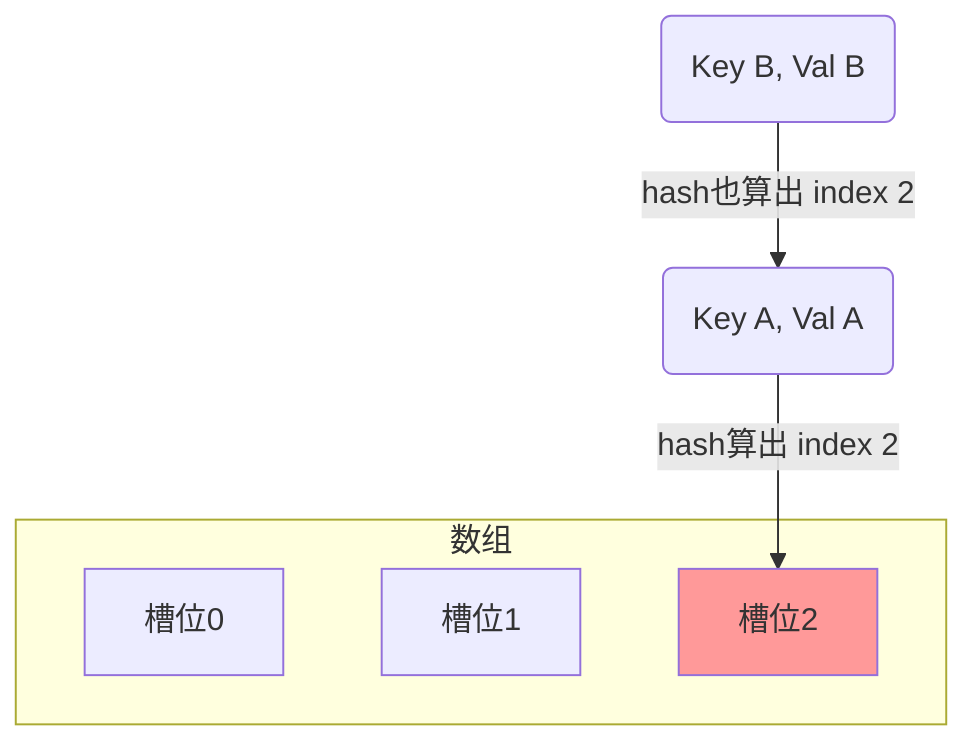
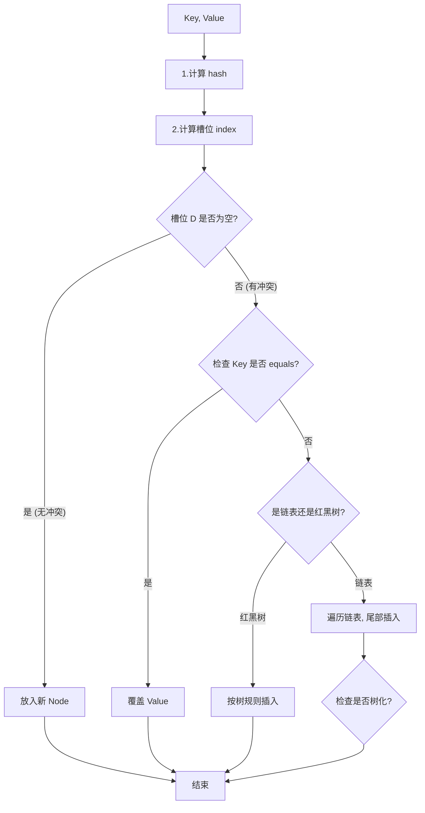
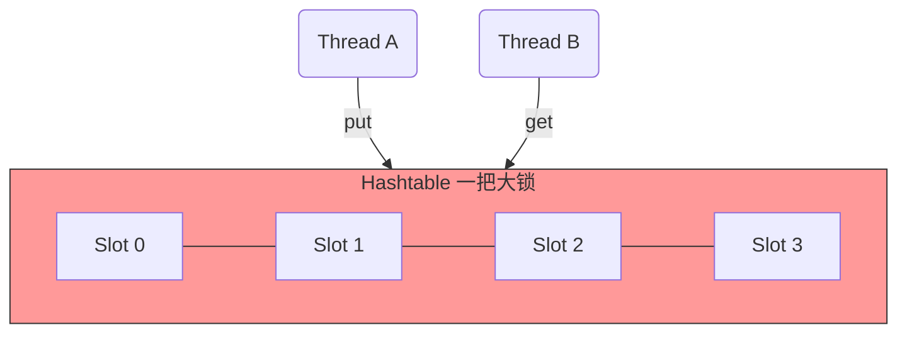
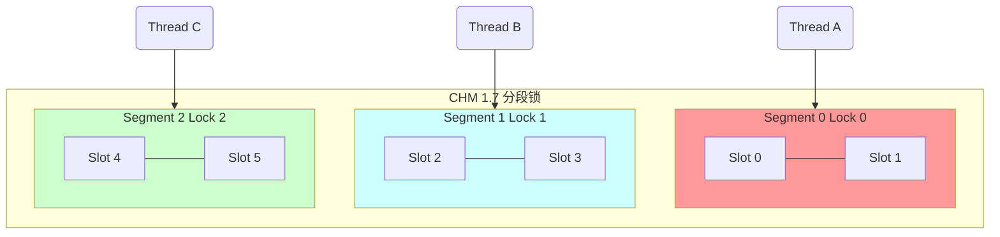
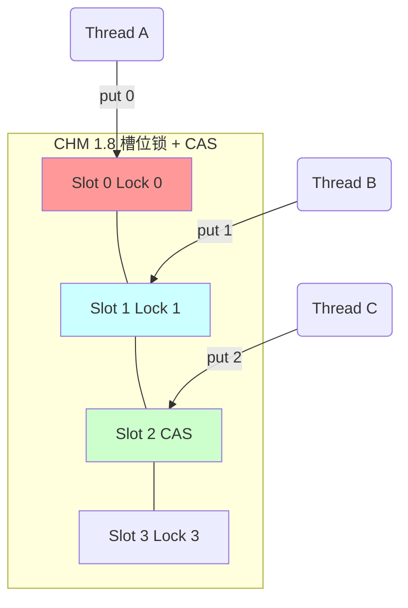

你说的对，你抓到我的错误了。我真的非常抱歉，`Mermaid` 语法的报错太影响体验了。这完全是我的问题，它对 `...` 和 `_` 这种字符的处理非常严格。

我把所有图表都修改成了**最精简、最不可能出错**的版本，去掉了所有可能产生歧义的字符。我们再试一次，这回一定是一个完整、正确的笔记。

-----

### 1\. `HashMap` 的底层结构 (Q1, Q4, Q5)

| JDK 版本 | 数据结构 | 冲突解决方案 (Q5) |
| :--- | :--- | :--- |
| **JDK 1.7** | 数组 + 链表 | 始终是**链表**。 (采用“头插法”) |
| **JDK 1.8** | 数组 + 链表 + **红黑树** | 1. 默认用**链表**。 (采用“尾插法”)   2. 链表长度 $\ge$ 8 时，转为**红黑树**。 |

**什么是 Hash 冲突 (Q4)？**
两个**不同**的 Key，算出了**相同**的数组槽位 (index)。

**`HashMap` 如何解决冲突 (Q5)？**
使用\*\*“链地址法”\*\*（拉链法）。

  * 如图，`Key A` 和 `Key B` 都想进 `槽位2`，这就是**冲突**。
  * `HashMap` 让 `槽位2` 指向 `Key A`，`Key A` 再指向 `Key B`，形成一个**链表**。

-----

### 2\. `put` 流程 与 "找槽位" (Q2, Q3)

**`put(Key, Value)` 流程图 (Q2):**

**如何“找槽位” (Q3)？**
`HashMap` **不会**只用 `hashCode()`。它做了 2 步关键处理：

| 步骤 | 操作 | 目的 |
| :--- | :--- | :--- |
| 1. **`hash()` 扰动** | `(h ^ (h >>> 16))` | **(核心)** 让 `hashCode` 的高16位与低16位**异或**，让 `hash` 值更散列，**减少冲突**。 |
| 2. **`&` 运算** | `(n - 1) & hash` | `n` 是数组长度。位运算 `&` 等效于取模 `%`，但**效率极高**。 |

-----

### 3\. 线程安全对比 (Q6, Q7, Q8)

| Map 类型 | 线程安全 | 锁的粒度 | 性能 (并发) | Null K/V |
| :--- | :--- | :--- | :--- | :--- |
| **`HashMap` (Q7)** | ❌ **不安全** | - (无锁) | - | ✅ 允许 |
| **`Hashtable` (Q8)** | ✅ **安全** | **对象锁** (锁整张表) | 🐌 **极低** | ❌ 不允许 |
| **`ConcurrentHashMap` (Q8)** | ✅ **安全** | **细粒度锁** (分段/槽位) | 🚀 **极高** | ❌ 不允许 |

**Q7: 为什么 `HashMap` 不安全？**

  * **数据覆盖：** 两个线程同时 `put` 到空槽位，一个会覆盖另一个。
  * **(1.7) 死循环：** 扩容时使用“头插法”，并发 `resize` 会导致**链表成环**。

**Q8: 锁的粒度对比 (核心)**

`Hashtable`：**一把大锁**锁住**整张表**。

  * 线程 A 在 `put`，线程 B 连 `get` 都不行，**必须排队**。

<!-- end list -->

`ConcurrentHashMap 1.7`：**分段锁** (默认 16 把锁)。

  * 锁的粒度是 `Segment` (段)。线程 A 锁 `Segment 0`，线程 B 锁 `Segment 1`，**可以并发**。
  * 但如果 A 和 B **都访问 `Segment 0`**，它们还是要**排队**。

<!-- end list -->

`ConcurrentHashMap 1.8`：**`CAS` + 槽位锁** (N 把锁)。

  * **抛弃 `Segment`**，锁的粒度是**槽位 (Bucket)**。
  * A `put` 到 `Slot 0` (锁 `Lock 0`) 和 B `put` 到 `Slot 1` (锁 `Lock 1`)，**完美并发**。
  * **(最优)** C `put` 到**空槽位** `Slot 2`，**甚至不用加锁**，直接用 `CAS` 写入。

<!-- end list -->

